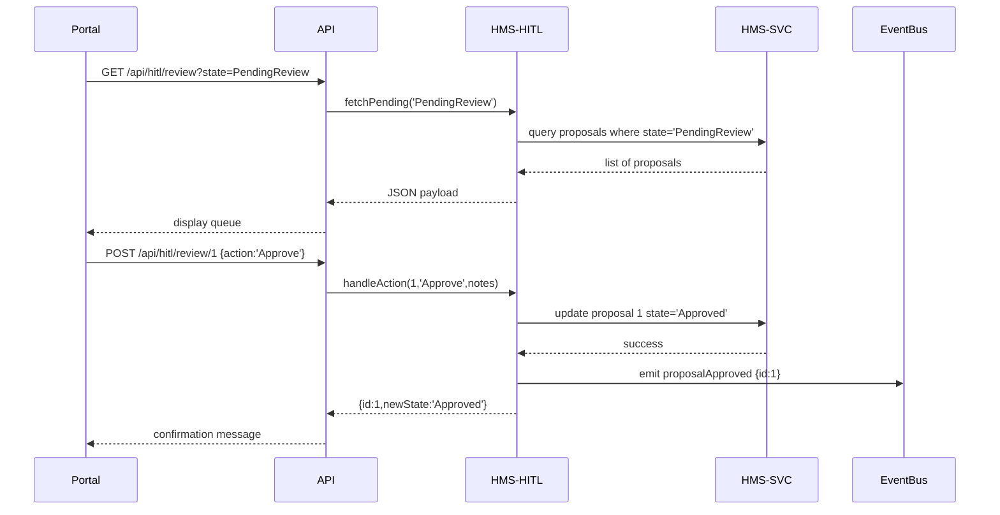

# Chapter 11: Human-In-The-Loop Workflow

In [Chapter 10: Governance Layer (HMS-SYS)](10_governance_layer__hms_sys__.md), we set up global policies and security checks for the platform. Now we introduce an accountability mechanism modeled after citizen oversight boards: the **Human-In-The-Loop (HITL) Workflow**. This lets elected officials or managers pause, inspect, adjust, or reject AI-generated proposals—ensuring agility with trust and legal compliance.

## 1. Why a HITL Workflow? A Real-World Use Case

Imagine the Wireless Telecommunications Bureau (WTB) uses an AI agent to draft a new “Spectrum Auction Policy.” Even if the AI passes all compliance checks, a policy manager must:

- Pause the automated pipeline once a draft is ready  
- Read or edit the draft text (e.g., change auction dates)  
- Approve, request revisions, or reject the proposal  

This human check prevents an AI from publishing a policy too quickly or overlooking legal nuances.

## 2. Key Concepts

1. **Review Queue**  
   A list of AI-generated proposals awaiting human action.  
2. **Workflow States**  
   - PendingReview  
   - Approved  
   - ChangesRequested  
   - Rejected  
3. **Review Actions**  
   - Approve: move the proposal forward  
   - RequestChanges: send back to AI or staff for edits  
   - Reject: archive or discard the proposal  
4. **Resume Pipeline**  
   Only after “Approved” does the automated pipeline continue.

## 3. How to Use the HITL Workflow

Here’s how a portal can list pending items and perform review actions via our API.

### 3.1 Fetch Pending Reviews

```js
// src/api/hitl.js
export async function listPending() {
  const res = await fetch('/api/hitl/review?state=PendingReview');
  return res.json(); 
}
// returns: [
//   { id:1, title:'Spectrum Auction Policy', draft:'...' },
//   …
// ]
```
This call retrieves all proposals in the “PendingReview” state.

### 3.2 Perform a Review Action

```js
// src/api/hitl.js
export async function reviewAction(id, action, notes='') {
  const res = await fetch(`/api/hitl/review/${id}`, {
    method: 'POST',
    headers: {'Content-Type':'application/json'},
    body: JSON.stringify({ action, notes })
  });
  return res.json(); 
}
// e.g. reviewAction(1,'Approve','Looks good')
//      reviewAction(1,'RequestChanges','Please update dates')
```
Use `action` = “Approve” | “RequestChanges” | “Reject” to set the new workflow state.

## 4. What Happens Under the Hood?



1. Portal fetches all pending reviews.  
2. Human clicks “Approve,” “RequestChanges,” or “Reject.”  
3. API calls the HITL service, which updates the state in HMS-SVC.  
4. If approved, an event (`proposalApproved`) is emitted to resume automation.

## 5. Under the Hood: Internal Implementation

### 5.1 Express Routes

File: `server/routes/hitlRoutes.js`

```js
const express = require('express');
const { fetchPending, handleAction } = require('../services/hitlService');
const router = express.Router();

// List pending reviews
router.get('/review', async (req, res) => {
  const items = await fetchPending(req.query.state);
  res.json(items);
});

// Perform a review action
router.post('/review/:id', async (req, res) => {
  const result = await handleAction(req.params.id, req.body);
  res.json(result);
});

module.exports = router;
```
These routes let the front-end fetch and act on proposals.

### 5.2 HITL Service Logic

File: `server/services/hitlService.js`

```js
const db = require('../lib/db');          // Simplified DB
const eventBus = require('../lib/eventBus');

async function fetchPending(state) {
  return db.query('proposals', { state });
}

async function handleAction(id, { action, notes }) {
  const map = {
    Approve: 'Approved',
    RequestChanges: 'ChangesRequested',
    Reject: 'Rejected'
  };
  const newState = map[action];
  await db.update('proposals', id, { state: newState, notes });
  if (newState === 'Approved') {
    eventBus.emit({ type: 'proposalApproved', id });
  }
  return { id, newState };
}

module.exports = { fetchPending, handleAction };
```
- `fetchPending` retrieves items by state.  
- `handleAction` maps an action to a new state, updates the record, and emits an event on approval.

## Conclusion

In this chapter you learned how the **Human-In-The-Loop Workflow**:

- Pauses the AI pipeline for human oversight  
- Provides a simple API to list and act on proposals  
- Updates workflow states and resumes automation upon approval  

Next, we’ll explore how to track system performance and user metrics in [Chapter 12: Real-Time Monitoring & Metrics](12_real_time_monitoring___metrics_.md).

---

Generated by [AI Codebase Knowledge Builder](https://github.com/The-Pocket/Tutorial-Codebase-Knowledge)