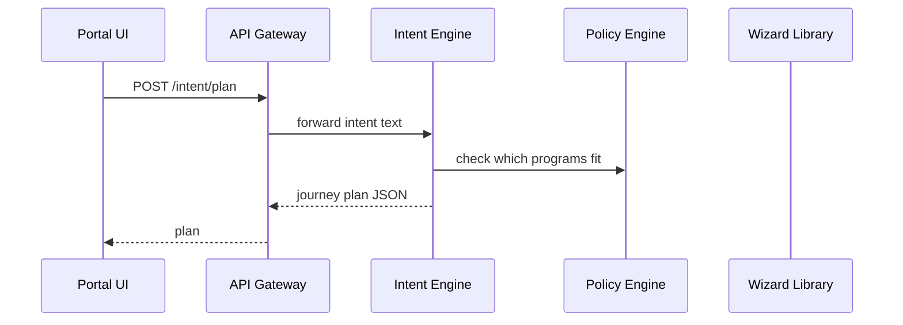

# Chapter 11: Intent-Driven Navigation Engine
*(continuing from [Chapter 10: Modular Front-End Library (HMS-MFE)](10_modular_front_end_library__hms_mfe__.md))*  

---

## 1. Why Do We Need a “GPS” for Government Portals?

Picture this:  
A Colorado farmer opens the *U.S. Department of Agriculture* site at 11 p.m. because hail destroyed his crops.  
All he knows is:

> “I need help paying for crop damage.”

He does **not** know the program name (“Emergency Assistance for Livestock, Honey Bees, and Farm-Raised Fish”) nor which of the 17 forms to start with.  
Traditional portals bury him in menus like **Programs → Disaster Relief → 2024 Hail → Form AD-311**—his browser’s back-button soon becomes the only navigation tool.

The **Intent-Driven Navigation Engine (IDNE)** acts like Google Maps for bureaucracy:

1. Asks a single plain-language question: **“What do you need to accomplish?”**  
2. Figures out the shortest legal route through forms, uploads, signatures, and payments.  
3. Escorts the user step-by-step—no dead ends, no duplicate data entry.

Result: The farmer finishes in minutes, not hours, and every agency rule is still enforced.

---

## 2. Key Concepts—Five Friendly Bricks

| Brick | Analogy | Beginner Meaning |
|-------|---------|------------------|
| Intent | Travel destination | “Get disaster aid for crops” |
| Step | Road segment | One screen, upload, or signature |
| Journey Plan | Turn-by-turn list | Ordered steps to reach the intent |
| Context Cache | Car’s memory | Stores answers so we never ask twice |
| Hint Engine | Helpful road sign | AI suggestions: “Need receipts? Here’s how to scan them.” |

Keep these five bricks in mind; the rest of the chapter simply snaps them together.

---

## 3. Walk-Through: “I Want Crop-Damage Aid”

### 3.1 Farmer’s First Click (Front-End < 20 lines)

```jsx
import { askIntent } from "@hms-emr/mfe";

askIntent({
  prompt: "What do you need today?",
  onSubmit: async (text) => {
    const plan = await fetch("/v1/intent/plan", {
      method: "POST",
      body: JSON.stringify({ intent: text }),
      headers: { "Content-Type": "application/json" }
    }).then(r => r.json());

    navigate(plan.firstStep.url);   // e.g., /wizard/crop-aid/step-1
  }
});
```

Explanation  
1. `askIntent` renders a single input box.  
2. We POST the user’s sentence—*“Help with crop damage costs”*—to the **Intent Endpoint**.  
3. The server replies with a **Journey Plan**; we send the user to step 1.

### 3.2 What the Journey Plan Looks Like

```json
{
  "intentId": "INT-9238",
  "firstStep": { "id": "eligibility", "url": "/wizard/crop-aid/step-1" },
  "nextHints": ["Have business tax ID ready", "Photos of damage help speed approval"]
}
```

The front-end shows a progress bar and the two hints beneath the title.

---

## 4. What Happens Behind the Curtain?



Five actors, crystal-clear roles.

---

## 5. Internal Recipe—How Does the Engine Cook the Plan?

1. **Intent Parsing**  
   ```python
   words = nlp.clean(text)        # “help crop damage costs”
   ```
2. **Program Match**  
   Queries a small table maintained in [Governance Portal](02_governance_portal__hms_gov__.md):

   | keywords           | programCode |
   |--------------------|-------------|
   | crop, damage, aid  | CROP_AID_V1 |

3. **Policy Check**  
   Calls [Process & Policy Engine](03_process___policy_engine_.md) to ensure the program is active.

4. **Step Stitching**  
   Reads UI step definitions from [HMS-MFE](10_modular_front_end_library__hms_mfe__.md):

   ```yaml
   - id: eligibility    ; form: crop_eligibility.json
   - id: documents      ; form: upload_receipts.json
   - id: signature      ; form: e_sign.json
   ```

5. **Context Cache Init**  
   Creates an empty store keyed by `intentId` so fields can auto-fill later.

6. **Hint Generation**  
   Lightweight LLM call suggests extra documents (optional).

7. **Return Plan**  
   JSON with `firstStep`, `intentId`, hints.

All under 300 ms on a typical AWS t3.micro.

---

## 6. Code Peek: Step Stitcher (< 18 lines)

```js
// engine/stitcher.js
export function buildPlan(programCode) {
  const steps = db.read(`ui_steps.${programCode}`);   // YAML above
  const plan  = { firstStep: steps[0], steps };

  // link each step to the next for easy navigation
  steps.forEach((s, i) => (s.next = steps[i + 1]?.id || null));

  return plan;
}
```

Beginner notes:  
• Reads a YAML array, attaches simple `next` pointers—nothing scary.

---

## 7. Navigating Between Steps (Front-End Helper < 12 lines)

```jsx
import { nextStep } from "@hms-emr/mfe";

function onComplete(currentId) {
  nextStep(currentId)          // auto-saves context & redirects
      .catch(e => alert(e.message));
}
```

`nextStep` hits `/v1/intent/next` with current answers; the engine replies with the next URL—or “FINISHED”.

---

## 8. Reusing Answers with Context Cache

If the farmer later starts a **Loan Forgiveness** journey, the eligibility screen finds `businessTaxId` already stored and pre-fills the field.  
No extra code—IDNE does it automatically.

---

## 9. Extending the Engine—Add a New Program in 2 Files

1. **Intent Map Update** (`intent_map.yml`, 4 lines)

```yaml
- keywords: ["storm", "relief"]
  programCode: STORM_RELIEF_V1
```

2. **Step Definition** (`ui_steps.STORM_RELIEF_V1.yml`, 6 lines)

```yaml
- id: eligibility   ; form: storm_elig.json
- id: evidence      ; form: upload_photos.json
- id: signature
```

Commit → [Governance Portal](02_governance_portal__hms_gov__.md) signs → IDNE hot-reloads—done.

---

## 10. Frequently Asked Beginner Questions

**Q 1: Is this the same as a normal router?**  
No. Routers map static URLs. IDNE builds **dynamic** journeys per user, per policy.

**Q 2: Do I need AI skills?**  
No. NLP & hint logic ship out-of-the-box. You can turn hints off with `hints: false`.

**Q 3: Can users change intent mid-way?**  
Yes. Call `/v1/intent/replan` with the new sentence; the engine merges completed steps and recalculates the rest.

**Q 4: What about accessibility?**  
All screens are still HMS-MFE components, so [Chapter 10](10_modular_front_end_library__hms_mfe__.md) accessibility guards apply.

---

## 11. Summary & What’s Next

You learned:

• The **Intent-Driven Navigation Engine** asks *what* the user wants, then stitches forms, uploads, and signatures into a single guided journey.  
• A journey plan JSON plus two simple helper functions (`askIntent`, `nextStep`) replace complex menu trees.  
• Under the hood, IDNE matches programs, checks policies, builds a step list, and caches context—all in < 300 ms.

In the next chapter we’ll add an **AI Representative Agent** that can *speak and act* on the user’s behalf inside those journeys—think “digital case worker.”  
Ready to meet your smart assistant? ➜ [Chapter 12: AI Representative Agent Framework (HMS-A2A)](12_ai_representative_agent_framework__hms_a2a__.md)

---

---

Generated by [AI Codebase Knowledge Builder](https://github.com/The-Pocket/Tutorial-Codebase-Knowledge)