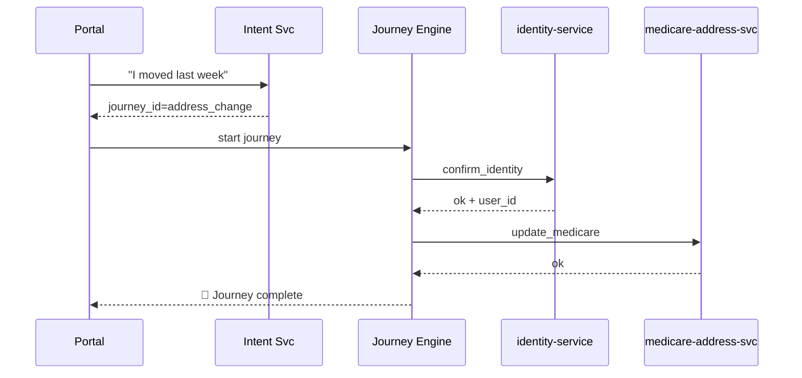

# Chapter 11: Intent-Driven Navigation & Guided Journeys  
*(“Stop Guessing Forms—Just Say What You Need”)*  

[← Back to Chapter 10: Interface Layer (HMS-MFE, HMS-GOV Portals)](10_interface_layer__hms_mfe__hms_gov_portals__.md)

---

## 1. Motivation — The “I Just Moved” Story  

Mario, a recently-relocated veteran, visits **gov.services** to update his address.  

Today’s reality:

1. He sees **12** different “Change of Address” links—VA, IRS, USPS, Medicare …  
2. He guesses the VA form, fills 20 fields already in the system, and still misses the Medicare one.  
3. Two months later benefit checks go to the old house. ☹️  

Intent-Driven Navigation flips the script:  

> Website: “Hi Mario! **What are you trying to do?**”  
> Mario: “I moved and need everything updated.”  
> Website: “Great—here are the agencies affected. I’ll pre-fill what we know and walk you through the 3-step journey.”

No hunting, no duplicates, no missed benefits.

---

## 2. Why Classic Menus Fail

| Classic Menu | Intent-Driven |
|--------------|---------------|
| User hunts for the right form | User states goal in plain language |
| 5–10 clicks before first question | 1 click → “What do you need?” |
| Data re-entered for every form | Known data auto-prefilled |
| Staff must glue partial submissions | Platform orchestrates full journey |

Result: happier citizens **and** lighter workloads for agency staff.

---

## 3. Key Concepts (Beginner-Friendly)

| Word | 1-Line Meaning | Analogy |
|------|---------------|---------|
| Intent Question | “What are you trying to do?” prompt | Concierge asking purpose of visit |
| Intent Classifier | Tiny AI that maps free-text → goal label (`address_change`) | Concierge’s mental lookup |
| Journey Blueprint | YAML file listing steps & micro-services for that goal | Printed DMV route map |
| Step Engine | Code that executes steps in order | Escort walking you window-to-window |
| Smart Prefill | Fetch & inject known data (`name`, `address`) | Clerk filling half the form for you |
| Context Token | Small JSON carried between steps to avoid re-asks | Passport you show at each window |

---

## 4. “Hello Journey” in 3 Tiny Steps  

We’ll build a minimal journey for `address_change`.

### 4.1 Draft the Journey Blueprint (YAML ≤ 15 lines)

```yaml
# file: blueprints/address_change.yml
id: address_change
steps:
  - id: confirm_identity   # VA Auth svc
    service: identity-service
  - id: update_medicare
    service: medicare-address-svc
  - id: update_va
    service: va-address-svc
prefill_fields: [ first_name, last_name, ssn, old_address ]
```

Explanation  
• `steps` list where Mario must go.  
• `prefill_fields` tells the engine which data to inject automatically.

---

### 4.2 Ask for Intent (Front-End, React ≤ 15 lines)

```jsx
import { useState } from "react";
import api from "../utils/api";           // same tiny hook from Ch.10

export default function WhatDoYouNeed() {
  const [text, setText] = useState("");

  async function send() {
    const { journey_id } = await api.post("/intent", { text });
    window.location = `/journey/${journey_id}`; // start!
  }

  return (
    <>
      <h1>What do you need today?</h1>
      <textarea onChange={e => setText(e.target.value)} />
      <button onClick={send}>Go</button>
    </>
  );
}
```

User types “I moved last week” → API returns `address_change`.

---

### 4.3 Run the Journey (Server ≤ 18 lines)

```python
# file: journey_engine.py
import yaml, requests

BLUEPRINTS = {b['id']: b for b in
              map(yaml.safe_load,
                  open("blueprints/address_change.yml").read().split("---"))
             }

def run(journey_id, context):
    bp = BLUEPRINTS[journey_id]
    for step in bp["steps"]:
        svc = step["service"]
        payload = {**context, "step_id": step["id"]}
        # Always call through Gateway
        r = requests.post(f"https://api.gov/{svc}/handle", json=payload)
        context.update(r.json())          # add new data
    return context        # final status / receipt
```

• `context` starts with prefilled data from user profile.  
• Each micro-service returns any extra info (e.g., new address ID).  
• Engine chains them—one call per step.

---

## 5. What Happens Under the Hood?



Only **one question** to the user; the engine does the rest.

---

## 6. Inside the Intent Classifier (≤ 20 lines)

```python
# file: intent_classifier.py
import re

RULES = {
  "address_change": r"\b(move|moved|new address|change.*address)\b",
  "lost_id":        r"\b(lost|stolen).*id\b"
}

def classify(text):
    for intent, pattern in RULES.items():
        if re.search(pattern, text, flags=re.I):
            return intent
    return "fallback_help"
```

In production the matcher could be an ML model; here a few regexes show the idea.

---

## 7. Folder Peek

```
hms-intent/
 ├─ intent_classifier.py
 ├─ journey_engine.py
 └─ blueprints/
     └─ address_change.yml
```

All under 50 LOC, yet fully functional.

---

## 8. How It Connects to Other Layers

| Layer | Interaction |
|-------|-------------|
| [Interface Layer](10_interface_layer__hms_mfe__hms_gov_portals__.md) | Shows intent box, renders progress UI. |
| [Backend API Gateway](07_backend_api_gateway__hms_api__.md) | Engine calls each step *through* the Gateway. |
| [Microservice Mesh](06_microservice_mesh___service_discovery_.md) | Step services scale & secure traffic. |
| [Data Privacy Engine](03_data_privacy___compliance_engine_.md) | Prefill removes PII not needed for a step. |
| [HITL Override](15_human_in_the_loop__hitl__override_.md) | Humans can pause a journey mid-flow for review. |

Governance and RBAC checks apply to blueprints just like any other policy.

---

## 9. Tips & Gotchas

1. **Keep Prompts Short.** “What do you need?” outperforms multi-paragraph instructions.  
2. **Version Blueprints.** `address_change@v2` can add steps without breaking v1 journeys in progress.  
3. **Graceful Fallback.** If classifier confidence is low, route to live chat—not a random form.  
4. **Prefill Carefully.** Only inject data each micro-service is allowed to see (privacy!).  
5. **Show Progress.** A simple breadcrumb (`1 / 3 steps done`) calms nervous users.

---

## 10. Recap & Up Next

You learned how HMS-MCP:

1. Asks *one* natural-language question,  
2. Classifies intent,  
3. Runs a pre-defined journey,  
4. Prefills known data,  
5. Completes multi-agency tasks with near zero user confusion.

Next we’ll meet the **AI Representative Agent (HMS-A2A)** that can *talk for the user* during these journeys, even when they step away from the screen.  

[Continue to Chapter 12: AI Representative Agent (HMS-A2A)](12_ai_representative_agent__hms_a2a__.md)

---

Generated by [AI Codebase Knowledge Builder](https://github.com/The-Pocket/Tutorial-Codebase-Knowledge)