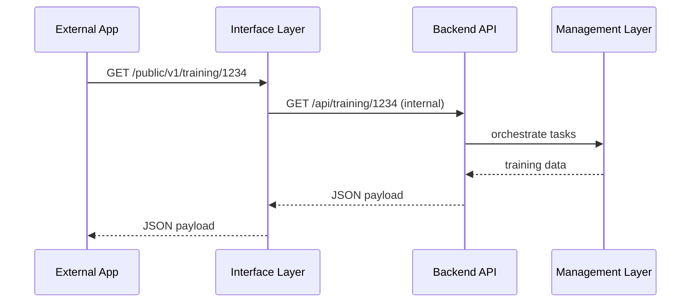

# Chapter 11: Interface Layer

Welcome back! In the previous chapter, we saw how the [Management Layer](10_management_layer_.md) orchestrates workflows, schedules crews, and watches SLAs. Now it’s time to open the front door for external teams and citizen‐facing apps. Welcome to the **Interface Layer** — the public “welcome center” of HMS.

## 1. Motivation & Central Use Case

Imagine you’re a developer at Marine Corps Training Command. You want to build a custom mobile app that:

- Shows trainees their upcoming exercises  
- Lets instructors submit after‐action reports  

Or you’re at a mining company integrating your internal schedule into HMS so inspection teams get alerts in real time. Rather than reverse‐engineering internal services, you use the Interface Layer:

- Public REST APIs for data  
- Embeddable UI widgets for dashboards  
- SDKs to simplify integration  

This layer makes HMS a well-documented, safe “front desk” that guides external apps into the right internal systems.

## 2. Key Concepts

1. Public API Endpoints  
   Exposed REST paths or GraphQL schemas for data and actions.  
2. UI Frameworks & Widgets  
   Prebuilt components (web or mobile) you can drop into your own portals.  
3. Developer SDKs  
   Language-native libraries (JavaScript, Python, iOS, Android) that wrap APIs and handle auth, retries, and versioning.  
4. Documentation Portal  
   A searchable site detailing endpoints, parameters, example calls.  
5. Versioning & Stability  
   Clear version tags (v1, v2) so you know when breaking changes happen.

## 3. Hands-On: Exposing APIs, Widgets, and an SDK

### 3.1 Public REST API

File: `interface-server.js`
```js
const express = require('express');
const app = express();
app.use(express.json());

// Public endpoint for training schedules
app.get('/public/v1/training/:userId', (req, res) => {
  // In reality, call internal HMS services
  res.json({ userId: req.params.userId, nextExercise: 'Day 5: Navigation' });
});

app.listen(4000, () => console.log('Interface Layer running on 4000'));
```
> This small server sits in front of internal APIs. External apps call `/public/v1/training/1234` without needing backend secrets.

### 3.2 Embeddable UI Widget

File: `training-widget.js`
```js
class TrainingWidget extends HTMLElement {
  connectedCallback() {
    const id = this.getAttribute('user-id');
    fetch(`/public/v1/training/${id}`)
      .then(r => r.json())
      .then(data => this.innerHTML = `<p>Next: ${data.nextExercise}</p>`);
  }
}
customElements.define('training-widget', TrainingWidget);
```
> Drop `<training-widget user-id="1234"></training-widget>` into any page and it fetches and displays the next exercise.

### 3.3 JavaScript SDK

File: `hms-sdk.js`
```js
export class HMSSDK {
  constructor({ baseUrl, apiKey }) {
    this.baseUrl = baseUrl;
    this.apiKey = apiKey;
  }
  async getTraining(userId) {
    const res = await fetch(`${this.baseUrl}/public/v1/training/${userId}`, {
      headers: { 'Authorization': this.apiKey }
    });
    return res.json();
  }
}
```
> Developers install `hms-sdk.js`, configure it once, then call `sdk.getTraining('1234')` without worrying about headers or URLs.

## 4. What Happens Under the Hood?



1. The external app hits the **Interface Layer**.  
2. It forwards to the internal **Backend API**.  
3. The **Management Layer** runs any workflows, then returns data.  
4. The Interface Layer delivers the result back to the app.

## 5. Internal Implementation Walkthrough

### 5.1 Non-Code Overview

1. **Define** public routes that mirror internal services.  
2. **Wrap** calls with authentication, rate limits, logging.  
3. **Host** embeddable UI components and docs (e.g., on a CDN).  
4. **Publish** SDKs via package managers (npm, PyPI).  

### 5.2 Core Files & Code

- **interface-server.js**  
  - Mounts routes under `/public/v1`.  
  - Applies middleware for auth and request logging.
- **ui/training-widget.js**  
  - A web component that fetches and renders public data.
- **sdk/hms-sdk.js**  
  - Client library handling base URLs and headers.

Each piece is small and focused, so developers can pick just what they need.

## 6. Summary & Next Steps

In this chapter you learned how the **Interface Layer**:

- Presents **public APIs** as a well-documented front door  
- Provides **UI widgets** for quick embedding  
- Offers **SDKs** to simplify common calls  

Next up, we’ll dive into the services powering these APIs in [Backend Services (HMS-SVC)](12_backend_services__hms_svc__.md). Happy building!

---

Generated by [AI Codebase Knowledge Builder](https://github.com/The-Pocket/Tutorial-Codebase-Knowledge)