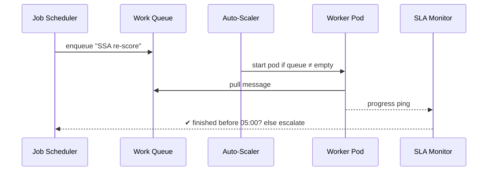

# Chapter 11: Management Layer (HMS-SVC / HMS-OPS / HMS-OMS)

*(We just wired every endpoint through a single door in the [Backend API Gateway](10_backend_api_gateway_.md).  
Now someone has to keep that building open 24 × 7, restock the coffee, and call maintenance when a lightbulb dies—that’s the job of the **Management Layer**.)*

---

## 1. Why Do We Need a “City Operations Center” for Code?

### Central Use-Case  
Every midnight the **Social Security Administration (SSA)** must:

1. Pull fresh wage data from IRS.  
2. Re-score 2 million benefit files.  
3. Push alerts to agencies if payments need adjustment—all **before** citizens wake up.

If a worker pod crashes at 00 : 37 or the queue grows too long, citizens may see wrong balances in the morning.  
**HMS-SVC / HMS-OPS / HMS-OMS** is the 911 dispatch that:

* Starts the jobs on time.  
* Spawns more workers if queues pile up.  
* Tracks SLAs (e.g., “finish by 05 : 00 UTC”).  
* Escalates to humans when red lights flash.

Think of it as *SimCity*, but the “buildings” are micro-services and the “traffic” is API calls.

---

## 2. Key Concepts (Plain English)

| Term | Beginner-Friendly Meaning |
|------|---------------------------|
| Service Registry | Phonebook that lists every running micro-service and which version. |
| Job Scheduler | Alarm clock that says “Run this task at 00 : 05 every night.” |
| Work Queue | A to-do list (messages) that workers pick up. |
| Auto-Scaler | Robot janitor that plugs in more servers when the queue gets long, unplugs them when things calm down. |
| SLA Monitor | Stopwatch that checks “Did the task finish before the deadline?” |
| Escalation Rule | If SLA fails, text the on-call engineer and file a ticket in HITL. |

---

## 3. Solving the SSA Use-Case in 3 Tiny Files

We will:

1. Declare the nightly job in YAML.  
2. Run a 19-line scheduler.  
3. Spin worker pods and watch the auto-scaler.

### 3.1 Job Declaration (`jobs/ssa_re-score.yaml`)

```yaml
id: ssa_re_score
schedule: "0 0 * * *"      # every midnight UTC
queue: ssa_re_score_q
sla_minutes: 300           # must finish in 5 h
image: usgov/ssa-worker:v1
```

Explanation  
• Cron string says *when*.  
• `queue` holds messages.  
• `image` is the docker image workers will run.

### 3.2 Minimal Scheduler (`svc/scheduler.py` – 18 lines)

```python
import yaml, time, subprocess, datetime

JOBS = [yaml.safe_load(open("jobs/ssa_re-score.yaml"))]

def enqueue(job):
    # pretend to push one big message
    open(f"q/{job['queue']}", "w").write("START")

while True:
    now = datetime.datetime.utcnow()
    for job in JOBS:
        hh, mm = map(int, job["schedule"].split()[0:2])
        if now.hour == hh and now.minute == mm:
            enqueue(job)
    time.sleep(60)
```

What it does  
1. Loads YAML job.  
2. Every minute checks if cron matches.  
3. Writes “START” into a file acting as the queue. (Real life ➜ Redis/SQS.)

### 3.3 Tiny Worker (`svc/worker.py` – 19 lines)

```python
import time, pathlib, json, random

QUEUE = pathlib.Path("q/ssa_re_score_q")

while True:
    if QUEUE.exists():
        data = QUEUE.read_text()
        QUEUE.unlink()
        # pretend the heavy job takes 2–5 min
        time.sleep(random.randint(120, 300))
        open("logs/ssa_done.json", "w").write(
            json.dumps({"done_at": time.time()})
        )
    time.sleep(10)
```

Runs forever, grabs the message, does the work, and logs completion.

### 3.4 Auto-Scaler Stub (`ops/autoscaler.py` – 17 lines)

```python
import subprocess, time, os

def queue_len():
    return os.path.exists("q/ssa_re_score_q")

workers = 0
while True:
    if queue_len() and workers < 3:
        subprocess.Popen(["python", "svc/worker.py"])
        workers += 1
        print("Spun up worker", workers)
    if not queue_len() and workers > 0:
        workers -= 1               # pretend pod dies naturally
        print("Scaling down, remaining", workers)
    time.sleep(30)
```

Adds workers until 3 are running, scales down when the queue is empty.

---

## 4. What Happens Inside? (Step-by-Step)



Only five moving parts—easy to picture.

---

## 5. Under the Hood (Peek at Files)

```
hms-management/
 ├─ jobs/
 │   └─ ssa_re-score.yaml
 ├─ svc/
 │   ├─ scheduler.py
 │   └─ worker.py
 ├─ ops/
 │   ├─ autoscaler.py
 │   └─ sla_monitor.py
 └─ logs/
```

### 5.1 SLA Monitor (`ops/sla_monitor.py` – 16 lines)

```python
import json, datetime, time, smtplib

SLA = 300          # minutes
while True:
    try:
        t = json.load(open("logs/ssa_done.json"))["done_at"]
        elapsed = (time.time() - t) / 60
        if elapsed > SLA:
            smtplib.SMTP("localhost").sendmail(
                "bot@ssa.gov", "oncall@ssa.gov",
                f"SLA breach! Took {elapsed} min")
    except FileNotFoundError:
        pass
    time.sleep(60)
```

Sends an e-mail if job overshoots the deadline.

---

## 6. How the Management Layer Talks to Other HMS Parts

| Layer | Why It Cares |
|-------|--------------|
| [Backend API Gateway](10_backend_api_gateway_.md) | Gateway health pings feed the **Auto-Scaler** (“add pods if 5 xx errors spike”). |
| [Monitoring & Observability](14_monitoring___observability__hms_ops__.md) | Exposes metrics *from* this layer to fancy dashboards. |
| [Human-in-the-Loop (HITL)](07_human_in_the_loop__hitl__oversight_.md) | SLA breaches create tickets in the HITL queue. |
| [Secure Data Repository](13_secure_data_repository__hms_dta__.md) | Logs and job outputs are stored here for auditors. |
| [Workflow Orchestration](12_workflow_orchestration__hms_act__.md) | Next chapter builds multi-step flows; Management Layer makes sure each step has compute and stays healthy. |

---

## 7. Hands-On Mini Lab

1. Create folders:

```bash
mkdir -p q logs jobs svc ops
```

2. Copy the code snippets into the right files.

3. Run in three terminals:

```bash
python svc/scheduler.py
python ops/autoscaler.py
python ops/sla_monitor.py
```

4. Wait until midnight UTC **or** change the cron string to run two minutes from now (`schedule: "*/2 * * * *"`).  
5. Watch the auto-scaler print “Spun up worker 1 … 3”, then “Scaling down…”.

Congrats—your miniature “city ops center” just finished a government batch job!

---

## 8. FAQ

**Q: How does this differ from Kubernetes?**  
Kubernetes is a full-fledged city; our tiny scripts teach the core ideas. In production HMS-SVC/OPS/OMS usually sits **on top of** Kubernetes, adding SLA logic and escalation rules specific to government workflows.

**Q: Who writes the YAML job files?**  
Program managers or DevOps engineers. A future MFE wizard will create them with a form.

**Q: Can I see real-time queue depth?**  
Yes—Management exports metrics the Monitoring layer graphs (Chapter 14).

**Q: What if a job needs human approval mid-run?**  
Add a HITL step; the scheduler pauses the queue until approval comes back (see next chapter).

---

## 9. What We Learned

* The **Management Layer** is the around-the-clock dispatcher: schedules jobs, scales pods, watches SLAs, and escalates when needed.  
* You defined a job in one YAML file and ran a scheduler, worker, auto-scaler, and SLA monitor—each under 20 lines.  
* This layer glues lower-level infra (containers, queues) to higher-level logic (workflows, policies).

Ready to chain many jobs into a single, auditable pipeline?  
➡️ Continue to [Workflow Orchestration (HMS-ACT)](12_workflow_orchestration__hms_act__.md)

---

Generated by [AI Codebase Knowledge Builder](https://github.com/The-Pocket/Tutorial-Codebase-Knowledge)