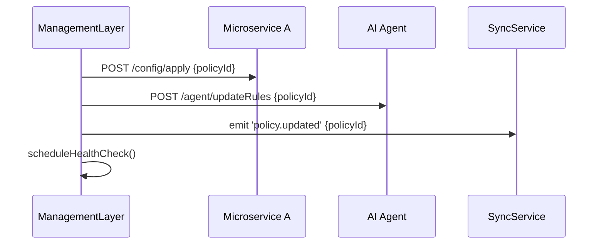

# Chapter 11: Management Layer

Welcome! In [Chapter 10: Policy Deployment Workflow](10_policy_deployment_workflow_.md) we saw how an approved policy gets staged, published to the Federal Register, and enforced across systems. Now, we’ll introduce the **Management Layer**, our “agency management office” that takes governance policies and turns them into running workflows, configurations, and health checks across all HMS-MFE components.

## Why the Management Layer Matters

Imagine the Federal Emergency Management Agency (FEMA) issues a new disaster-response directive:

1. Dispatch rules must update in the call center UI.  
2. AI agents need to adjust evacuation‐route decisions.  
3. Real-time sync must push new instructions to field devices.  
4. We must watch service health to catch errors early.

The **Management Layer** ensures all these steps happen in the right order. It’s like an executive team that reads a new law and issues detailed memos, task lists, and monitoring instructions so every office knows what to do and when.

## Key Concepts

1. **Orchestration**  
   Coordinates microservices, AI agents, and sync connectors into one end-to-end workflow.  

2. **Rule Management**  
   Loads, updates, and distributes decision rules (e.g., AI thresholds or policy flags).

3. **Configuration Loader**  
   Reads policy configurations (JSON/YAML) and feeds them into services.

4. **Health Monitoring**  
   Periodically checks each component’s status and triggers alerts if anything fails.

## Using the Management Layer

Here’s a minimal example. We’ll apply a new “evacuation_policy” and let the Management Layer handle all downstream tasks.

```ts
// File: src/management/usage.ts
import { ManagementService } from './index'

async function run() {
  const mgmt = new ManagementService()
  await mgmt.loadConfigs('./config/policies.json')
  // Apply the new policy across systems
  await mgmt.applyPolicy('evacuation_policy')
  console.log('Disaster-response policy deployed and monitored!')
}

run()
```

Explanation:  
1. We create a `ManagementService`.  
2. We point it at our policy file.  
3. We call `applyPolicy(policyId)`.  
4. Under the hood, it kicks off orchestration, rule updates, syncs, and health checks.

## What Happens Behind the Scenes



1. **ManagementLayer** tells each microservice to load the new config.  
2. It updates AI decision rules.  
3. It emits an event so external systems sync immediately.  
4. It schedules periodic health checks to watch system status.

## Under the Hood: Implementation

### 1. Entry Point

```ts
// File: src/management/index.ts
import { loadConfigs } from './config'
import { Orchestrator } from './orchestrator'
import { HealthChecker } from './healthChecker'

export class ManagementService {
  private orchestrator = new Orchestrator()
  private health = new HealthChecker()

  async loadConfigs(path: string) {
    const configs = await loadConfigs(path)
    this.orchestrator.setConfigs(configs)
  }

  async applyPolicy(policyId: string) {
    await this.orchestrator.run(policyId)
    this.health.start()  // begin monitoring
  }
}
```

**Explanation**:  
- We load all policies into an `Orchestrator`.  
- When `applyPolicy` runs, we kick off orchestration and start health checks.

### 2. Loading Configuration

```ts
// File: src/management/config.ts
import fs from 'fs/promises'

export async function loadConfigs(path: string) {
  const raw = await fs.readFile(path, 'utf-8')
  return JSON.parse(raw)   // { policies: { eviction_policy: { steps: [...] }, ... } }
}
```

**Explanation**:  
- Reads a JSON file that lists each policy’s workflow steps and targets.

### 3. Orchestrating Tasks

```ts
// File: src/management/orchestrator.ts
import fetch from 'node-fetch'
export class Orchestrator {
  private configs: any

  setConfigs(configs: any) { this.configs = configs.policies }

  async run(policyId: string) {
    const steps = this.configs[policyId].steps
    for (const step of steps) {
      await fetch(step.url, { method: 'POST', body: JSON.stringify({ policyId }) })
    }
  }
}
```

**Explanation**:  
- Reads each `step.url` (microservice endpoint or AI agent).  
- Calls them in sequence, passing the `policyId`.

### 4. Health Checking

```ts
// File: src/management/healthChecker.ts
import fetch from 'node-fetch'

export class HealthChecker {
  start() {
    setInterval(() => this.checkAll(), 60_000)  // every minute
  }

  private async checkAll() {
    const services = ['http://localhost:3001/health', 'http://localhost:3002/health']
    for (const url of services) {
      try {
        const res = await fetch(url)
        console.log(`${url} → ${res.status}`)
      } catch {
        console.error(`❗ Service down: ${url}`)
      }
    }
  }
}
```

**Explanation**:  
- Polls each service’s `/health` endpoint every minute.  
- Logs status or errors for quick response.

## Summary

In this chapter you learned how the **Management Layer**:

- Acts as an executive office that **orchestrates** microservices and AI agents.  
- Loads and distributes **policy configurations**.  
- Manages **decision rules** for AI.  
- Oversees **system health** with periodic checks.

Next up: we’ll zoom out to the top-level **Governance Layer**, where policies are drafted, versioned, and approved before landing in the Management Layer. See [Chapter 12: Governance Layer](12_governance_layer_.md)!

---

Generated by [AI Codebase Knowledge Builder](https://github.com/The-Pocket/Tutorial-Codebase-Knowledge)