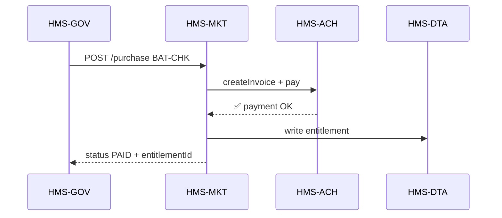

# Chapter 11: Marketplace Service (HMS-MKT)

*[Jump back to Chapter 10: Financial Transaction System (HMS-ACH)](10_financial_transaction_system__hms_ach__.md)*  

---

## 1  Why Do We Need HMS-MKT?

Scenario:

> The **Consumer Product Safety Commission (CPSC)** suddenly needs a
> “Lithium-Battery Recall Checker” widget for its public portal.  
> A small vendor already sells such a checker, but traditional federal
> procurement would take **6-12 months**.

With **HMS-MKT** the agency can:

1. Open the in-platform **Marketplace** (think “App Store for Government”).  
2. Click **Purchase** (funds move instantly via [HMS-ACH](10_financial_transaction_system__hms_ach__.md)).  
3. The checker appears as a plug-in tile inside the CPSC dashboard within minutes.  

No contracts to sign, no new servers to install—just *browse, buy, plug-in*.

---

## 2  Key Concepts in Plain English

| Word | Friendly Analogy |
|------|------------------|
| **Listing** | An app’s product page, like “Lithium-Battery Recall Checker 1.2.” |
| **Plugin** | The actual code bundle to snap into [HMS-MFE](04_micro_frontend_interface_library__hms_mfe__.md) or an agent module for [HMS-AGX](02_ai_representative_agent__hms_agx__.md). |
| **Entitlement** | Your receipt—proof the agency owns a license. |
| **Install Hook** | A setup script that copies the plugin, registers routes, and writes to [HMS-DTA](07_central_data_repository__hms_dta__.md). |
| **Rating & Audit** | Stars + security scan results so buyers trust the listing. |

---

## 3  3-Minute Hands-On Tour

We’ll:

1. List available apps.  
2. Purchase one.  
3. Enable it in a workflow.

### 3.1 List All Apps

```bash
curl /api/mkt/listings
# → [
#   {"id":"BAT-CHK","name":"Lithium-Battery Recall Checker","price":25000},
#   {"id":"FOIA-AN","name":"FOIA Auto-Anonymizer","price":5000}
# ]
```

### 3.2 Purchase the Checker

```python
# buy_checker.py  (≤15 lines)
import httpx, os
listing = "BAT-CHK"
r = httpx.post(
  f"/api/mkt/purchase/{listing}",
  json={ "fund":"OPS_BUDGET_2025" }     # cost centre
).json()
print(r)
# → {'status':'PAID','entitlementId':'ENT-7781'}
```

What happened?  
HMS-MKT called [HMS-ACH](10_financial_transaction_system__hms_ach__.md) to debit $25,000 and created an **entitlement**.

### 3.3 Enable in Workflow

```bash
curl -X POST /api/mkt/install/ENT-7781
# → {"status":"INSTALLED","frontend":"<recall-checker>"}
```

The widget is now discoverable by HMS-MFE; an orchestration step like
`"task":"battery_recall_check"` is auto-added to [HMS-ACT](06_agent_orchestration_engine__hms_act__.md).

---

## 4  What Happens Behind the Curtain?



Afterwards an **install** call:

1. MKT fetches the plugin bundle from the vendor’s registry.  
2. Runs security scan via [HMS-ESQ](08_legal___compliance_module__hms_esq__.md).  
3. Drops the bundle into the **Plugin Folder** used by HMS-MFE / HMS-AGX.  
4. Writes an **Install Log** row in DTA.

---

## 5  Inside the Code (Tiny Peeks)

### 5.1 Purchase Route (Node.js, 18 lines)

```js
// services/mkt/purchase.js
router.post('/purchase/:id', async (req,res)=>{
  const id = req.params.id;
  const app = await Listings.find(id);
  const invoice = await ACH.createInvoice(app.price, app.name);
  await ACH.payInvoice(invoice.id, req.body.fund);
  const ent = await Entitlements.create({ listing:id, invoice:invoice.id });
  res.json({ status:'PAID', entitlementId: ent.id });
});
```

Explanation:  
• Create invoice → pay → store entitlement.  
• Business logic is < 20 lines—procurement in a blink.

### 5.2 Install Hook (Python-style, 15 lines)

```python
def install(entitlement_id):
    ent = db.find("entitlements", entitlement_id)
    bundle = fetch_bundle(ent.listing)          # download zip
    if not esq.scan(bundle): raise Exception("Legal scan failed")
    save_to_plugins(bundle)                     # path: /plugins/BAT-CHK
    db.insert("install_logs", {"ent":entitlement_id})
    return {"status":"INSTALLED"}
```

Beginners’ read: download → legal scan → copy files → log.

### 5.3 Minimal Entitlements Table (SQL, 6 lines)

```sql
CREATE TABLE entitlements (
  id        TEXT PRIMARY KEY,
  listing   TEXT,
  invoice   TEXT,
  installed BOOLEAN DEFAULT false,
  ts        TIMESTAMP DEFAULT now()
);
```

One row proves the agency owns the license.

---

## 6  How Other Layers Interact

| Layer | Interaction with HMS-MKT |
|-------|--------------------------|
| [HMS-GOV](01_governance_layer___admin_portal__hms_gov__.md) | UI for browsing, purchasing, and approving installs. |
| [HMS-ACH](10_financial_transaction_system__hms_ach__.md) | Handles all payments and ledger entries. |
| [HMS-ESQ](08_legal___compliance_module__hms_esq__.md) | Scans every bundle before install; blocks if violations. |
| [HMS-MFE](04_micro_frontend_interface_library__hms_mfe__.md) | Auto-loads newly installed frontend widgets. |
| [HMS-AGX](02_ai_representative_agent__hms_agx__.md) | Gains new agent capabilities when a plugin exports tasks. |
| [HMS-OPS](12_operational_monitoring___logging__hms_ops__.md) | Monitors install success rates & plugin health. |

---

## 7  Frequently Asked Questions

**“Do plugins run in a sandbox?”**  
Yes. Frontend widgets are WebComponents with CSP, and backend tasks run in containerized sidecars with limited scopes.

**“Can I publish my own app?”**  
Submit a `listing.yaml`, upload your bundle, and set pricing. After security review your app appears in the marketplace.

**“What about subscription or per-use pricing?”**  
MKT supports **billing hooks** that call ACH every month or per invocation.

---

## 8  What You Learned

• HMS-MKT is the platform’s **App Store for data feeds, widgets, and AI agents**.  
• You listed apps, bought one, and installed it in under 30 lines of code.  
• Behind the scenes MKT coordinates payments (ACH), legal scans (ESQ), plugin deployment (MFE/AGX), and audit logs (DTA).  

Ready to keep an eye on all these moving parts in real time?  
Continue to [Operational Monitoring & Logging (HMS-OPS)](12_operational_monitoring___logging__hms_ops__.md).

---

Generated by [AI Codebase Knowledge Builder](https://github.com/The-Pocket/Tutorial-Codebase-Knowledge)