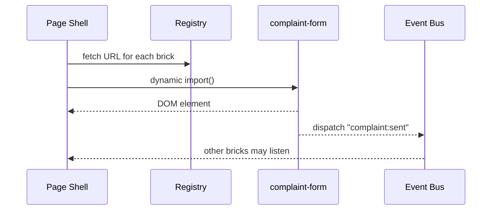

# Chapter 11: Micro-Frontend Interface Layer (HMS-MFE)
[← Back to Chapter 10: Intent-Driven Navigation & Guided Journeys](10_intent_driven_navigation___guided_journeys_.md)

---

## 1. Why Break the UI Into “Tiny Bricks”?

Imagine the U.S. Department of Housing & Urban Development (HUD) site.  
It has:

* a **Complaint Form** (Fair-Housing office)  
* a **Status Card** (Inspector-General dashboard)  
* an **Analytics Widget** (Budget office)

Traditionally, changing _one_ of these requires rebuilding and redeploying **the whole site**.  
With **HMS-MFE** each piece is an independent “LEGO brick.”  
The Fair-Housing team can update the Complaint Form **today** without waiting for the Budget team’s next sprint.

---

## 2. Central Use-Case We’ll Build

> A citizen opens `hud.gov/fair-housing/form`.  
> The page shows three micro-frontends:
> 1.   `complaint-form` (Fair-Housing team)  
> 2.   `status-card`   (Inspector-General team)  
> 3.   `help-chat`     (AI Agent team)

We will load them **at runtime** from three different URLs, but they will still look and behave as one seamless HUD page.

---

## 3. Key Concepts (Beginner Friendly)

| Term | Simple Analogy | One-Sentence Job |
|------|----------------|------------------|
| Shell | Empty LEGO baseplate | Hosts & arranges bricks. |
| Micro-Frontend | Single LEGO brick | Self-contained UI (HTML + JS + CSS). |
| Design Tokens | Paint colors | Shared palette so all bricks match. |
| Version Pinning | “1x2 brick, neon green, rev B” | Guarantees the right file is loaded. |
| Event Bus | Walkie-talkie | Lets bricks talk without tight coupling. |

---

## 4. 18-Line Prototype

Below is a **real** micro-frontend shell you can paste into `index.html`.

```html
<!-- file: index.html  (18 lines) -->
<!DOCTYPE html><html><head>
  <script type="module">
    const registry = {
      'complaint-form': 'https://fair-housing.gov/mfe/complaint.js',
      'status-card'   : 'https://ig.hud.gov/mfe/status.js',
      'help-chat'     : 'https://ai.hud.gov/mfe/chat.js'
    };
    const design = { color:'#205493', font:'Source Sans Pro' };         // tokens

    function loadMFE(name){
      import(registry[name]).then(mod=>{
         const el = mod.render(design);          // each module exports render()
         document.getElementById('root').append(el);
      });
    }

    ['complaint-form','status-card','help-chat'].forEach(loadMFE);
  </script>
</head><body>
  <h1>HUD Fair-Housing Portal</h1>
  <div id="root"></div>
</body></html>
```

**What happens?**

1. The shell imports each remote script **dynamically**.  
2. Every micro-frontend gets the **same design tokens** (`color`, `font`).  
3. Each module returns a DOM element and is slotted into `#root`.

---

### 4.1 A 12-Line Micro-Frontend Module

```js
// file: complaint.js  (12 lines)
export function render(design){
  const form = document.createElement('form');
  form.innerHTML = `
    <label style="color:${design.color}">
       Describe your complaint:<br/>
       <textarea rows="4"></textarea>
    </label><br/>
    <button>Submit</button>`;
  form.style.fontFamily = design.font;
  form.addEventListener('submit', e=>{
     e.preventDefault();
     dispatchEvent(new CustomEvent('complaint:sent'));
  });
  return form;
}
```

*Independent & stylable*, yet still adheres to the shared HUD look.

---

## 5. How Does It Work Behind the Curtain?



---

## 6. Internal Building Blocks (Tiny Code Peeks)

### 6.1 Remote Registry Resolver (8 lines)

```js
// file: mfe/registry.js
export async function resolve(name){
  const res = await fetch(`/api/registry/${name}`);
  if(!res.ok) throw 'Unknown MFE';
  return (await res.json()).url;      // e.g., "https://.../status.js"
}
```

*The registry lives in the [Marketplace Registry](17_marketplace_registry__hms_mkt__.md).*  
This keeps URLs & versions centralized.

### 6.2 Event Bus (14 lines)

```js
// file: mfe/bus.js
const listeners = {};
export function on(topic, fn){ (listeners[topic] ??= []).push(fn); }
export function emit(topic, data){
  (listeners[topic]||[]).forEach(fn=>fn(data));
}
```

Bricks can call `emit('complaint:sent')`; others subscribe via `on(...)`.

### 6.3 Version Pinning Guard (9 lines)

```js
// file: mfe/loader.js
export async function safeImport(name, version){
  const url = await resolve(name);
  const full = `${url}?v=${version}`;
  return import(full);             // browser caches by full URL
}
```

Ensures today’s page always loads **v1.2.3** even if v2.0 ships tomorrow.

---

## 7. How HMS-MFE Integrates with Other Chapters

* Journey steps chosen in [Intent-Driven Navigation](10_intent_driven_navigation___guided_journeys_.md) **map 1-to-1** to micro-frontends (`upload_insurance ➜ upload-mfe`).  
* Identity tokens from the upcoming [Universal Identity & Access](12_universal_identity___access__account___authn__.md) are injected into every brick via the shell, so each team needn’t re-implement login.  
* Runtime policy checks on API calls go through [Compliance Guardrail Framework](05_compliance_guardrail_framework__hms_esq__.md).  
* Performance and error metrics for every brick stream into [System Observability & Ops Center](19_system_observability___ops_center__hms_ops__.md).

---

## 8. 60-Second Lab

1.  Create a folder with `index.html` and `complaint.js` from Sections 4 & 4.1.  
2.  Run a tiny web server:

    ```bash
    npx serve .
    ```

3.  Open `localhost:3000` – you’ll see the form and “Submit” button.  
4.  Add a new file `help.js` with:

    ```js
    export const render = d=>{
      const b=document.createElement('button');
      b.textContent='Live Chat';
      return b;
    };
    ```

    Insert it into the `registry` and refresh—**no rebuilds needed**.

Congrats! You just hot-plugged a UI brick into a running page. 🎉

---

## 9. Recap & What’s Next

* HMS-MFE lets multiple agency teams ship independent UI bricks that snap together at runtime.  
* A small **shell** + **registry** + **design tokens** keep everything looking uniform and policy-compliant.  
* You’ve loaded, version-pinned, and hot-swapped micro-frontends with under 30 lines of code.

In the next chapter we’ll connect those bricks to a single sign-on and permission system so users never re-enter credentials:  
[Chapter 12: Universal Identity & Access (Account & AuthN)](12_universal_identity___access__account___authn__.md)

---

---

Generated by [AI Codebase Knowledge Builder](https://github.com/The-Pocket/Tutorial-Codebase-Knowledge)