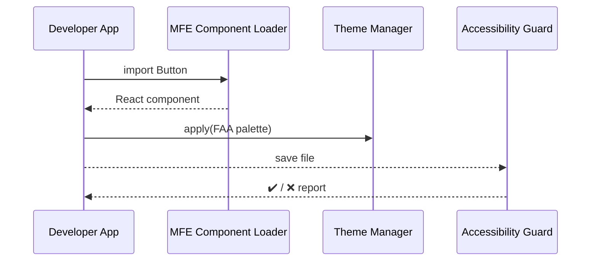

# Chapter 11: Micro-Frontend Library (HMS-MFE)

*(If you just finished wiring real money through the [Financial Clearinghouse (HMS-ACH)](10_financial_clearinghouse__hms_ach__.md) you might be thinking, “Great, the backend is humming—now how do I build a friendly, 508-compliant UI **fast**?”  HMS-MFE is the answer.)*

---

## 1. Why Do We Need HMS-MFE?

Picture the **Internal Revenue Service (IRS)** launching a new *Energy-Efficient Home Credit* form before tax season ends.  

Old way  
1. A React dev designs buttons from scratch.  
2. A designer tweaks them for color-blind contrast.  
3. A lawyer checks 508 compliance.  
4. Weeks slip by… taxpayers wait.

**HMS-MFE turns that month into an afternoon.**  
Think of it as a LEGO set:

* **Bricks** = pre-built buttons, date-pickers, form steps.  
* **Studs** = built-in accessibility & design tokens.  
* **Instructions** = copy-paste snippets and go.

Beginners snap blocks together; experts skin them to match agency branding (e.g., FAA blue dashboards).

---

## 2. Key Building Blocks

| LEGO Analogy | HMS-MFE Part | What It Does (plain English) |
|--------------|-------------|------------------------------|
| Brick        | **UI Component** | `<Button>`, `<Chart>`, `<FormStep>`—ready to drop in. |
| Baseplate    | **Layout Grid**  | Keeps spacing & mobile break-points consistent. |
| Paint Set    | **Theme Palette**| Colors, fonts, spacing tokens per agency. |
| Safety Check | **A11y Guard**   | Lints code for 508 & WCAG issues on save. |
| Instruction Book | **Storybook Playground** | Live gallery + copyable code for every component. |

You only need **UI Component** and **Theme Palette** to ship something useful; the rest come free.

---

## 3. Hands-On: Build a Tax-Credit Form in 10 Lines

```tsx
// CreditForm.tsx  (React, <20 lines)
import { Form, TextField, DateField, Button } from "hms-mfe";

export function CreditForm() {
  return (
    <Form title="Energy-Efficient Home Credit">
      <TextField  label="Taxpayer Name"    name="name"     required />
      <DateField  label="Installation Date" name="install" required />
      <Button     type="submit">Submit Claim</Button>
    </Form>
  );
}
```

Explanation  
1. Import from `"hms-mfe"`—one package, zero config.  
2. Accessibility labels & keyboard navigation come baked in.  
3. Submitting fires `onSubmit` (not shown) where you can call the IRS API.

---

## 4. Theme an FAA Dashboard in 6 Lines

```ts
// index.tsx
import { ThemeProvider, createTheme, Button } from "hms-mfe";

const faa = createTheme({ primary:"#0033a0", accent:"#e31c3d" });

root.render(
  <ThemeProvider theme={faa}>
      <Button>Check Flight Status</Button>
  </ThemeProvider>
);
```

Change two hex codes → every component (charts, alerts, tabs) now matches FAA branding—no CSS gymnastics.

---

## 5. Run an Instant Accessibility Check

```bash
# terminal
npx hms-mfe a11y CreditForm.tsx
```

Sample output:

```
✅  No contrast violations
✅  All inputs have labels
```

Red ❌ lines appear if you forget a label or use low-contrast text. Fixes take seconds, not FOIA requests.

---

## 6. What Happens Behind the Scenes?



Four hops, all local—no network latency, no mystery.

---

## 7. Peek Under the Hood

### 7.1 Component Registry (TypeScript, 18 Lines)

```ts
// mfe/registry.ts
const components = new Map();

export function register(name, cmp){
  components.set(name, cmp);
}

export function get(name){
  if(!components.has(name)) throw `Unknown ${name}`;
  return components.get(name);
}
```

Every `<Button>` or `<Chart>` is just a key in this map.  
Beginners never touch it; advanced teams can `register("RocketGauge", MyGauge)` to extend the library.

---

### 7.2 Theme Merge Helper (Python, 14 Lines)

```py
# mfe/theme.py
DEFAULT = {"primary":"#005ea2", "accent":"#e31c3d"}

def merge(user):
    merged = {**DEFAULT, **user}   # user colors override defaults
    return merged
```

Two lines deliver agency-specific branding while inheriting U.S. Web Design System defaults.

---

## 8. How HMS-MFE Plays With Other Modules

| Module | What Connects |
|--------|---------------|
| [Government/Admin Portal (HMS-GOV)](01_government_admin_portal__hms_gov__.md) | All dashboards & buttons are MFE bricks. |
| [Workflow Hub (HMS-OMS)](08_workflow___task_management_hub__hms_oms__.md) | `<Timeline>` component shows ticket stages. |
| [Operations & Observability Suite (HMS-OPS)](15_operations___observability_suite__hms_ops__.md) | `<AlertBanner>` surfaces live outage notices. |
| [Marketplace & Capability Registry (HMS-MKT)](12_marketplace___capability_registry__hms_mkt__.md) | Publishes new agency themes & add-on components. |

---

## 9. Mini-FAQ

**Q: Do I need React?**  
A: Components ship in native Web Components too:  
```html
<mfe-button variant="primary">Click</mfe-button>
```

**Q: How big is the bundle?**  
A: ≈50 KB gzipped for common widgets; tree-shake to pull only what you use.

**Q: Can I override CSS?**  
A: Yes—pass a custom theme or use the `className` prop; internal styles are scoped to avoid leaks.

**Q: Is it really 508 compliant out-of-the-box?**  
A: Every release passes automated Axe + manual keyboard tests before it hits [AI Governance Layer](04_ai_governance_layer_.md) guardrails.

---

## 10. Recap & What’s Next

You just:

• Learned how HMS-MFE is the **LEGO kit** for fast, consistent, accessible gov UIs.  
• Built a tax-credit form in 10 lines, themed it in 6, and ran an a11y check in 1 command.  
• Peeked inside the component registry and theme merge code.  
• Saw where MFE plugs into dashboards, tickets, and ops alerts across HMS-SME.

Ready to **publish** your shiny new components so other agencies can reuse them?  
Jump to the marketplace in [Marketplace & Capability Registry (HMS-MKT)](12_marketplace___capability_registry__hms_mkt__.md).

---

Generated by [AI Codebase Knowledge Builder](https://github.com/The-Pocket/Tutorial-Codebase-Knowledge)