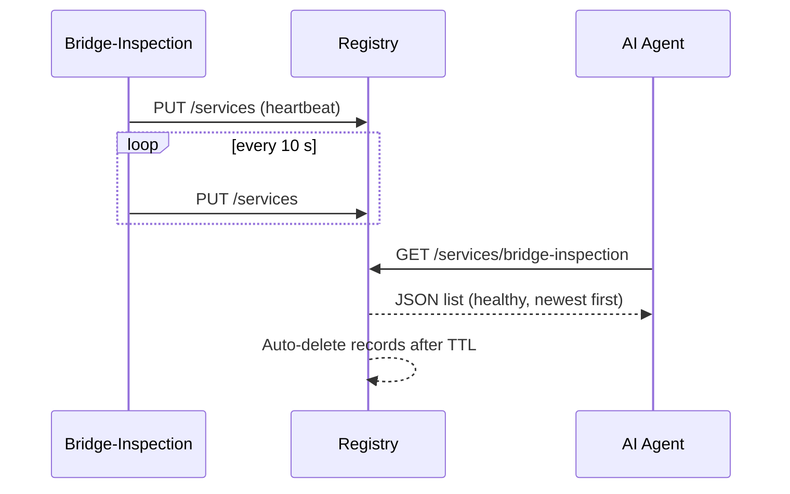

# Chapter 11: Microservice Registry & Discovery  
*A friendly continuation from* [Data Privacy & Compliance Guardrails](10_data_privacy___compliance_guardrails_.md)  

---

## 1 Why Do We Need a “Digital Phonebook”?

Imagine the Department of Transportation (DOT) just pushed **v1.7** of its *Bridge-Inspection* microservice.  
Within minutes:

* the **AI Scheduling Agent** must call the new endpoint to plan next-day inspections,  
* the **Metrics Dashboard** must scrape fresh health stats,  
* older replicas (v1.6) must quietly vanish from all calls.

If a single consumer keeps dialing the *retired* service, wrong data—or outages—follow.  
**Microservice Registry & Discovery** is the always-current **phonebook** that:

1. Lets every service **publish its address & version**.  
2. Answers the question **“Who is healthy right now?”** in milliseconds.  
3. Makes sure callers **never hit stale or dead endpoints**.

Result: new code rolls out, traffic instantly finds it, and nobody edits config files at 3 a.m. 🎉

---

## 2 Big Ideas in Plain English

| Term | Think of it as… | Why it matters |
|------|-----------------|----------------|
| Service Record | Phonebook entry | Holds `name`, `URL`, `version`, `last_heartbeat` |
| Registry | Central phonebook | Stores all records in one place |
| Discovery Client | Auto-dialer | Asks the registry **“Give me a healthy Bridge-Inspection”** |
| TTL (Time-to-Live) | Expiration date | If a service stops checking-in, its record auto-expires |
| Health Check | “Are you alive?” ping | Keeps false numbers out of the phonebook |

---

## 3 Core Use Case: AI Agent Finds the Right Bridge-Inspection Service

Step-by-step goal:  
*AI Agent* needs to call **/schedule** on the *Bridge-Inspection* API and must land on the **latest healthy version**.

We will:

1. Register *Bridge-Inspection v1.7* with a 20-line script.  
2. Query the registry from the AI Agent.  
3. Watch the registry auto-drop a dead instance.

---

### 3.1 Registering a Service (Python – 15 lines)

```python
# register.py
import requests, socket, os, json, time

REG = os.getenv("REGISTRY", "http://registry:8000")
SELF = {
  "name": "bridge-inspection",
  "version": "1.7.0",
  "url": f"http://{socket.gethostbyname(socket.gethostname())}:9000",
  "ttl": 30        # seconds
}

while True:                         # send a heartbeat every 10 s
    requests.put(f"{REG}/services", json=SELF, timeout=2)
    time.sleep(10)
```

Beginner explanation  
• Sends a `PUT /services` with the service’s details.  
• `ttl` means “delete my record if no heartbeat arrives for 30 s.”  
• A loop keeps the record fresh; kill the process and it silently disappears.

---

### 3.2 Discovering a Service (AI Agent – 12 lines)

```python
import requests, os

REG = os.getenv("REGISTRY", "http://registry:8000")

def lookup(name):
    r = requests.get(f"{REG}/services/{name}")
    # returns list sorted by newest, healthiest first
    svc = r.json()[0]                 # pick top record
    return svc["url"]

bridge_api = lookup("bridge-inspection")
resp = requests.post(f"{bridge_api}/schedule", json={"date":"2024-07-01"})
print(resp.status_code)               # 200 = success!
```

Explanation  
1. One `GET` fetches all healthy instances.  
2. Chooses the first (latest version, passing health checks).  
3. AI Agent never hard-codes hostnames—always calls `lookup()` first.

---

### 3.3 Watch Auto-Cleanup (CLI – 3 commands)

```bash
# 1. See record alive
curl http://registry:8000/services/bridge-inspection
# 2. Kill the service container
docker stop bridge-v1_7
# 3. Wait 30 s, query again – record is gone!
curl http://registry:8000/services/bridge-inspection
```

The phonebook stays clean without human hands.

---

## 4 What Happens Under the Hood?



Four moving parts, all simple:

1. Service says “I’m alive” every few seconds.  
2. Registry stores/refreshes the record.  
3. Callers ask “Who’s alive?” on demand.  
4. TTL sweeps remove stale entries.

---

## 5 Peek Inside the Registry (≤ 18 Lines)

```python
# registry.py  (tiny Flask app)
from flask import Flask, request, jsonify
import time, threading

app = Flask(__name__)
book = {}     # key -> record dict
lock = threading.Lock()

@app.put("/services")
def upsert():
    rec = request.json | {"last": time.time()}
    with lock:
        book[rec["name"], rec["url"]] = rec
    return "", 204

@app.get("/services/<name>")
def get_service(name):
    now = time.time()
    alive = [r for (n,_),r in book.items()
             if n == name and now - r["last"] < r["ttl"]]
    alive.sort(key=lambda r: (-r["last"], -float(r["version"].split(".")[1])))
    return jsonify(alive)
```

Explain the code line-by-line  
1. `book` is an in-memory dict: key is `(name,url)`.  
2. `upsert()` stores heartbeat with a timestamp.  
3. `get_service()` filters out expired records (`now - last > ttl`).  
4. Sorts newest heartbeat + highest minor version first.  
5. Returns JSON list; empty list means “service unavailable.”

*(Production registries like Consul, etcd, or Eureka add clustering & persistence, but the ideas stay identical.)*

---

## 6 Relationship to Other HMS-UTL Layers

• **Service Mesh** – Sidecars use the registry instead of static DNS when routing traffic. (See [Backend Services Mesh](09_backend_services_mesh__hms_svc__.md))  
• **Governance Layer** – Registry tags each record with the active `X-Policy-Version` coming from [Governance Layer](01_governance_layer__hms_gov__.md).  
• **Metrics Dashboard** – Health-check failures & TTL expirations feed live charts in [Metrics & Monitoring Dashboard](15_metrics___monitoring_dashboard_.md).  
• **Continuous Delivery** – New versions auto-appear during blue/green deploys, as you’ll see in [Continuous Delivery & Compliance Pipeline](12_continuous_delivery___compliance_pipeline_.md).

---

## 7 Frequently Asked Questions

**Q: What if two versions are both healthy?**  
A: Registry sorts by *version* then by *freshness*. Callers can also request `?version=1.6.*` to target a specific line.

**Q: Do I need a load-balancer now?**  
A: No. The caller picks one healthy URL. Combined with the Service Mesh’s retries, this is usually enough. Large loads can still put a LB in front—registry keeps it updated.

**Q: How are health checks defined?**  
A: Each service exposes `/health` (200 OK). Registry pings it every `health_interval` seconds; three failures mark the record unhealthy.

**Q: Does registry data survive a reboot?**  
A: In production, registry nodes store data in Raft-backed storage. Our toy code is RAM-only for clarity.

---

## 8 What You Learned

• The Registry is a live phonebook: services add their number; callers look it up.  
• Heartbeats + TTL keep the phonebook free of dead numbers.  
• A 12-line caller and a 15-line registrar are enough to demo the pattern.  
• Other HMS-UTL layers (mesh, governance, CI/CD, metrics) lean on the registry for fresh, trustworthy endpoints.

Ready to see how new service versions roll through the pipeline **and** trigger registry updates automatically?  
Jump to [Continuous Delivery & Compliance Pipeline](12_continuous_delivery___compliance_pipeline_.md).

---

Generated by [AI Codebase Knowledge Builder](https://github.com/The-Pocket/Tutorial-Codebase-Knowledge)