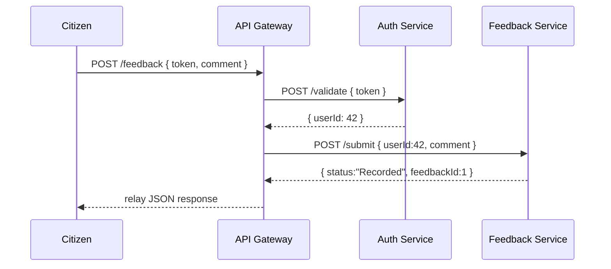

# Chapter 11: Microservices Architecture

Welcome back! In [Chapter 10: Management Layer](10_management_layer_.md) we learned how workflows, tasks, and resources get coordinated across departments. Now we’ll zoom out one level and see the big picture: the **Microservices Architecture** that lets each feature—like user authentication, citizen feedback, or budget approvals—run as its own independent service, yet all work together like a well-organized fleet of specialized vehicles.

---

## 1. Why Microservices?

Imagine a government motor pool with different vehicles:

- A sedan carries the public’s basic requests (login, profiles).  
- A pickup truck hauls citizen feedback to the right department.  
- A cargo van delivers budget approvals to finance systems.  

Each has its own job and driver, but they share roads, gas stations, and traffic rules. If one vehicle breaks down, the rest still run—our system stays online even when one microservice needs maintenance.

### Central Use Case

A citizen logs in, submits feedback on a new recycling policy, and later checks the budget approval status for funding that policy:

1. **Auth Service** validates the citizen’s token.  
2. **Feedback Service** records the comment.  
3. **Policy Service** flags the suggestion for review.  
4. **Budget Service** shows current approval state.

All calls flow through a lightweight **API Gateway** that directs each request to the right microservice.

---

## 2. Key Concepts

1. **Service Independence**  
   Each microservice owns its codebase, database, and deployment.  

2. **Loose Coupling**  
   Services communicate over APIs (usually HTTP/REST), not by sharing code.  

3. **Scalability**  
   You can scale only the busy services (e.g., the Feedback Service) without touching others.  

4. **Failure Isolation**  
   One service crashing doesn’t take down the entire system.  

5. **API Gateway**  
   A single entry point that routes requests to the appropriate microservice based on URL paths.

---

## 3. How to Use This Abstraction

Let’s build a minimal gateway and two tiny services: **Auth** and **Feedback**.

### 3.1 API Gateway (gateway.js)

```js
// gateway.js
const express = require('express');
const fetch = require('node-fetch');
const app = express();
app.use(express.json());

// Route to Auth Service
app.post('/login', async (req, res) => {
  const authRes = await fetch('http://localhost:3001/validate', {
    method:'POST', body: JSON.stringify(req.body), headers:{'Content-Type':'application/json'}
  });
  const data = await authRes.json();
  res.status(authRes.status).json(data);
});

// Route to Feedback Service
app.post('/feedback', async (req, res) => {
  const fbRes = await fetch('http://localhost:3002/submit', {
    method:'POST', body: JSON.stringify(req.body), headers:{'Content-Type':'application/json'}
  });
  const result = await fbRes.json();
  res.status(fbRes.status).json(result);
});

app.listen(3000, ()=>console.log('API Gateway on :3000'));
```

Explanation:  
- Client calls `/login` or `/feedback` on port 3000.  
- Gateway forwards to service at ports 3001 (Auth) or 3002 (Feedback).  

### 3.2 Auth Service (authService.js)

```js
// authService.js
const express = require('express');
const app = express();
app.use(express.json());

app.post('/validate', (req, res) => {
  const { token } = req.body;
  // Dummy check: any token "citizen123" is valid
  if (token === 'citizen123') res.json({ userId: 42 });
  else res.status(401).json({ error: 'Invalid token' });
});

app.listen(3001, ()=>console.log('Auth Service on :3001'));
```

Explanation:  
- Verifies a token and returns a user ID or an error.

### 3.3 Feedback Service (feedbackService.js)

```js
// feedbackService.js
const express = require('express');
const app = express();
let feedbackDB = []; // in-memory store
app.use(express.json());

app.post('/submit', (req, res) => {
  const entry = { id: feedbackDB.length+1, ...req.body };
  feedbackDB.push(entry);
  res.json({ status: 'Recorded', feedbackId: entry.id });
});

app.listen(3002, ()=>console.log('Feedback Service on :3002'));
```

Explanation:  
- Accepts `{ userId, comment }`, stores it, and returns a new `feedbackId`.

---

## 4. Under the Hood: Request Flow

Here’s how a feedback submission travels from the citizen to the Feedback Service:



1. Gateway first checks the token with Auth Service.  
2. On success, Gateway calls Feedback Service with `userId`.  
3. Feedback Service records the comment and returns an ID.

---

## 5. Internal Implementation Details

Each service is just a small Express app listening on its own port. In production you’d:

- Use Docker or Kubernetes to deploy each microservice.  
- Protect your services behind a real API Gateway (e.g., NGINX, Kong).  
- Add service discovery and health checks.  
- Store data in separate databases (PostgreSQL, MongoDB, etc.).

But the core idea remains:  
- **One service = one responsibility.**  
- **API Gateway = single entry point.**  
- **Services talk via simple HTTP calls.**

---

## Conclusion

You’ve seen how **Microservices Architecture** breaks a large system into small, independent services—like a fleet of specialized vehicles—so each can be built, deployed, and scaled on its own while still working together. Next up, we’ll explore the low-level plumbing that makes this possible: the [Core Infrastructure (HMS-SYS)](12_core_infrastructure__hms_sys__.md).

---

Generated by [AI Codebase Knowledge Builder](https://github.com/The-Pocket/Tutorial-Codebase-Knowledge)