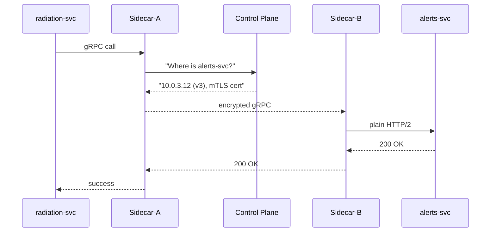

# Chapter 11: Microservices Mesh & Service Registry  
[← Back to Chapter 10: Backend Policy Deployment Pipeline](10_backend_policy_deployment_pipeline_.md)

---

## 0. Why Do We Need an “Air-Traffic Tower” for APIs?

Imagine the **Defense Threat Reduction Agency (DTRA)** has three micro-services:

1. `radiation-svc` – returns sensor readings near bases.  
2. `alerts-svc` – pushes SMS if readings spike.  
3. `report-svc` – drafts a situation report for the Joint Chiefs.

At 02:00 a.m. a spike occurs in Guam.  
Within **200 ms** we must:  
* Encrypt every hop (classified data).  
* Retry if `alerts-svc` burps.  
* Make sure we’re calling the **latest** `alerts-svc:v3` pod, not the old v2 stuck in a forgotten zone.  
* Trip a circuit-breaker before a flood of retries melts the cluster, and page an SRE.

That coordination job is the **Microservices Mesh & Service Registry**.  
Think of it as a **control tower**: planes (service calls) still fly themselves, but the tower tells each one **where** to go, **when**, under strict **rules of the sky**.

---

## 1. Key Concepts (Plain-English Cheat-Sheet)

| Concept | Beginner Explanation | Analogy |
|---------|----------------------|---------|
| Sidecar Proxy | Tiny container injected next to each service; handles traffic for it. | A personal translator whispering in your ear. |
| Service Mesh | The network of all sidecars + a central “control plane.” | Air-traffic system with radars & radios. |
| mTLS | Mutual TLS encryption and identity for service-to-service calls. | Two diplomats exchanging passports **before** talking. |
| Circuit-Breaker | Auto-stops calls to an unhealthy service. | “Runway closed” sign. |
| Service Registry | Phone book that says which instance & version is healthy. | The tower’s arrival/departure board. |
| Observability Dashboard | Real-time view of latency, error rate, breaker status. | Radar screen with red blips. |

---

## 2. A 3-Minute Walk-Through: “Send Radiation Alert”

### 2.1 10-Line gRPC Call (Service Code)

```python
# radiation_svc/client.py  (≤10 lines)
import grpc, alerts_pb2, alerts_pb2_grpc

def send_alert(msg):
    # Mesh injects certificates + routing, we just dial the Mesh DNS
    channel = grpc.insecure_channel("alerts-svc.mesh:50051")
    stub = alerts_pb2_grpc.AlertStub(channel)
    stub.Push(alerts_pb2.AlertMessage(text=msg))
```

What happens **without** extra code from you:

1. The sidecar transparently **upgrades** this to mTLS.  
2. Service Registry resolves `alerts-svc` → `10.0.3.12` (v3).  
3. If the first pod is sick, the mesh retries on pod 2.  
4. Circuit-breaker opens after N failures, preventing a thundering herd.  
5. Dashboards show the breaker in yellow; on-call SRE wakes up.

---

## 3. Under the Hood (Step-By-Step)



Only **five** participants—simple to visualize.

---

## 4. Using the Mesh & Registry (Hands-On in 4 Steps)

> We’ll use **Istio** (open-source) because it’s easy to demo, but Linkerd, Consul Connect, or AWS App Mesh work similarly.

```bash
# 1. Install a tiny K8s (kind) + Istio
kind create cluster --name hms-demo
istioctl install -y

# 2. Label the namespace so Istio auto-injects sidecars
kubectl create ns dtra && kubectl label ns dtra istio-injection=enabled

# 3. Deploy two demo services (YAML < 20 lines each, omitted for brevity)
kubectl apply -n dtra -f radiation-svc.yaml
kubectl apply -n dtra -f alerts-svc.yaml

# 4. Exec into radiation pod & call alerts-svc
kubectl -n dtra exec -it deploy/radiation-svc -- python client.py
```

Open `http://localhost:15014/healthz/ready` (Istio control plane) → you should see “SERVING”.  
Grafana dashboards (auto-installed) now show **mTLS: ON**, **Retries: 0**, **Breaker: CLOSED**.

---

## 5. How Do Services Register Themselves?

A sidecar **auto-reports** to the Registry when the pod becomes `Ready`.

Tiny pseudo-code (just 8 lines):

```go
// mesh/agent.go
func onPodReady(pod Pod) {
    info := ServiceInfo{
       Name:  pod.Labels["app"],
       Addr:  pod.IP,
       Ver:   pod.Labels["version"],
    }
    registry.Register(info)   // gRPC call to control plane
}
```

Explanation:  
• No app code involved; the mesh agent listens to Kubernetes events.  
• `registry.Register` stores the tuple `{name, addr, version, health}`.

---

## 6. Observability: Catch Outages *Before* Citizens Do

Add a **query** in Grafana (provided out-of-the-box by Istio):

```
istio_requests_total{destination_service="alerts-svc.mesh", response_code="5xx"}
```

Create an alert rule: **>50 errors in 5 min = PagerDuty trigger**.

Small JSON (11 lines):

```json
{
  "name": "alerts-svc 5xx spike",
  "expr": "sum(rate(istio_requests_total{destination_service=\"alerts-svc.mesh\",response_code=~\"5..\"}[5m])) > 50",
  "for": "2m",
  "labels": { "severity": "critical" },
  "annotations": { "summary": "High 5xx from alerts-svc" }
}
```

Result: the mesh acts as an **early-warning radar**; SREs can roll back using [Backend Policy Deployment Pipeline](10_backend_policy_deployment_pipeline_.md) **before** Guam’s base commander calls.

---

## 7. Minimal Folder Snapshot

```
mesh-and-registry/
├─ manifests/
│  ├─ radiation-svc.yaml
│  └─ alerts-svc.yaml
├─ client-code/
│  └─ radiation_client.py
└─ docs/
   └─ istio_setup.md
```

### Example `radiation-svc.yaml` (17 lines)

```yaml
apiVersion: apps/v1
kind: Deployment
metadata: { name: radiation-svc }
spec:
  replicas: 1
  selector: { matchLabels: { app: radiation-svc } }
  template:
    metadata:
      labels: { app: radiation-svc, version: v1 }
    spec:
      containers:
      - name: app
        image: gov/dtra-radiation:v1
        ports: [ { containerPort: 5000 } ]
```

Deploying this is **all** you need; Istio injects its sidecar automatically.

---

## 8. How This Integrates with Other HMS-ACT Layers

* **Security Guardrails** ([Chapter 8](08_security___privacy_guardrails_.md)) – mesh enforces mTLS; guardrails still scan the payload content.  
* **Role Matrix** ([Chapter 7](07_role_based_access___entitlement_matrix_.md)) – mesh can attach user JWT to the request as a header; downstream services still call `/check`.  
* **Deployment Pipeline** ([Chapter 10](10_backend_policy_deployment_pipeline_.md)) – when a green deployment flips to production, the mesh registry instantly updates routing; no DNS TTL waits.  
* **Autonomous Accountability Engine** ([Chapter 15](15_autonomous_accountability_engine_.md)) – consumes mesh metrics to score “agency uptime compliance.”

---

## 9. Common Questions

**Q: Do I *have* to learn Envoy configs?**  
A: Not for day-one. Most defaults are fine; 90 % of devs never touch the YAML. Advanced teams can tweak retries or timeouts later.

**Q: What about external calls (e.g., FEMA APIs)?**  
A: The mesh can **egress** through a controlled gateway with its own mTLS certs, providing the same observability.

**Q: Isn’t this heavy for small services?**  
A: Sidecar memory ≈ 50 MiB. For low-traffic agencies, use **ambient mesh** (Istio CNI) to share one proxy per node.

**Q: How does blue-green affect the registry?**  
A: Both `alerts-svc:blue` and `alerts-svc:green` report in. The control plane weights traffic 90/10, 50/50, then 100/0 as instructed by the pipeline.

---

## 10. What You Learned

• A **Service Mesh** transparently encrypts, retries, and health-checks every call.  
• A **Service Registry** tracks live pods + versions so code never hard-codes IPs.  
• Sidecars inject themselves; app code stays blissfully ignorant.  
• Dashboards & circuit-breakers give SREs radar-level visibility.  

Ready to see how HMS-ACT talks to ***external*** systems like FEMA, IRS, or state databases?  
Head to [Chapter 12: External System Sync Adapter](12_external_system_sync_adapter_.md).

---

Generated by [AI Codebase Knowledge Builder](https://github.com/The-Pocket/Tutorial-Codebase-Knowledge)