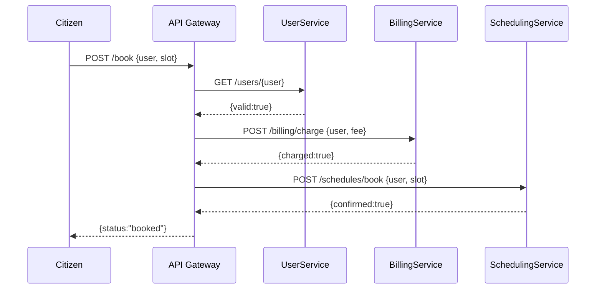

# Chapter 11: Modular Microservices Structure

In [Chapter 10: Core Infrastructure (HMS-SYS)](10_core_infrastructure__hms_sys__.md) we built the “utilities” of our platform—authentication, logging, configuration. Now let’s break our system into small, independent neighborhoods that talk over APIs. This is the **Modular Microservices Structure**.

---

## 1. Motivation & Use Case

Imagine the Consumer Product Safety Commission runs an online recall-notification system. In a monolith, one bug in the scheduling module (when inspectors set inspection times) might force you to redeploy the entire application. With microservices:

- **User Management** runs on its own, handling logins.  
- **Billing** handles fines and reimbursements.  
- **Scheduling** handles inspection calendars.  

Each “department” of the system can be built, tested, deployed, and scaled independently—just like a city’s water, power, and transit agencies all have their own teams but share data.

---

## 2. Key Concepts

1. **Service Neighborhood**  
   A self-contained service (e.g., `user-service`, `billing-service`, `schedule-service`) with its own code, data, and team.

2. **API Communication**  
   Services talk only via well-defined HTTP or messaging APIs—no direct database sharing.

3. **Independent Deployment & Scaling**  
   You can update or scale one service (e.g., add more scheduling instances) without touching others.

4. **Fault Isolation**  
   If the billing service crashes, scheduling and user-management keep running.

---

## 3. High-Level Flow

When a citizen books an inspection slot, the request might travel like this:



---

## 4. Frontend to Microservices via API Gateway

Here’s a minimal `api-gateway.js` that routes calls to each microservice:

```js
// File: api-gateway.js
const express = require('express');
const fetch   = require('node-fetch');
const app     = express();
app.use(express.json());

// Forward user check
app.get('/users/:id', (req,res) =>
  fetch(`http://user-service/users/${req.params.id}`)
    .then(r=>r.json()).then(data=>res.json(data))
);

// Forward billing
app.post('/billing/charge', (req,res) =>
  fetch('http://billing-service/charge',{
    method:'POST', body:JSON.stringify(req.body),
    headers:{'Content-Type':'application/json'}
  }).then(r=>r.json()).then(data=>res.json(data))
);

// Forward scheduling
app.post('/schedules/book', (req,res) =>
  fetch('http://schedule-service/book',{
    method:'POST', body:JSON.stringify(req.body),
    headers:{'Content-Type':'application/json'}
  }).then(r=>r.json()).then(data=>res.json(data))
);

app.listen(3000, ()=>console.log('API Gateway up on 3000'));
```

> Explanation:  
> - The **API Gateway** listens on port 3000.  
> - It simply forwards requests to the right service and returns responses.

---

## 5. Inside a Microservice

Below is a tiny `schedule-service` that books slots in its own database:

```js
// File: schedule-service/index.js
const express = require('express');
const app     = express();
app.use(express.json());

let slots = {}; // in-memory for demo

app.post('/book', (req,res) => {
  const {user, slot} = req.body;
  if (slots[slot]) {
    return res.status(400).json({error:'Slot taken'});
  }
  slots[slot] = user;
  res.json({confirmed:true, slot});
});

app.listen(4002, ()=>console.log('SchedulingService on 4002'));
```

> Explanation:  
> - This service keeps its own `slots` state.  
> - It never reaches into another service’s database.

---

## 6. Putting It All Together

1. **API Gateway** routes each endpoint to the right microservice.  
2. **UserService** manages identities.  
3. **BillingService** processes fees.  
4. **SchedulingService** books calendar slots.  

Each service has its own lifecycle:

- Code repository  
- CI/CD pipeline  
- Container or VM  
- Autoscaling rules

---

## 7. Summary & Next Steps

You’ve learned how **Modular Microservices Structure** breaks a platform into independent “neighborhoods” that:

- Communicate via APIs  
- Deploy and scale on their own  
- Improve reliability and team autonomy  

With this structure in place, you can add new services—like a **NotificationService**—without touching existing ones.  

Up next, we’ll explore how these microservices expose their functionality as reusable **[Backend Services (HMS-SVC)](12_backend_services__hms_svc__.md)**.

---

Generated by [AI Codebase Knowledge Builder](https://github.com/The-Pocket/Tutorial-Codebase-Knowledge)