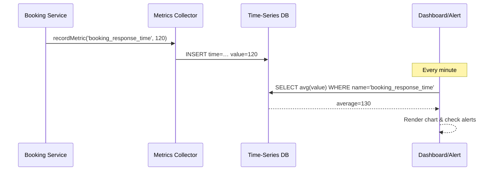

# Chapter 11: Monitoring & Metrics Engine

In [Chapter 10: Security & Compliance Framework](10_security___compliance_framework_.md) we learned how to lock down HMS-EMR with authentication, authorization, auditing, and encryption. Now, let’s look at how to **watch** the health and performance of all those services by building our **Monitoring & Metrics Engine**—the reporting backbone that tracks KPIs like response times, error rates, and satisfaction scores. Think of it like a public-health dashboard that flags outbreaks, resource usage, and outcome measures across your system.

---

## 1. Why Monitoring & Metrics Matter

Imagine the Centers for Disease Control (CDC) runs an online portal for vaccine appointments. They need to know:

- Are appointment lookups fast enough?  
- How often do requests fail?  
- Are citizens happy with response times?

Without a metrics engine, problems hide until citizens complain. With monitoring, you get real-time graphs and alerts—just like how a public-health dashboard shows infection spikes.

**Central Use Case**  
Nurse Alicia books a new vaccine slot. Behind the scenes:

1. The booking service logs “response_time=120ms.”  
2. An aggregator stores it.  
3. A dashboard shows the average over the last hour.  
4. If it spikes above 300 ms, an alert is fired to the on-call engineer.

---

## 2. Key Concepts

1. **Metric**  
   A named measurement (e.g., `response_time`, `error_count`, `sat_score`).

2. **Collector**  
   Library code you sprinkle in services to record metrics.

3. **Store**  
   A time-series database where metrics are saved (e.g., InfluxDB, Prometheus).

4. **Aggregator**  
   Processes raw metrics into summaries (averages, percentiles).

5. **Dashboard & Alerts**  
   Visual charts for KPIs and rules that notify you when thresholds are breached.

---

## 3. Using the Monitoring API

Below is a minimal example of how a booking service records and queries metrics.

```js
// bookingService.js
import { recordMetric, queryMetric } from './metrics/collector';

// 1. Record a response time
async function bookSlot(req, res) {
  const start = Date.now();
  // ... do booking logic ...
  const elapsed = Date.now() - start;
  recordMetric('booking_response_time', elapsed);
  res.send({ status: 'ok' });
}

// 2. Query average over last 5 minutes
async function getStats() {
  const avgTime = await queryMetric('booking_response_time', { window: '5m', agg: 'avg' });
  console.log('Avg booking time:', avgTime);
}
```

Explanation:  
- `recordMetric(name, value)` sends data to your collector.  
- `queryMetric(name, options)` fetches an aggregated value from the store.

---

## 4. What Happens Under the Hood?



1. **Service** calls the **Collector**.  
2. **Collector** writes to the **Store**.  
3. **Dashboard** polls the store, builds charts, and triggers alerts.

---

## 5. Internal Implementation Breakdown

All code lives under `src/metrics/`. Let’s peek at three small files.

### 5.1 src/metrics/collector.js

```js
// Collector sends and queries metrics
import fetch from 'node-fetch';

export function recordMetric(name, value) {
  // In reality, batch and retry for efficiency
  fetch('http://metrics-store:4000/ingest', {
    method: 'POST',
    headers: {'Content-Type':'application/json'},
    body: JSON.stringify({ name, value, timestamp: Date.now() })
  });
}

export async function queryMetric(name, { window, agg }) {
  const res = await fetch(
    `http://metrics-store:4000/query?name=${name}&window=${window}&agg=${agg}`
  );
  const data = await res.json();
  return data.result;
}
```

> A simple HTTP client to ingest and query metrics.

### 5.2 src/metrics/store.js

```js
// A toy in-memory store for demo purposes
const db = {};

export function ingest({ name, value, timestamp }) {
  db[name] = db[name] || [];
  db[name].push({ value, timestamp });
}

export function query(name, windowMs, agg) {
  const cutoff = Date.now() - windowMs;
  const points = (db[name] || []).filter(p => p.timestamp >= cutoff);
  if (agg === 'avg') {
    const sum = points.reduce((s,p) => s + p.value, 0);
    return points.length ? sum / points.length : null;
  }
  // other aggregations...
}
```

> In practice, you’d use a real time-series DB. Here we show the core idea: store and aggregate.

### 5.3 src/metrics/dashboard.js

```js
// A minimal polling dashboard
import { query } from './store';

setInterval(() => {
  const avg = query('booking_response_time', 5*60*1000, 'avg');
  console.log(`5-min avg booking time: ${avg}ms`);
  if (avg > 300) {
    console.warn('ALERT: booking_response_time too high!');
  }
}, 60*1000);
```

> Every minute, fetch the 5-minute average and warn if it crosses 300 ms.

---

## 6. Conclusion

In this chapter you learned how to:

- Instrument services with a **Metrics Collector**.  
- Store and aggregate metrics in a **Time-Series Store**.  
- Build a simple **Dashboard & Alert** loop.  

With the **Monitoring & Metrics Engine** in place, you’ll spot performance regressions and failures before they impact citizens. Next, we’ll pull all these layers together in a big picture view in [Chapter 12: System Architecture Layer](12_system_architecture_layer_.md).

---

Generated by [AI Codebase Knowledge Builder](https://github.com/The-Pocket/Tutorial-Codebase-Knowledge)