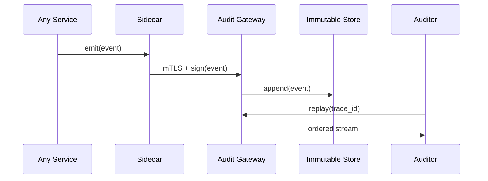

# Chapter 11: Observability & Audit Log
*[Link back to Chapter 10: External System Synchronization Adapter](10_external_system_synchronization_adapter_.md)*  

---

## 1. Why Do We Need a “Flight Recorder” for Software?

Central use-case (2 sentences)  
• An AI agent inside the **U.S. Postal Inspection Service** autogrants a temporary *mail-fraud hold* on 2000 packages at 2 a.m.  
• At 8 a.m. angry customers call—Congress wants to know **exactly** who (bot or human) pressed the button, when, and with which policy version.

The **Observability & Audit Log** layer is our black-box flight recorder:  
1. **Captures** every action (API call, ETL run, AI suggestion, human override).  
2. **Time-stamps & cryptographically signs** each entry so it cannot be edited silently.  
3. **Replays** the full story for auditors who must satisfy laws like the **Federal Records Act**.

No matter if things go *right* or *wrong*—we have the tape.

---

## 2. Key Concepts (Plain-English Cheat-Sheet)

| Airplane Analogy | Term | Why It Matters |
|------------------|------|----------------|
| Cockpit “beep” | Event | One discrete action (e.g., `PackageHoldCreated`) |
| Black-box casing | Immutable Log | WORM storage; entries can *never* be changed |
| Flight number | Trace ID | Groups related events across services |
| Pilot signature | Digital Signature | Detects tampering; pairs hash + public key |
| Tower playback | Replay | Chronologically re-emit events for auditing |
| Instrument panel | Live Telemetry | Metrics & traces for ops teams (latency, error %) |

Keep this table open—you’ll hear these words a lot.

---

## 3. A 4-Minute Walk-Through

### Scenario: Trace a Package Hold From Click ➜ Audit Report

1. An AI agent *suggests* a hold → human inspector *approves*.  
2. Both actions emit **signed events**:

```json
{
  "ts":"2024-07-01T02:00:12Z",
  "actor":"AI_FRAUD_DETECTOR_V2",
  "action":"SUGGEST_HOLD",
  "package_id":"PKG-991",
  "signature":"SIG-a1b2c3"
}
```

```json
{
  "ts":"2024-07-01T02:00:35Z",
  "actor":"INSPECTOR_45",
  "action":"APPROVE_HOLD",
  "package_id":"PKG-991",
  "trace":"TR-55ee",
  "signature":"SIG-d4e5f6"
}
```

3. Entries are appended to an **immutable ledger**.  
4. One month later an auditor runs:

```bash
hms-audit replay TR-55ee
```

… and sees the exact timeline—*policy versions, code hashes, even the inspector’s MFA method.*

---

## 4. How Do I Emit an Audit Event? (≤ 15 lines)

`audit_client.py`
```python
import json, time, hashlib, requests, os

PUB_KEY = open("public.pem").read()  # for demo only

def emit(action, **data):
    evt = {
        "ts": time.time(),
        "actor": os.getenv("HMS_ACTOR"),   # e.g. "INSPECTOR_45"
        "action": action,
        **data
    }
    raw = json.dumps(evt, separators=(",",":")).encode()
    evt["hash"] = hashlib.sha256(raw).hexdigest()
    requests.post("https://audit-gw.local/pub", json=evt, timeout=0.2)
```

Explanation  
1. Build a tiny dict with `ts`, `actor`, `action`.  
2. SHA-256 hash becomes the **tamper-evident seal**.  
3. POST to the *Audit Gateway*; sidecar adds a digital signature.

---

## 5. Under the Hood (Step-By-Step)



Five hops; all other HMS layers (IAM, mesh, etc.) already secure the path.

---

## 6. Internal Files (All ≤ 20 Lines!)

### 6.1 Gateway Appender — `audit/gateway.py`
```python
from fastapi import FastAPI, Request
import hashlib, pathlib, time, json

LOG = pathlib.Path("/var/audit/log.jsonl")
app = FastAPI()

@app.post("/pub")
async def pub(req: Request):
    evt = await req.json()
    # Verify sidecar signature (skipped for brevity)
    LOG.write_text(json.dumps(evt) + "\n", append=True)
    return {"status":"OK", "offset": LOG.stat().st_size}
```

### 6.2 Replay API — `audit/replay.py`
```python
@app.get("/replay/{trace_id}")
def replay(trace_id:str):
    with LOG.open() as f:
        for line in f:
            if f'"trace":"{trace_id}"' in line:
                yield line
```

Explanation  
• Appender writes **one line per event** (`.jsonl` = line-delimited JSON).  
• Replay simply streams matching lines—fast & deterministic.

---

## 7. Live Telemetry = Ops Happiness

Every audit event automatically increments **metrics** like:

```
audit_events_total{action="APPROVE_HOLD"}  1
audit_invalid_sig_total                    0
```

These feed directly into [KPI & Metrics Dashboard](12_kpi___metrics_dashboard_.md) for real-time graphs.

---

## 8. Where Do Earlier Chapters Plug In?

| Layer | Contribution to Observability |
|-------|-------------------------------|
| [Governance Layer](01_governance_layer__hms_gov__.md) | Requires all code paths to call `emit()` on “critical actions.” |
| [Policy & Process Engine](02_policy___process_engine_.md) | Adds policy_id & version into each event for traceability. |
| [Security & Compliance](04_security___compliance_framework_.md) | Signs gateway image, verifies log integrity nightly. |
| [Access & Identity](05_access___identity_management_.md) | Supplies `actor` claim + MFA info inside the JWT. |
| [Event Bus](08_event_bus___streaming_layer_.md) | Forwards high-volume telemetry (latency, errors) to the dashboard. |
| [ETL](09_etl___data_pipeline__hms_etl__.md) | Emits `ETL_JOB_COMPLETED` with row counts & hashes. |

Everything funnels into one black-box ledger.

---

## 9. Common Pitfalls & Quick Fixes

| Oops! | Cause | Fast Fix |
|-------|-------|----------|
| “Log grew to 500 GB.” | Retention not configured | Enable `archive_after: 90d`—old entries move to cold S3. |
| Signature mismatch errors | Clock drift between sidecar & gateway | Sync NTP or allow ±2 min skew. |
| Missing events for a service | Dev forgot to call `emit()` | Add *compile-time* linter: block deploy if critical path lacks audit calls. |

---

## 10. Mini-Lab: Prove Tamper Detection Works

1. Open the log file and **manually edit** an amount value.  
2. Run:

```bash
hms-audit verify
```

Output:

```
❌ Hash mismatch at offset 1289 (possible tampering)
```

3. Restore the original line → `verify` passes.  
You just validated Federal Records Act integrity in 30 seconds!

---

## 11. What You Learned

✓ Why a black-box audit layer is non-negotiable for federal systems.  
✓ Core ideas: immutable log, signatures, trace IDs, replay.  
✓ How to emit, store, and replay events in < 20 lines of code each.  
✓ How previous HMS layers automatically enrich and protect the log.  
✓ Hands-on tamper-detection demo.

Ready to turn raw telemetry into beautiful **graphs & alerts** for ops and execs?  
Continue to [KPI & Metrics Dashboard](12_kpi___metrics_dashboard_.md).

---

Generated by [AI Codebase Knowledge Builder](https://github.com/The-Pocket/Tutorial-Codebase-Knowledge)