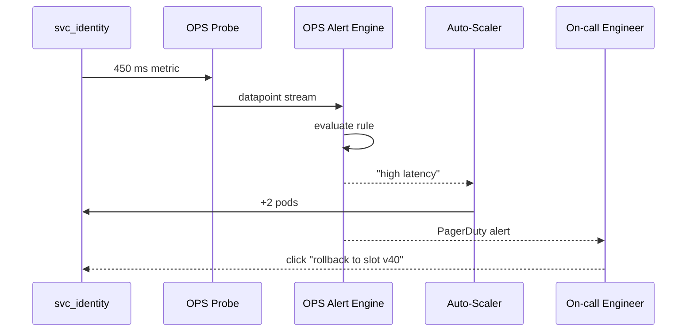

# Chapter 11: Operational Nerve Center (HMS-OPS)

*[← Back to Chapter 10: Backend Service Mesh (HMS-SVC & HMS-API)](10_backend_service_mesh__hms_svc___hms_api__.md)*  

---

## 0. Why Do We Need “OPS”? — The 3 a.m. Rule-Change Panic  

It’s 2:57 a.m. on a federal holiday.  
An **AI policy-bot** in the Office of Textiles and Apparel (OTEXA) auto-publishes a new tariff rule.  
Within seconds:

1. A dozen backend micronodes reload price tables.  
2. Overseas exporters start hitting the public API at 10× the normal rate.  
3. A sleepy on-call engineer must know **exactly** what changed and how to roll back—**without** SSH-ing into 15 servers.

**HMS-OPS** is the always-awake *nerve center* that:

* records every metric and log in an immutable ledger,  
* turns weird spikes into human-friendly alerts,  
* auto-scales safe capacity, and  
* gives any engineer a one-click rollback button.  

If [HMS-SVC](10_backend_service_mesh__hms_svc___hms_api__.md) is the highway, **HMS-OPS is the traffic-control tower** that keeps the lights green.

---

## 1. Key Concepts — Learn These Six Words First

| Term | Kid-Friendly Analogy | One-Line Job |
|------|----------------------|--------------|
| Metric Probe | Thermometer | Collects numbers (latency, CPU, etc.) |
| Alert Rule | Smoke alarm | Fires when a metric crosses a line |
| Auto-Scaler | Balloon pump | Adds/removes pods based on load |
| Immutable Log | Diary with glue | Write-once event store; no edits |
| Rollback Slot | Undo button | Known-good config you can re-deploy |
| SLO Dashboard | Scoreboard | Shows if promises (e.g., “99.9 % uptime”) are met |

Keep **Probe → Alert → Action** in your head; everything else revolves around it.

---

## 2. 3-Step Mental Model

```mermaid
flowchart LR
  A[1️⃣ Observe\n(Metric Probes)] --> B[2️⃣ Decide\n(Alert Rules)] --> C[3️⃣ Act\n(Auto-Scaler / Rollback)]
  B --> D[Immutable Logs & SLO Dashboard]
```

1. **Observe** – collect raw facts.  
2. **Decide** – compare them to thresholds.  
3. **Act** – scale, page, or roll back—while writing everything to an immutable log.

---

## 3. “Hello OPS” — Monitoring a Micronode in 18 Lines

Below we bolt monitoring onto the `identity.verify` micronode from Chapter 10.

```python
# monitor_identity.py  (18 lines)
from hms_ops import probe, alert, scaler

# 1. Collect a latency metric every request
@probe.metric("identity.verify.latency_ms")
def record_latency(ms: int):
    pass   # the decorator sends ms to OPS automatically

# 2. Fire an alert if p95 latency > 300 ms for 5 min
alert.rule(
    name="identity_slow",
    metric="identity.verify.latency_ms.p95",
    threshold=300,
    window="5m",
    severity="high"
)

# 3. Add 2 pods if CPU > 75 % for 2 min
scaler.horizontal(
    target="svc_identity",
    metric="cpu.percent",
    threshold=75,
    step=2,
    window="2m"
)
```

Beginner breakdown  
1. The `@probe.metric` decorator logs latency—no manual HTTP calls required.  
2. `alert.rule` is declarative: write one line, get PagerDuty alerts.  
3. `scaler.horizontal` autoscales **only** that service, not the whole cluster.

---

## 4. What Happens When Latency Spikes? (5 Actors, 7 Steps)



Result: service gets more capacity **and** a human is notified with a single, traceable incident ID.

---

## 5. Under the Hood — Step-by-Step (Non-Code)

1. **Metric Probe** writes points into **Time-Series DB** (Influx).  
2. **Alert Engine** runs every 15 s; rules are plain YAML in Git.  
3. **Auto-Scaler** reads the same metrics and talks to Kubernetes.  
4. Every change (scale event, alert fire, rollback click) writes an MCP envelope to the **Immutable Log**—later visible in the SLO Dashboard.  
5. Rollback simply re-applies the last known **Rollback Slot** config stored in Git.

---

## 6. Tiny Peek at Alert Evaluation Logic (≤18 Lines)

```python
# hms_ops/alert_core.py  (simplified)
def eval_rule(rule, series):
    window = series.last(rule.window)            # fetch N minutes
    value  = percentile(window, 95) if "p95" in rule.metric else avg(window)
    if value > rule.threshold:
        fire(rule.name, value)

def fire(name, value):
    env = mcp_envelope(
        tool="ops.alert.fire",
        args={"alert": name, "value": value}
    )
    publish_to_dlq_safe(env)     # guarantees immutability
    notify_pagerduty(env)
```

Explain like I’m 5:  

* `eval_rule` looks at the last 5 min of numbers.  
* If the 95th percentile crosses 300, it calls `fire`.  
* `fire` wraps the event in an MCP envelope and notifies humans **and** machines—no silent failures.

---

## 7. SLO Dashboard — One Command to Check Health

```bash
$ hms-ops slo show svc_identity
```

Sample output:

```
Service           Target SLO   Actual   Trend
---------------   ----------   ------   -----
svc_identity      99.9 %       99.94 % ↑
```

Green arrow? Sleep well.  
Red arrow? Ops team digs into the immutable log timeline.

---

## 8. Connecting OPS to Previous Layers

Layer | How It Talks to OPS
------|---------------------
[HMS-SVC](10_backend_service_mesh__hms_svc___hms_api__.md) | Emits latency & error probes out-of-the-box |
[HMS-A2A Bus](07_hms_a2a_inter_agency_messaging_bus_.md) | Publishes `incident.created` and `service.scaled` topics |
[HMS-DTA](09_data_spine__hms_dta__.md) | Stores compressed, signed log chunks for long-term audit |
[HMS-GOV Console](13_human_in_the_loop_oversight_console__hms_gov__.md) | Surfaces live incidents & rollback buttons |

---

## 9. Common Pitfalls (and How OPS Saves the Day)

Problem | Legacy Stack | With HMS-OPS
--------|--------------|-------------
Hidden latency spikes | Users complain first | Alert Rule pages you in <5 minutes |
Manual scaling | Midnight SSH sessions | Auto-Scaler adds pods instantly |
Tampered logs | “Who deleted syslog?” | **Immutable Log** forbids edits |
Rollback guesswork | “git reset maybe?” | **Rollback Slot** = one-click re-deploy |
Unmet uptime promises | Surprise during audit | **SLO Dashboard** shows real-time score |

---

## 10. Recap & What’s Next

In this chapter you learned that **HMS-OPS**:

• Collects metrics with **Probes**,  
• Transforms them into **Alerts**,  
• Takes automatic **Actions** (scale or rollback), and  
• Records every heartbeat in an **Immutable Log**.

Your backend now runs 24/7 without heroic night shifts.  
Time to see how the *front-end* team gets the same love with plug-and-play UI components:  
[Next: Micro-Frontend Library (HMS-MFE)](12_micro_frontend_library__hms_mfe__.md)

---

Generated by [AI Codebase Knowledge Builder](https://github.com/The-Pocket/Tutorial-Codebase-Knowledge)