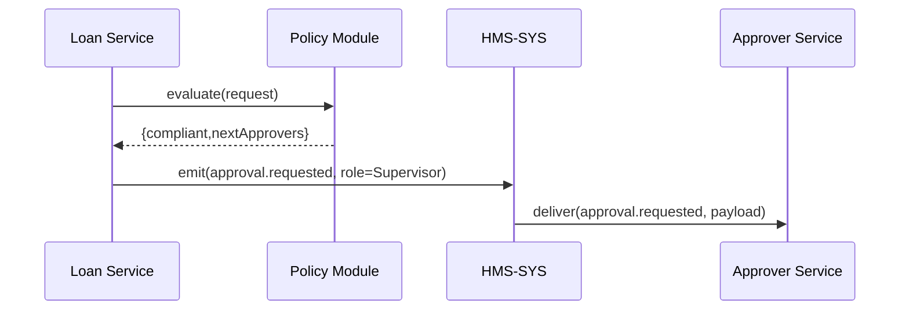

# Chapter 11: Policy Module

In the last chapter we saw how the [Management Layer](10_management_layer_.md) orchestrates workflows step-by-step. Now we’ll add the department’s “legal binder” that defines which forms to fill, who signs them, and when: the **Policy Module**.

## 1. Motivation & Central Use Case

Every federal program—from grant awards at the National Agricultural Library to land-conservation permits at the Natural Resources Conservation Service—has rules:

- Under \$5,000: only a supervisor’s approval is needed.  
- Over \$5,000: requires both a supervisor and the director.  
- Environmental risks above level 3 must trigger a compliance review.

Without a central policy engine, each service hard-codes its own checks. Changes in legislation or agency rules force code rewrites.  

**Policy Module** is our “legal binder.” You drop in your rulebook, and it:

1. Validates incoming requests (compliance checks).  
2. Builds approval workflows (who signs, in what order).  
3. Rejects or routes requests automatically.

## 2. Key Concepts

1. **Policy Definition**  
   A human-readable file (JSON/YAML) listing rules, thresholds, and sign-off steps.

2. **Approval Workflow**  
   A sequence or parallel set of roles (e.g., Supervisor → Director → Compliance Officer).

3. **Compliance Checks**  
   Automated validations (e.g., “amount ≤ budget” or “project type ∈ allowed list”).

4. **Policy Engine**  
   The component that loads definitions, evaluates requests, and returns next steps.

## 3. Using the Policy Module

### 3.1 Define a Policy File

```yaml
# policies/loan-policy.yaml
name: SmallBusinessLoan
rules:
  - id: AmountCheck
    when: request.amount <= 5000
    approve: ['Supervisor']
  - id: DirectorCheck
    when: request.amount > 5000
    approve: ['Supervisor','Director']
  - id: EnvReview
    when: request.riskLevel >= 3
    approve: ['EnvOfficer']
```

This file says:

- If `amount ≤ 5000`, route to **Supervisor**.  
- If `amount > 5000`, route to **Supervisor** then **Director**.  
- If `riskLevel ≥ 3`, also route to **EnvOfficer**.

### 3.2 Evaluate a Request

```js
// app.js
const PolicyModule = require('./policy-module');
const policy = PolicyModule.load('policies/loan-policy.yaml');

const request = { amount: 8000, riskLevel: 2 };
const result  = policy.evaluate(request);

console.log(result);
/*
{
  compliant: true,
  nextApprovers: ['Supervisor','Director']
}
*/
```

Explanation:

1. We load our YAML policy.  
2. We call `evaluate()` with the application data.  
3. The engine returns whether it’s compliant and who needs to approve next.

### 3.3 Enforce Before Processing

```js
// services/loanService.js
const policy = PolicyModule.load('policies/loan-policy.yaml');

async function submitLoan(req) {
  const check = policy.evaluate(req.body);
  if (!check.compliant) {
    throw new Error('Request violates policy');
  }
  // Emit an event for each approver
  for (const role of check.nextApprovers) {
    await coreClient.emit('approval.requested', {
      role, payload: req.body
    });
  }
}
```

Explanation:

- We guard `submitLoan()` with our policy check.  
- For each approver role, we emit an `approval.requested` event on the HMS bus.

## 4. Under the Hood: Step-by-Step Flow



1. **Loan Service** calls **Policy Module** with the request.  
2. **Policy Module** checks rules and returns next approvers.  
3. Loan Service emits `approval.requested` for each role.  
4. **HMS-SYS** routes the event to the **Approver Service**.

## 5. Internal Implementation Details

### 5.1 File Structure

```
policy-module/
├─ index.js
├─ engine.js
└─ loader.js
```

### 5.2 loader.js

```js
// loader.js
const fs   = require('fs');
const yaml = require('js-yaml');

function load(path) {
  const content = fs.readFileSync(path, 'utf8');
  const def     = yaml.load(content);
  return require('./engine').create(def);
}

module.exports = { load };
```

Explanation:

- Reads a YAML file.  
- Parses it into a JS object.  
- Hands it to the Policy Engine.

### 5.3 engine.js

```js
// engine.js
function create(def) {
  return {
    evaluate(request) {
      const next = [];
      def.rules.forEach(r => {
        if (eval(r.when)) {        // simplified: in real code use a safe evaluator
          next.push(...r.approve);
        }
      });
      return { compliant: next.length > 0, nextApprovers: next };
    }
  };
}

module.exports = { create };
```

Explanation:

- For each rule, if its `when` condition matches the request, we add its approvers.  
- We collect all approvers into `nextApprovers` and report compliance.

## 6. Summary & Next Steps

In this chapter you learned how the **Policy Module**:

- Acts as a “legal binder” of process rules.  
- Defines approval workflows and compliance checks in a human-readable file.  
- Returns next approvers and enforces policy before forwarding work.

Next, we’ll build the top-level “constitutional” guardrail for the entire platform in the [Governance Layer](12_governance_layer_.md).

---

Generated by [AI Codebase Knowledge Builder](https://github.com/The-Pocket/Tutorial-Codebase-Knowledge)