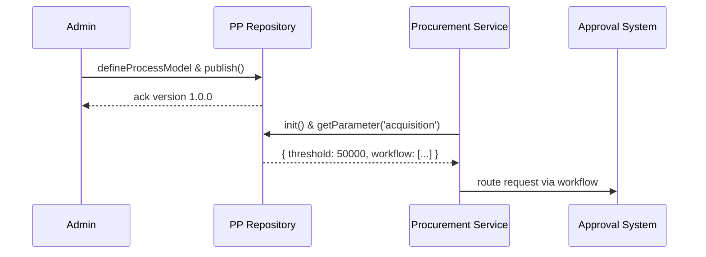

# Chapter 11: Policy & Process Module

In [Chapter 10: Admin/Gov Portal (HMS-GOV)](10_admin_gov_portal__hms_gov__.md) we built the review interface for AI proposals. Now we’ll explore the **Policy & Process Module**—the “legislative clerk” of your system that records, versions, and serves organizational rules and workflows.

## Why the Policy & Process Module?

Imagine the U.S. Mint sets a rule:  
> “All equipment purchases over \$50,000 require a three-step approval: Clerk → Supervisor → Director.”  

Instead of scattering that logic in code, you store it centrally in a versioned Policy & Process repository.  
- Administrators update thresholds, approval steps, or conflict resolution rules.  
- Agents and services read from it at runtime, so every decision reflects the latest policies.  
- Old versions remain accessible for audits or rollback.

## Central Use Case: Acquisition Threshold Workflow

A procurement agent submits a \$75,000 order. At runtime:

1. The service calls the Policy & Process Module to fetch the current “acquisition” workflow.  
2. It sees:  
   - Threshold = \$50,000  
   - Approval steps: Clerk → Supervisor → Director  
3. Since \$75,000 > \$50,000, it automatically routes the request through those three approvers.  

Everything is driven by data in a versioned repository—no hard-coded numbers.

## Key Concepts

1. **Process Models**  
   Define named workflows (e.g., `acquisition`) as ordered steps.

2. **Approval Hierarchies**  
   List roles or users who must sign off in sequence.

3. **Conflict Resolution**  
   Rules for handling simultaneous edits or policy clashes.

4. **Versioned Repository**  
   Each change gets a version tag (`1.2.0`), so you can audit or roll back.

5. **Runtime Reads & Admin Writes**  
   Services “read” policies at runtime. Admin tools “publish” updates back to the repo.

## How to Use the Module

### 1. Define and Publish a Workflow

Below is a minimal example using a fictitious `hms-pp` library.

```javascript
// File: define-acquisition.js
const pp = require('hms-pp');

// 1. Define process model steps
pp.defineProcessModel('acquisition', [
  'submitRequest',
  'clerkApproval',
  'supervisorApproval',
  'directorApproval',
  'finalize'
]);

// 2. Set an acquisition threshold
pp.setParameter('acquisition', { threshold: 50000 });

// 3. Publish version 1.0.0 to the repo
pp.publish('acquisition', '1.0.0');
```

After running this, version `1.0.0` of the acquisition workflow is saved in the module’s repository.

### 2. Read and Apply at Runtime

A procurement microservice can load the latest policy and route requests accordingly:

```javascript
// File: procurement-service.js
const pp = require('hms-pp');

async function handlePurchase(amount) {
  await pp.init(); // load latest definitions
  const workflow = await pp.getProcessModel('acquisition');
  const { threshold } = await pp.getParameter('acquisition');

  if (amount > threshold) {
    console.log('Routing through steps:', workflow);
    // e.g., send to clerk → supervisor → director
  } else {
    console.log('Auto-approved: below threshold.');
  }
}
```

Here, the service never hard-codes the `$50,000` limit or the list of approvers—those come from the module.

## What Happens Under the Hood?



1. **Admin** uses an admin tool to define and publish policies.  
2. **PP Repository** stores them under a version.  
3. At runtime **Procurement Service** initializes and fetches the current workflow and parameters.  
4. It then calls the internal Approval System to follow those steps.

## Inside the Module

### policyRepository.js

```javascript
// File: hms-pp/policyRepository.js
const store = {}; // In-memory; replaceable with real DB

function save(name, version, data) {
  store[name] = store[name] || {};
  store[name][version] = { data, timestamp: new Date() };
}

function loadLatest(name) {
  const versions = Object.keys(store[name] || {});
  const latest = versions.sort().pop();
  return store[name][latest].data;
}

module.exports = { save, loadLatest };
```

- `save()`: stores a named policy under a version.  
- `loadLatest()`: retrieves the data for the highest version.

### processModel.js

```javascript
// File: hms-pp/processModel.js
const repo = require('./policyRepository');

function defineProcessModel(name, steps) {
  repo.save(name, '1.0.0', { steps });
}

function getProcessModel(name) {
  const { steps } = repo.loadLatest(name);
  return steps;
}

module.exports = { defineProcessModel, getProcessModel };
```

- `defineProcessModel()`: wraps the repository save for workflows.  
- `getProcessModel()`: loads the steps array for runtime use.

A similar pattern applies to parameters (thresholds) or approval hierarchies.

## Summary

In this chapter you learned how the **Policy & Process Module**:

- Acts as a versioned store for workflows, thresholds, and approval rules  
- Lets administrators define and publish updates like a legislative clerk  
- Provides services and agents with up-to-date policies at runtime  
- Supports auditing and rollback through version tags  

Next up: learn how to keep external systems in sync with your policies and data in  
[Chapter 12: External System Synchronization](12_external_system_synchronization_.md).

---

Generated by [AI Codebase Knowledge Builder](https://github.com/The-Pocket/Tutorial-Codebase-Knowledge)