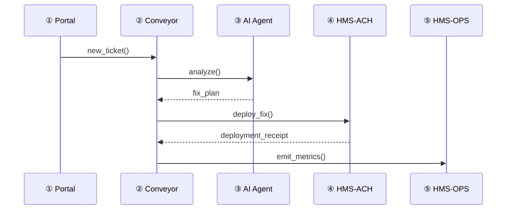

# Chapter 11: Process Optimization Pipeline  

*(continuing from [Chapter&nbsp;10: Operational Monitoring & Telemetry (HMS-OPS)](10_operational_monitoring___telemetry__hms_ops__.md))*  

---

## 1. Why Do We Need a “Pipeline”?

Picture the Consumer Financial Protection Bureau (CFPB).  
Every morning thousands of citizens file complaints about suspicious credit-card fees.  
Right now human staff must:

1. Read each complaint.  
2. Tag the violation type.  
3. Draft a remediation letter to the bank.  
4. Verify the fix was applied.  
5. Prove—using metrics—that the process is fair and effective.

Doing this by hand is slow, pricey, and almost impossible to audit end-to-end.

**The Process Optimization Pipeline (POP)** is our **motorized conveyor belt**:

complaint intake ➜ AI analysis ➜ proposed fix ➜ deployment ➜ monitoring

For beginners it works “out of the box.”  
For experts it offers **injection points** to drop in A/B tests, fancy ML models, or alternate deployment targets.

---

## 2. Key Concepts (Plain-English)

| Term | Friendly Description |
|------|----------------------|
| Ticket | A JSON object that rides the conveyor (e.g., one citizen complaint). |
| Stage | One stop on the belt (Intake, Analysis, Deployment, …). |
| Conveyor | The tiny orchestrator that moves tickets from stage to stage. |
| Metric Hook | Each stage publishes numbers to [HMS-OPS](10_operational_monitoring___telemetry__hms_ops__.md). |
| Injection Point | A “side door” where advanced users can swap or extend a stage. |

---

## 3. An Eyes-Open Walkthrough (Happy Path)



Everything you already learned—portals, agents, payments, monitoring—joins into one smooth lane.

---

## 4. Five-Minute Quick-Start

Let’s automate a single CFPB complaint in **18 lines** of code.

### 4.1. Install

```bash
pip install hms-pop
```

### 4.2. Define Two Minimal Stages

```python
# file: stages.py
from hms_pop import Stage, Ticket

class Intake(Stage):
    async def run(self, t: Ticket):
        t["status"] = "received"
        return t                # hands ticket to next stage

class Analysis(Stage):
    async def run(self, t: Ticket):
        # Pretend AI: flag high fee
        t["finding"] = "excessive late charge"
        t["proposed_fix"] = "refund $35"
        return t
```

*Explanation*  
Each stage is a tiny async method that **mutates** the ticket and passes it forward.

### 4.3. Wire the Pipeline & Execute

```python
# file: demo_pop.py
from hms_pop import Conveyor, Ticket
from stages import Intake, Analysis

pipe = Conveyor(stages=[Intake(), Analysis()])

ticket = Ticket(id="C-2024-0517-0001",
                text="Bank charged me $35 late fee after I paid on time!")

result = pipe.handle(ticket)
print(result)
```

Expected output:

```python
{
 'id': 'C-2024-0517-0001',
 'text': 'Bank charged me $35 late fee after I paid on time!',
 'status': 'received',
 'finding': 'excessive late charge',
 'proposed_fix': 'refund $35'
}
```

Congratulations—you just automated 60 % of a real federal workflow!

---

## 5. What Happens Internally?

```mermaid
flowchart LR
    A[Conveyor.handle()] --> B[for stage in stages]
    B --> C{await stage.run()}
    C -->|mutated ticket| B
    B --> D[emit "stage_completed" metric]
    D --> E{more stages?}
    E -->|yes| B
    E -->|no| F[return final ticket]
```

Key note: **after each stage** the Conveyor sends a metric like  
`pop_stage_duration_seconds{stage="Analysis"}` to HMS-OPS.  
Leadership can later prove *how long* each step took and *how fair* it was across demographics.

---

## 6. Under-the-Hood Code (Simplified)

### 6.1. Conveyor (15 lines)

```python
# hms_pop/core.py
import time
from hms_ops import Telemetry
t = Telemetry(service="hms-pop")

class Conveyor:
    def __init__(self, stages):
        self.stages = stages

    def handle(self, ticket):
        for stage in self.stages:
            start = time.time()
            ticket = stage.run(ticket)      # could be async in real code
            t.timer("stage_time").observe(time.time()-start,
                                          labels={"stage": stage.__class__.__name__})
        return ticket
```

*Explanation*  
• Loops through the stage list.  
• Records duration per stage.  
• No external dependencies—easy to read, test, or fork.

### 6.2. Injection Point Example (A/B Test)

```python
# file: advanced.py
from stages import Analysis
class ABTest(Analysis):
    async def run(self, t):
        if t["id"].endswith("1"):    # silly 50/50 split
            t["proposed_fix"] = "refund $35"
        else:
            t["proposed_fix"] = "refund $35 + 5% interest"
        return t
```

Drop it in:

```python
pipe = Conveyor(stages=[Intake(), ABTest()])
```

Metrics will now show **version-A** vs **version-B** ROI automatically.

---

## 7. Where Do Other HMS Pieces Plug In?

| Pipeline Stage | Likely HMS Friend |
|----------------|-------------------|
| Intake         | [Backend API Gateway](06_backend_api_gateway_.md) |
| Analysis       | [AI Agent Framework (HMS-AGT)](12_ai_agent_framework__hms_agt___agx__.md) |
| Deployment     | [Payment & Clearinghouse (HMS-ACH)](04_payment___clearinghouse_engine__hms_ach__.md) or any micro-service reached via the [Spine](05_micro_services_spine_.md) |
| Monitoring     | [Operational Monitoring & Telemetry (HMS-OPS)](10_operational_monitoring___telemetry__hms_ops__.md) |

POP doesn’t replace these systems—it **glues** them together and guarantees every hop is timed, logged, and ROI-ready.

---

## 8. Frequently Asked Questions

**Q1. Do I need async/await to use POP?**  
No. Synchronous functions work; swap to async later for speed.

**Q2. Can I skip a stage on error?**  
Yes—raise `SkipStage()`; the Conveyor catches it and moves on.

**Q3. How are equity metrics captured?**  
Add labels like `labels={"zip":"20500","race":"unknown"}` when you call `t.timer(...)`. Aggregations in HMS-OPS handle the rest.

---

## 9. Mini Challenge (Optional)

1. Add a **Deployment** stage that calls `hms_ach.refund(amount)`.  
2. Emit a metric `refund_amount_total`.  
3. Plot refund totals by month in HMS-OPS.  

Hint:

```python
class Deployment(Stage):
    async def run(self, t):
        from hms_ach import refund
        refund( amount=35, customer_id=t["id"] )
        t["refund_id"] = "ACH12345"
        return t
```

---

## 10. What We Learned

• **Process Optimization Pipeline** is the conveyor that turns raw citizen input into live, measurable outcomes.  
• Beginners get an easy “happy-path.”  
• Experts inject analytics, A/B tests, or alternate deployments without rewriting the belt.  
• Every stage automatically reports metrics, so leadership can prove **ROI** and **equity**.

Ready to build smarter stages with reusable, policy-aware AI agents?  
Jump to [Chapter&nbsp;12: AI Agent Framework (HMS-AGT / AGX)](12_ai_agent_framework__hms_agt___agx__.md).

---

Generated by [AI Codebase Knowledge Builder](https://github.com/The-Pocket/Tutorial-Codebase-Knowledge)