# Chapter 11: Process / Policy Management API  
*(The platform’s digital “switchboard” for every rule change)*  

[← Back to Chapter 10: Autonomous Process Optimization Agent](10_autonomous_process_optimization_agent_.md)

---

## 1. Why Does HMS-NFO Need a “Switchboard”?

Picture the **National Highway Traffic Safety Administration (NHTSA)**.  
At 4 PM the policy office changes a rule:

> “All recall submissions are now due **72 hours** after a defect is found (previously 96).”

What must instantly happen?

1. The public **website countdown** changes from *4 days* to *3 days*.  
2. The **email-reminder microservice** recalculates its send-times.  
3. State finance partners update **penalty fees**.  
4. Auditors need the old rule kept for 7 years.

Manually emailing every team would be chaos.  
The **Process / Policy Management API (PPM-API)** automates this.  
Think of it as the *switchboard operator* who:

1. **Validates** a proposed rule.
2. **Version-controls** it (v1 → v2).  
3. **Broadcasts** the update to every subscribed microservice and external partner—within seconds.

---

## 2. Key Concepts (Plain English)

| Term | What It Really Means | Analogy |
|------|----------------------|---------|
| Policy Document | JSON object holding the actual rule. | Official memo on City Hall letterhead. |
| Version Tag | Incrementing number (`v2`, `v3`). | “Revised 3rd edition” stamp. |
| Validation Pipeline | Checks formatting, RBAC, and ethics. | The clerk who makes sure the form is signed correctly. |
| Publish Event | Machine-readable message (`policy.updated`). | PA system announcement. |
| Subscription | Service opting-in to receive updates. | Department phone line connected to the switchboard. |

---

## 3. Quick “Hello, New Deadline” Walk-Through  

We’ll change NHTSA’s recall deadline from 96 → 72 hours.

### 3.1 Draft the New Policy (JSON, 12 lines)

```jsonc
// recall_deadline_v2.json
{
  "id"        : "recall_deadline",
  "version"   : 2,                 // ← bumped
  "agency"    : "NHTSA",
  "field"     : "hours_to_submit",
  "value"     : 72,
  "effective" : "2023-11-15T00:00:00Z"
}
```

### 3.2 One-Line Publish Call (Node, 10 lines)

```ts
// changeDeadline.ts
import { publishPolicy } from "@hms-nfo/ppm-api";

await publishPolicy("sec_officer_17", "./recall_deadline_v2.json");
console.log("📢 Policy dispatched!");
```

**What just happened?**  
1. The file is **validated** (JSON schema + [RBAC](03_role_based_access_control__rbac__.md)).  
2. The API stores it as **v2**.  
3. A `policy.recall_deadline.updated` event fires to every subscriber.

### 3.3 How Services React (pseudo, 8 lines)

```ts
// emailReminderService/onPolicy.ts
bus.on("policy.recall_deadline.updated", p => {
  DEADLINE_HOURS = p.value;          // now 72
});
```

No redeploy; the new constant loads at runtime.

---

## 4. What Happens Under the Hood? (Step-by-Step)

```mermaid
sequenceDiagram
    participant Pub as publishPolicy()
    participant VAL as Validation
    participant VER as Version Store
    participant BUS as Event Bus
    participant SVC as Subscriber
    Pub->>VAL: JSON + userId
    VAL-->>Pub: ✅ ok
    VAL->>VER: save v2
    VER-->>BUS: policy.updated
    BUS-->>SVC: new value (72)
```



1. **Validation** checks JSON schema, RBAC role, and [Values Guard](06_ai_governance_values_framework_.md).  
2. **Version Store** appends a new record (never overwrites).  
3. **Event Bus** emits the update—internal and external systems get it.  

---

## 5. File Structure Peek

```
ppm-api/
  src/
    publishPolicy.ts
    validate.ts
    store/
      index.ts          // versioning helpers
    bus.ts              // wraps Kafka/SNS
    subscriptions/
      index.ts
```

Everything fits in one screen—perfect for beginners.

---

## 6. Tiny Implementation Snippets

### 6.1 Validation (15 lines)

```ts
// validate.ts
import { can } from "@hms-nfo/rbac";
import schema from "./schema.json";

export function validate(user, doc){
  if (!can(user.role, "change:policy")) throw "403 Forbidden";

  // 1. JSON schema
  if (!ajv.validate(schema, doc)) throw "Invalid format";

  // 2. Value sanity
  if (doc.value <= 0) throw "Bad value";

  return true;
}
```

### 6.2 Version Control (18 lines)

```ts
// store/index.ts
import fs from "fs";
const DIR = "policies/";

export function save(doc){
  const file = `${DIR}${doc.id}_v${doc.version}.json`;
  if (fs.existsSync(file)) throw "Version exists";
  fs.writeFileSync(file, JSON.stringify(doc, null, 2));
  return file;
}
```

### 6.3 Publish Helper (14 lines)

```ts
// publishPolicy.ts
import { validate } from "./validate";
import { save } from "./store";
import bus from "./bus";

export async function publishPolicy(userId, path){
  const user = await getUser(userId);          // lookup
  const doc  = JSON.parse(await fs.promises.readFile(path));

  validate(user, doc);
  save(doc);
  bus.publish(`policy.${doc.id}.updated`, doc);   // 🔊

  return doc;
}
```

All three files together are under 50 lines—easy to grok.

---

## 7. Hands-On Exercise (5 min)

1. `npm start ppm-demo`  
2. Run `node changeDeadline.js` (provided).  
3. Terminal prints `📢 Policy dispatched!`.  
4. In another shell:  

```bash
node listeners/emailReminder.js   # shows "DEADLINE_HOURS updated → 72"
```  

5. Open `policies/recall_deadline_v2.json`—version locked forever. 🎉

---

## 8. Common Pitfalls & Quick Fixes

| Problem | Symptom | Fix |
|---------|---------|-----|
| Missing subscribers | Some services ignore new rule | Call `subscribe("policy.*")` in each service init. |
| Version clash | “Version exists” error | Pull latest version first, bump `version` +1. |
| Over-permissive access | Anyone can change policy | Tighten RBAC permission `change:policy`. |

---

## 9. How PPM-API Talks to Other Layers

* **Governance Layer** (05 — HMS-GOV) — UI uses `publishPolicy()` under the hood.  
* **Audit Trail** (08) — `publishPolicy()` calls `record()` so investigators can replay every rule change.  
* **HITL Oversight** (07) — Approved proposals are posted here for final dispatch.  
* **External System Synchronization** (coming in Chapter 13) — Partners subscribe to the same `policy.updated` events.

---

## 10. Summary & What’s Next

You now have a lightweight, versioned **switchboard** that:

1. Validates any rule change.  
2. Locks it into an immutable history.  
3. Notifies every microservice and partner in real time.

In the next chapter we’ll see how the **Management Layer** uses these events to reconfigure live services and keep everything running smoothly:  
[Chapter 12: Management Layer (HMS-SVC & Friends)](12_management_layer__hms_svc___friends__.md)

---

---

Generated by [AI Codebase Knowledge Builder](https://github.com/The-Pocket/Tutorial-Codebase-Knowledge)