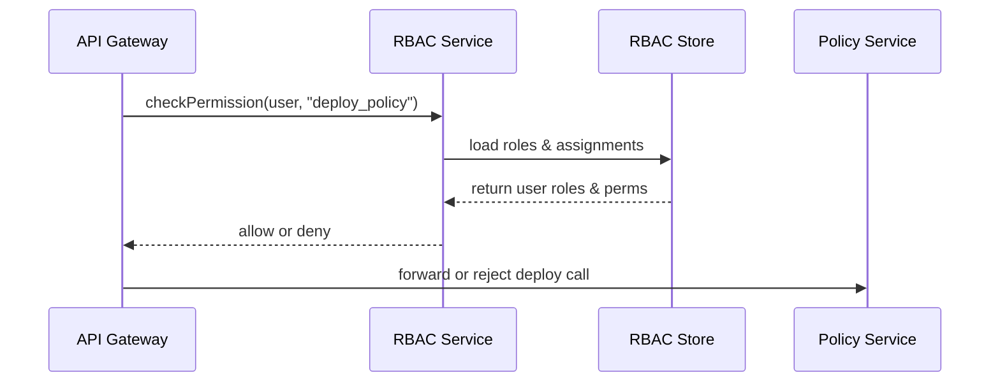

# Chapter 11: Role-Based Access Control (RBAC)

In [Chapter 10: Human-in-the-Loop (HITL) Override](10_human_in_the_loop__hitl__override_.md) we added a safety switch to pause AI-driven updates for human review. Now we need a way to enforce **who** can view suggestions, propose overrides, or deploy changes. That’s where **Role-Based Access Control (RBAC)** comes in.

---

## 1. Motivation: Municipal Badges for Digital Staff

Think of an RBAC system like municipal badges for city hall staff:

- **Citizens** can only view and submit forms.  
- **Clerks** can view and propose changes.  
- **Managers** can override proposals.  
- **Auditors** can only view logs.  
- **AI Agents** have limited rights (e.g., propose but not deploy).

With RBAC, we assign each “badge” (role) a set of **permissions**—actions they’re allowed to take. When a user makes a request, the system checks: “Does their badge include this permission?” If yes, they proceed; otherwise, the request is denied.

---

## 2. Key Concepts

1. **Role**  
   A named collection of permissions (e.g., `clerk`, `manager`, `auditor`).

2. **Permission**  
   An action on a resource (e.g., `view_policy`, `override_threshold`, `deploy_policy`).

3. **Role Assignment**  
   Linking a user (or service) to one or more roles.

4. **Role Hierarchy**  
   Higher roles inherit permissions from lower ones (e.g., `manager` inherits `clerk`).

5. **Permission Check**  
   At runtime, verifying a user’s assigned roles include the needed permission.

6. **External Identity Integration**  
   Connecting RBAC to systems like LDAP, OAuth or SAML for single sign-on and group sync.

---

## 3. Using RBAC to Enforce “Deploy Policy”

Below is a minimal example showing how to configure roles, assign a user, and check permissions in code.

### 3.1 Define Roles and Permissions

File: `rbac/config/roles.json`
```json
{
  "clerk":   ["view_policy", "propose_policy"],
  "manager": ["override_policy", "deploy_policy"],
  "auditor": ["view_audit_logs"]
}
```
Explanation:  
- We list each role and its permissions.  
- A **manager** can both override and deploy policies.

### 3.2 Assign Roles to Users

File: `rbac/config/assignments.json`
```json
{
  "alice@example.gov": ["clerk"],
  "bob@example.gov":   ["manager"],
  "carol@example.gov": ["auditor"]
}
```
Explanation:  
- “bob@…” has the `manager` role, so he can deploy changes.

### 3.3 Checking Permission in Code

```js
import { checkPermission } from './rbacService'

async function deployPolicy(userEmail, policyId, data) {
  if (!await checkPermission(userEmail, 'deploy_policy')) {
    throw new Error('Access denied: cannot deploy policy')
  }
  // proceed to deploy...
}
```
Explanation:  
- Before deploying, we call `checkPermission`.  
- If the user lacks the `deploy_policy` permission, we reject the request.

---

## 4. What Happens Step-by-Step



1. The **API Gateway** asks RBAC Service if the user has `deploy_policy`.  
2. RBAC Service loads role definitions and the user’s assignments.  
3. It returns allow or deny.  
4. The Gateway either forwards the request or returns a 403 error.

---

## 5. Under the Hood: RBAC Service Implementation

### 5.1 Simple Permission Check

File: `rbac/rbacService.js`
```js
import roles       from './config/roles.json'
import assignments from './config/assignments.json'

// Returns true if userEmail is allowed to perform permission
export async function checkPermission(userEmail, permission) {
  const userRoles = assignments[userEmail] || []
  for (const role of userRoles) {
    if ((roles[role] || []).includes(permission)) {
      return true
    }
  }
  return false
}
```
Explanation:  
- We load a user’s roles and see if any role grants the requested permission.

### 5.2 Adding Role Hierarchies

File: `rbac/config/hierarchy.json`
```json
{
  "manager": ["clerk"],
  "clerk":   []
}
```
File: `rbac/rbacService.js` (updated role loading)
```js
import hierarchy from './config/hierarchy.json'

function expandRoles(userRoles) {
  const all = new Set(userRoles)
  for (const role of userRoles) {
    for (const parent of hierarchy[role] || []) {
      all.add(parent)
    }
  }
  return [...all]
}

// In checkPermission, use expandRoles on userRoles before checking perms
```
Explanation:  
- A `manager` also inherits all `clerk` permissions automatically.

---

## 6. Integrating with External Identity Providers

In production, you don’t store emails locally. Instead:

1. **Synchronize Groups**: Pull user group membership from LDAP or an OAuth provider.  
2. **Map Groups to Roles**: In your RBAC service config, map external groups (e.g., “HR-Managers”) to internal roles.

This centralizes user management and keeps access rules consistent.

---

## Conclusion

In this chapter you learned how **RBAC** assigns roles (like municipal badges) with defined permissions, how to configure roles and user assignments, and how to enforce checks in code. You also saw how a simple service can load definitions, handle hierarchies, and integrate with external identity systems.

Up next: dive into the [Policy Module](12_policy_module_.md) to see how policies are authored, versioned, and enforced in HMS-OPS.

---

Generated by [AI Codebase Knowledge Builder](https://github.com/The-Pocket/Tutorial-Codebase-Knowledge)