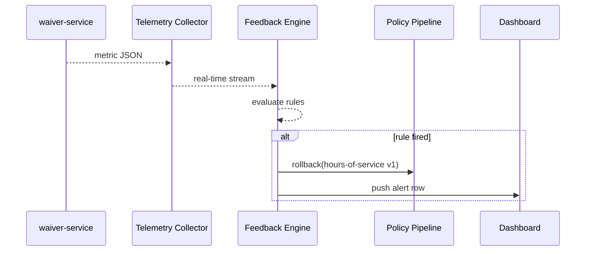

# Chapter 11: Telemetry & Feedback Loop  

*(We just shipped a new rule through the  
[Policy Versioning & Deployment Pipeline](10_policy_versioning___deployment_pipeline_.md).  
Now we must **watch it in the wild** and—if something goes wrong—automatically steer the ship back on course.)*  

---

## 1 · Why Bother? – A 90-second Story  

The **Federal Motor Carrier Safety Administration (FMCSA)** releases a policy that relaxes the “hours-of-service” rule for snow-storm relief trucks.  

*Day 1*  
• 5 000 haulers file digital waivers.  
• Average approval latency = **2 s**. Everything looks good.  

*Day 3*  
• Latency jumps to **18 s**.  
• Denials spike from **2 % → 17 %**.  
• Social-media chatter: *“The waiver site is broken!”*  

Because HMS has a **Telemetry & Feedback Loop**:

1. A tiny metric message (“denial_rate 17 %”) streams to HMS-OPS.  
2. An **alert rule** yells: “🚨 Anomaly!”  
3. The pipeline instantly **rolls back** to the previous, stable policy.  
4. A dashboard flags the issue for human review.  

Citizens never see a 404 page; truckers keep rolling.

---

## 2 · Key Ideas in Plain English  

| Term              | Beginner Meaning                                        |
|-------------------|---------------------------------------------------------|
| Metric            | A number that changes over time (latency, error-rate).  |
| Telemetry Event   | One JSON message carrying metrics + context.            |
| Feedback Engine   | The brain that looks at fresh metrics and applies rules.|
| Alert Rule        | “If X > threshold for Y minutes → do Z.”                |
| Auto-Action       | What happens next (dashboard ping, rollback, scale-up). |
| Closed Loop       | Metrics feed decisions ➜ decisions change the system ➜ new metrics. |

Analogy: A smart home thermostat (Feedback Engine) reads room temperature (metrics) and turns the heater on or off (auto-action) without you touching the dial.

---

## 3 · A 3-Step Beginner Recipe  

We will:  
1. Emit a metric from a microservice.  
2. Write an alert rule.  
3. See the rule trigger a rollback.

### 3.1 Emit a Metric (≤ 12 lines)

```ts
// waiver-service/metrics.ts
import { send } from '@hms/telemetry';
export function recordDecision(ms: number, approved: boolean) {
  send({
    stream: 'waiver.decisions',
    latencyMs: ms,
    approved,
    ts: Date.now()
  });
}
```

Explanation  
• `send` is a tiny SDK call; no ports to remember.  
• Each approval or denial sends one JSON blob to HMS-OPS.

---

### 3.2 Declare an Alert Rule (8-line YAML)

```yaml
# rules/waiver-anomaly.yaml
stream: waiver.decisions
condition: "denial_rate > 10 && hits > 100"
window: 5m                 # look at last 5 minutes
action:
  type: rollback-policy
  policyId: hours-of-service
```

Explanation  
• HMS computes `denial_rate` & `hits` automatically inside the window.  
• When true, the **Policy Versioning Pipeline** is asked to roll back.

---

### 3.3 Wire the Rule into HMS-OPS (one command)

```bash
hms ops rules add rules/waiver-anomaly.yaml
```

Success output:

```txt
✔ Rule registered (id = rule-77)
```

You’re done—no redeploy needed.

---

## 4 · What Happens Under the Hood?  



Only **5 actors** keep the loop clear.

---

## 5 · Tiny Code Tour (All Mini-Snippets)  

### 5.1 Telemetry Collector (Node, 18 lines)

```ts
// collector/index.ts
import WebSocket, { Server } from 'ws';
const wss = new Server({ port: 9009 });
wss.on('connection', sock => {
  sock.on('message', raw => {
    const ev = JSON.parse(raw.toString());
    queue.push(ev);               // in-memory ring buffer
  });
});
setInterval(() => {
  const batch = queue.drain();    // last N events
  feedback(batch);                // hand to engine
}, 1000);
```

Explanation  
• Accepts WebSocket messages from services.  
• Batches them once per second for efficiency.

---

### 5.2 Feedback Rule Evaluator (10 lines)

```ts
// engine/eval.ts
import mathjs from 'mathjs';      // tiny expression parser
export function check(rule, events){
  const hits = events.length;
  const denials = events.filter(e=>!e.approved).length;
  const ctx = {
    hits,
    denial_rate: hits ? (denials/hits)*100 : 0
  };
  return mathjs.evaluate(rule.condition, ctx);
}
```

Explanation  
• Converts the YAML `condition` string into a Boolean.  
• Any math function is allowed (avg, max, etc.).

---

### 5.3 Auto-Rollback Hook (9 lines)

```ts
// engine/actions.ts
import { rollback } from '@hms/pipeline';
export async function doAction(a){
  if (a.type === 'rollback-policy')
    await rollback(a.policyId);
}
```

Explanation  
• Delegates to the pipeline you met in Chapter 10—code reuse!

---

## 6 · Hands-On: Watch It Work Locally  

```bash
# Start collector + engine
docker compose up telemetry

# Fire 150 denial events in 5 seconds
node scripts/bombard.js

# Tail engine logs
docker logs -f telemetry_engine
# Expect: "Rule rule-77 triggered → rollback hours-of-service v1"
```

---

## 7 · Dashboards for Humans (Zero Code)

Point Grafana at `ws://collector:9009/metrics`; auto-generated graphs appear:

| Metric             | Target | Sparkline (15 m) |
|--------------------|--------|------------------|
| waiver_latency_ms  | 5 s    | ▄▁▂▂▃▅█          |
| denial_rate %      | < 10   | ▁▁▂▂▂▁█🚩        |

Red 🚩 aligns with the rollback timestamp—easy to explain at the next stand-up.

---

## 8 · Common Pitfalls & Easy Fixes  

| Pitfall                                   | Fast Fix |
|-------------------------------------------|-----------|
| Flood of metrics overloads engine         | Use **sampling**: send 1 of N events or emit aggregates. |
| Hard-coding alert thresholds in code      | Keep rules in YAML; hot-swap at runtime. |
| False positives during nightly batch runs | Add `if (business_hours)` predicate in `condition`. |
| Unknown metric names break dashboards     | Adopt a **metric naming contract** in Git (`metrics.md`). |

---

## 9 · Why GAO Auditors Love This  

• Every alert + action is written to the same **immutable ledger** used by HMS-GOV.  
• They can prove the system *self-audits* every minute—continuous compliance.

---

## 10 · Recap & Next Steps  

You now know how HMS-OPS:  
1. Collects metrics in real time.  
2. Evaluates simple YAML rules.  
3. Auto-executes rollbacks or other actions.  
4. Feeds clear dashboards for humans and reports for auditors.

In the next chapter we’ll meet the **AI Representative Agent**, the digital civil servant that *reads* those metrics and proactively suggests improvements.

[Next Chapter — AI Representative Agent (HMS-A2A)](12_ai_representative_agent__hms_a2a__.md)

---

Generated by [AI Codebase Knowledge Builder](https://github.com/The-Pocket/Tutorial-Codebase-Knowledge)