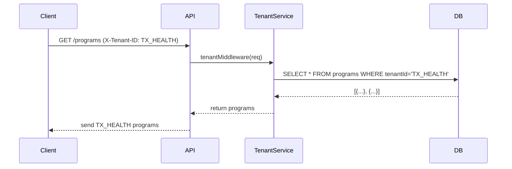

# Chapter 11: Tenant Management

In [Chapter 10: HMS-AGX (Knowledge Graph)](10_hms_agx__knowledge_graph__.md), we built a map of laws and precedents. Now we’re going to act like a city registrar and talk about **Tenant Management**—how HMS keeps each agency’s data and settings safely separated.

---

## 1. Motivation & Central Use Case

Imagine a big city registrar office that manages records for different neighborhoods. You don’t want Elm Street’s parking rules showing up in Oak Avenue’s files. In the same way:

**Problem:** Multiple agencies (state health, federal health, DMV) share the same HMS platform but need totally separate data, user lists, and custom program catalogs.

**Use Case Example:**  
- The **Texas Health Dept** (tenant `TX_HEALTH`) sets an income cap of \$25,000 for a nutrition program.  
- The **California Health Dept** (tenant `CA_HEALTH`) uses \$30,000.  
- When a TX user logs in, they only see `TX_HEALTH` programs and rules—nothing from CA or the feds.

Tenant Management makes this isolation easy to code and to maintain.

---

## 2. Key Concepts

1. **Tenant**  
   Like a neighborhood in our city registrar. Each tenant has its own name (`TX_HEALTH`) and owns its data.

2. **Configuration**  
   Settings (policies, program lists) that live under one tenant and never leak to another.

3. **CodifySubprojects**  
   A way to group related services or modules under a tenant. Think of these as “sub-neighborhoods” that can share or override settings.

4. **Inheritance Rules**  
   You might have a federal “default” tenant whose settings every state can inherit—unless a state specifically overrides them.

---

## 3. Using Tenant Management

Below is a minimal example showing how you define tenants and then use them to scope your data.

### 3.1 Define Tenants in a Config File

```json
// config/tenants.json
[
  {
    "id": "FEDERAL",
    "name": "Federal Health",
    "inherits": null
  },
  {
    "id": "TX_HEALTH",
    "name": "Texas Health Dept",
    "inherits": "FEDERAL"
  }
]
```
Here we list two tenants. Texas inherits defaults from the federal tenant.

### 3.2 Load Tenant on Each Request

```js
// src/middleware/tenantMiddleware.js
import tenants from '../config/tenants.json'

export function tenantMiddleware(req, res, next) {
  const tenantId = req.header('X-Tenant-ID')
  req.tenant = tenants.find(t => t.id === tenantId)
  if (!req.tenant) return res.status(400).send('Unknown tenant')
  next()
}
```
We read `X-Tenant-ID` from the request header and attach the matching tenant object to `req.tenant`.

### 3.3 Fetch Data for a Tenant

```js
// src/services/programService.js
export async function listPrograms({ tenant }) {
  // We assume each program row has a tenantId column
  return db('programs').where({ tenantId: tenant.id })
}
```
When you call `listPrograms({ tenant: req.tenant })`, you only get that tenant’s programs.

---

## 4. What Happens Under the Hood



1. **Client** sends a request with `X-Tenant-ID`.  
2. **API** middleware finds the tenant.  
3. **TenantService** queries only that tenant’s records.  
4. Data never crosses tenant boundaries.

---

## 5. Internal Implementation

Here’s a simple file layout and code snippets to see what lives where.

```
hms-api/
└── src/
    ├── config/
    │   └── tenants.json
    ├── middleware/
    │   └── tenantMiddleware.js
    ├── models/
    │   └── tenant.js
    ├── services/
    │   └── tenantService.js
    └── controllers/
        └── programController.js
```

### 5.1 Tenant Model

```js
// src/models/tenant.js
export class Tenant {
  constructor({ id, name, inherits }) {
    this.id = id
    this.name = name
    this.inherits = inherits  // parent tenant ID or null
  }
}
```

A simple class to hold tenant info and inheritance.

### 5.2 Tenant Service

```js
// src/services/tenantService.js
import tenantsData from '../config/tenants.json'
import { Tenant }      from '../models/tenant'

export function getTenantById(id) {
  const raw = tenantsData.find(t => t.id === id)
  return raw ? new Tenant(raw) : null
}
```

This service reads the JSON and returns a `Tenant` instance.

### 5.3 Controller Uses Tenant

```js
// src/controllers/programController.js
import { listPrograms } from '../services/programService'

export async function getPrograms(req, res) {
  const programs = await listPrograms({ tenant: req.tenant })
  res.json(programs)
}
```

The controller doesn’t need to know the tenant logic—it just calls the service with `req.tenant`.

---

## 6. Conclusion & Next Steps

You’ve learned how **Tenant Management**:

- Treats each agency like a separate “neighborhood”  
- Uses middleware to bind requests to a tenant  
- Scopes all data queries so settings and records never cross boundaries  
- Supports inheritance (e.g., state → federal defaults)

With each tenant safely isolated, you can onboard new agencies in minutes.  

Next up, we’ll zoom in on how modules fit together in [Chapter 12: Module Architecture](12_module_architecture_.md). See you there!

---

Generated by [AI Codebase Knowledge Builder](https://github.com/The-Pocket/Tutorial-Codebase-Knowledge)