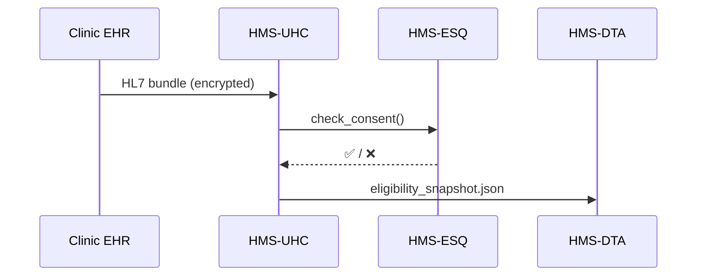
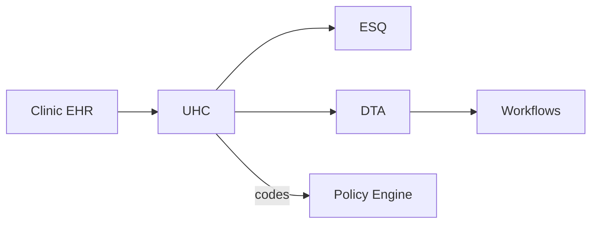

# Chapter 11: Universal Health Care Integration (HMS-UHC)


*(Picking up right after [Inter-Agency Data Exchange (HMS-A2A)](10_inter_agency_data_exchange__hms_a2a__.md))*  

> “Doctors speak 🏥 ‘HL7’, insurers speak 💰 ‘EDI-835’, lawyers speak 📜 ‘HIPAA’—  
> HMS-UHC is the interpreter in the middle.”  
> —A bewildered benefits agent, day 1

---

## 1. Why Do We Need UHC?

### 1.1 A 60-Second Story — “Can María Get Medicaid Coverage *Today*?”

1. **María** shows up at a county clinic.  
2. The clinic must know—right now—if she is Medicaid-eligible.  
3. Her lab results, diagnoses (ICD-10), and prior consent live in different EHRs.  
4. Federal law (HIPAA) forbids the clinic from blasting her lab data to every state system.

Without UHC: clerks fax forms, wait days, and patients postpone care.  
With UHC: a **HIPAA-compliant tunnel** streams only the *minimum necessary* facts (e.g., “Diabetes ICD-10 = E11.9, consent = yes”) to the benefits agent—María gets help before lunch.

---

## 2. Four Key Concepts (Beginner Cheat-Sheet)

| # | Concept | What It Really Means | Emoji Hook |
|---|---------|---------------------|------------|
| 1 | HIPAA Tunnel | Encrypted pipe for PHI | 🚇 |
| 2 | Terminology Mapper | ICD-10 / HL7 ⇒ HMS codes | 🗺️ |
| 3 | Consent Gateway | Yes/No switch based on signed forms | 🔑 |
| 4 | Eligibility Snapshot | Tiny JSON summary any agent can read | 📄 |

Remember **T-M-C-S**—Tunnel, Mapper, Consent, Snapshot.

---

## 3. Declaring a UHC Pipeline (≤ 18 Lines)

Create `uhc_medicaid.yaml`:

```yaml
id: UHC_Medicaid_Eligibility
source_ehr: Epic@CountyClinic
destination: HMS-DTA            # Chapter 9 vault
tunnel:
  protocol: https
  encryption: TLS1.3
terminology:
  inbound: ICD10, HL7v2
  outbound: HMS-CoreCodes v1
consent_rule: MINIMUM_NECESSARY # defined in ESQ corpus
fields_needed: [diagnosis, income, residency]
```

One YAML file = one hospital-court MOU for data flow.

---

## 4. Using UHC in Code — 3 Calls, 30 Seconds

### 4.1 Pull the Data

```python
import uhc_sdk as uhc

link = uhc.load("uhc_medicaid.yaml")
raw = uhc.pull(link, patient_id="MARIA123")     # 🚇
```

### 4.2 Produce an Eligibility Snapshot

```python
mapped = uhc.map_terms(raw, link)               # 🗺️
snap  = uhc.make_snapshot(mapped, link)         # 📄
```

### 4.3 Hand It to the Benefits Agent

```python
uhc.store(snap, link)        # lands in HMS-DTA (Chapter 9)
print("✅ Snapshot ready:", snap["status"])
```

Output (example):

```json
{
  "patient_id": "MARIA123",
  "status": "likely_eligible",
  "basis": ["diagnosis:E11.9", "income:below_state_median"],
  "timestamp": "2024-06-01T14:07Z"
}
```

Only the facts needed—no lab values, no doctor notes.

---

## 5. What Happens Under the Hood?



Five messages, four actors—easy for auditors.

---

## 6. Internal Modules (Toy Versions ≤ 18 Lines)

### 6.1 HIPAA Tunnel

```python
# uhc/tunnel.py
import requests, os

def pull(link, patient_id):
    url = f"{link['source_ehr']}/fhir/Patient/{patient_id}"
    token = os.getenv("EHR_API_TOKEN")
    r = requests.get(url, headers={"Authorization": f"Bearer {token}"}, timeout=5)
    return r.json()            # still encrypted by TLS 🚇
```

### 6.2 Terminology Mapper

```python
# uhc/mapper.py
ICD_TO_CORE = {"E11.9": "DX_DIABETES"}

def map_terms(bundle, link):
    dx = bundle["condition"][0]["code"]["coding"][0]["code"]
    return {"diagnosis": ICD_TO_CORE.get(dx)}
```

### 6.3 Consent Gateway

```python
# uhc/consent.py
from esq_sdk import allow_disclosure

def check(patient_id, purpose):
    return allow_disclosure(patient_id, purpose)   # 🔑
```

### 6.4 Snapshot Maker

```python
# uhc/snapshot.py
import time

def make(mapped):
    eligible = mapped["diagnosis"] == "DX_DIABETES"
    return {
        "status": "likely_eligible" if eligible else "ineligible",
        "basis": [f"diagnosis:{mapped['diagnosis']}"],
        "timestamp": time.strftime("%Y-%m-%dT%H:%MZ")
    }
```

Each file focuses on **one** concept—beginners won’t drown.

---

## 7. Compliance Touch-Points

1. **HIPAA §164.502(b)** — “Minimum Necessary”; enforced by **Consent Gateway**.  
2. **42 CFR Part 2** — Substance-use info? UHC redacts by default.  
3. **State Medicaid Manual** — Eligibility thresholds live in [HMS-CDF](03_policy_codification_engine__hms_cdf__.md); Snapshot Maker imports them.

One line of code per law keeps lawyers happy.

---

## 8. Real-World Extensions

| Extension (AGX) | Adds Power | Example Use |
|-----------------|-----------|-------------|
| `HL7-BulkLoader` | Streams 1 M records/hour | Disaster response |
| `FHIR-Validator` | Schematizes inbound JSON | Prevent bad data |
| `Lab-Redactor` | Drops HIV & genetics LOINC codes | Privacy-by-design |

Attach any of them the same way you learned in [Chapter 6](06_specialized_agent_extensions__hms_agx__.md).

---

## 9. Quick “Did I Do It Right?” Checklist

☐ `.yaml` pipeline lists **tunnel**, **terminology**, **consent_rule**  
☐ `uhc.pull()` returns a raw HL7/FHIR bundle in dev  
☐ `uhc.map_terms()` converts at least one ICD-10 code correctly  
☐ Snapshot stored in **HMS-DTA** (`dta.find(topic="uhc.snapshot")`)  
☐ ESQ blocks transfer when consent is missing (test with a fake patient)

Pass all five and you’ve built a **patient-first, lawyer-approved health data bridge**!

---

## 10. Where UHC Fits in the HMS Map



UHC is the *health-only doorway* into everything you’ve built so far.

---

## 11. Conclusion & Next Steps

You can now channel PHI safely, harmonize medical jargon, and spit out bite-size eligibility facts for any federal or state program—all in minutes, not months.

Next, we’ll move the money once eligibility is confirmed!  
👉 Continue to: [Financial Transactions & Clearinghouse (HMS-ACH)](12_financial_transactions___clearinghouse__hms_ach__.md)

Happy healing 🏥

---

Generated by [AI Codebase Knowledge Builder](https://github.com/The-Pocket/Tutorial-Codebase-Knowledge)