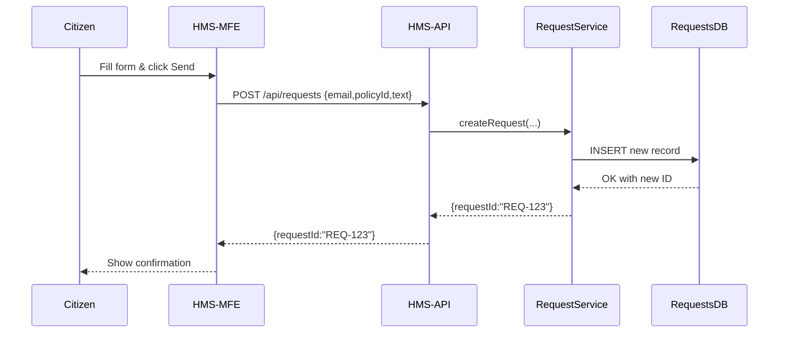

# Chapter 11: User Portal (HMS-MFE)

In [Chapter 10: PolicyEditor Component](10_policyeditor_component_.md), we built a focused UI for drafting and editing policies. Now we’ll switch gears to the **public-facing** side: the **User Portal (HMS-MFE)**—an online town hall where citizens submit requests, complaints, or feedback, and then track their status.

---

## 1. Motivation & Central Use Case

Imagine you’re a New York angler who thinks the new “30 lb fish limit” policy is too low. You want to:

1. Visit the User Portal.  
2. Submit a complaint or suggestion about the limit.  
3. See your submission in a “My Requests” list.  
4. Check back later to see if your input has been reviewed or acted on.

The User Portal bundles all this into one friendly, public UI—no special login (or just your email), simple forms, and real-time status updates.

---

## 2. Key Concepts

1. **Submission Form**  
   A page where citizens fill in:
   - Request type (Complaint, Feedback, Petition)  
   - Related policy (e.g., Fishing Weight Limit)  
   - Description or attachments  

2. **My Requests Dashboard**  
   A list view showing each submission’s:
   - ID, date submitted  
   - Current status (Received, Under Review, Closed)  

3. **API Calls**  
   - **POST** `/api/requests` to send a new request  
   - **GET** `/api/requests?userEmail=...` to fetch your list  

4. **Status Updates**  
   Internally, the Management Layer processes your request (see [Chapter 3: Backend API](03_backend_api__hms_api__.md)) and updates its status, which you can poll or refresh.

5. **Micro-Frontend Architecture**  
   The HMS-MFE is a self-contained React/Vue app that plugs into the main portal shell, allowing independent deployment and versioning.

---

## 3. How to Use the User Portal

### 3.1 Submitting a Request

1. Citizen navigates to `/submit` in the portal.  
2. Fills out the form and clicks **Send**.  
3. Sees a confirmation message: “Your request ID is `REQ-123`.”

**Example Form (React)**  
```jsx
// components/SubmitRequest.jsx
import { useState } from 'react'
export default function SubmitRequest() {
  const [data, setData] = useState({ email:'', policyId:'', text:'' })
  async function send() {
    const resp = await fetch('/api/requests', {
      method:'POST',
      headers:{'Content-Type':'application/json'},
      body:JSON.stringify(data)
    })
    const result = await resp.json()
    alert('Submitted! Your Request ID: ' + result.requestId)
  }
  return (
    <div>
      <h2>Submit Feedback or Complaint</h2>
      <input placeholder="Your Email" 
             onChange={e=>setData({...data,email:e.target.value})}/>
      <input placeholder="Policy ID" 
             onChange={e=>setData({...data,policyId:e.target.value})}/>
      <textarea placeholder="Your Message" 
                onChange={e=>setData({...data,text:e.target.value})}/>
      <button onClick={send}>Send</button>
    </div>
  )
}
```
This simple form:
- Collects `email`, `policyId`, and `text`.  
- Calls the HMS-API endpoint to create a request.  
- Alerts the citizen with their new ID.

### 3.2 Tracking Past Submissions

On `/my-requests`, citizens enter their email to see all their requests:

```jsx
// components/MyRequests.jsx
import { useState } from 'react'
export default function MyRequests() {
  const [email, setEmail] = useState('')
  const [list, setList] = useState([])
  async function load() {
    const resp = await fetch(`/api/requests?userEmail=${email}`)
    setList(await resp.json())
  }
  return (
    <div>
      <h2>My Requests</h2>
      <input placeholder="Enter your email"
             onChange={e=>setEmail(e.target.value)}/>
      <button onClick={load}>Load My Requests</button>
      <ul>
        {list.map(r =>
          <li key={r.id}>
            {r.id} – {r.policyId} – {r.status}
          </li>
        )}
      </ul>
    </div>
  )
}
```
Here we:
- Fetch submissions by email.  
- Display each ID, related policy, and current status.

---

## 4. Under the Hood: Step-by-Step



1. **UI** posts the form to **HMS-API**.  
2. **HMS-API** calls the **RequestService** to store the request.  
3. The service writes to the **RequestsDB**.  
4. A new ID comes back to the citizen.

Tracking uses a similar flow with a **GET** instead of **POST**.

---

## 5. Internal Implementation Details

Below is the core service and API route that make submissions possible.

### 5.1 Request Service (Node.js)

```javascript
// services/request-service.js
class RequestService {
  constructor(repo) { this.repo = repo }            // inject repository
  async create({email, policyId, text}) {
    const id = 'REQ-' + Date.now()
    await this.repo.save({ id, email, policyId, text, status:'Received' })
    return id
  }
  async listByEmail(email) {
    return this.repo.findAll(r => r.email === email)
  }
}
export default RequestService
```
This service:
- Generates a unique ID.  
- Saves the request with a default status.  
- Lists requests by email.

### 5.2 API Routes

```javascript
// hms-api/routes/requests.js
import express from 'express'
import RequestService from '../services/request-service.js'
const svc = new RequestService(/* repo instance */)
const router = express.Router()

router.post('/', async (req,res) => {
  const id = await svc.create(req.body)
  res.json({ requestId: id })
})

router.get('/', async (req,res) => {
  const list = await svc.listByEmail(req.query.userEmail)
  res.json(list)
})

export default router
```
The API:
- Exposes **POST /api/requests** to create.  
- Exposes **GET /api/requests?userEmail=…** to fetch status.

---

## Conclusion

In this chapter you learned how the **User Portal (HMS-MFE)** acts as an online town hall:
- Citizens submit feedback, complaints, or petitions via a simple form.  
- They track their submissions in “My Requests.”  
- Behind the scenes, the portal talks to **HMS-API** and the **RequestService** to store and retrieve data.

Next up, we’ll explore how our system can automatically answer citizens using AI in [Chapter 12: AI Representative Agent](12_ai_representative_agent_.md).

---

Generated by [AI Codebase Knowledge Builder](https://github.com/The-Pocket/Tutorial-Codebase-Knowledge)