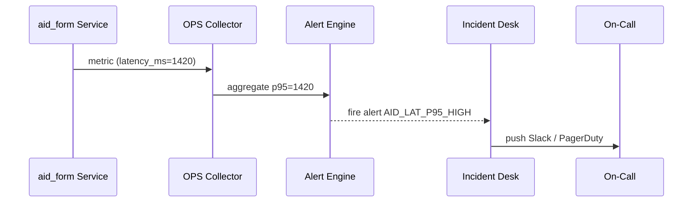

# Chapter 12: Activity & Operations Monitoring (HMS-OPS / HMS-OMS)

*(Coming from [Human-in-the-Loop (HITL) Control](11_human_in_the_loop__hitl__control_.md)?  
Great!  We now have humans, agents, and micro-services working together.  
But who is watching the watchers?  That job belongs to HMS-OPS / HMS-OMS.)*  

---

## 1. Why Do We Need HMS-OPS?

### Story – “Keep FEMA.gov Up During a Hurricane”

1. A Category-4 storm is approaching Florida.  
2. Millions of citizens will smash **“Apply for Disaster Assistance”** at 8 AM.  
3. If the site slows down or errors spike, people can’t request help, Congress gets angry, and lives are affected.  
4. We need a **NORAD-style command center** that shouts  
   “Latency ↑ on `svc-aid-form`, CPU 🔥 on `db-payments`, HITL queue 📈  > 100.”  
5. The moment something breaks, the right on-call engineer must get a Slack ping **within seconds**.

That end-to-end vigilance is **Activity & Operations Monitoring**:

* **HMS-OPS** – runtime metrics & alert engine.  
* **HMS-OMS** – dashboards + incident playbooks (OMS = *Operations Management Suite*).

> Think of OPS as the **smoke detector** and OMS as the **fire-station dispatcher**.

---

## 2. Key Concepts (Plain English)

| Word / Emoji | What It Means | Analogy |
|--------------|--------------|---------|
| 📈 Metric | Number that changes over time (latency, queue length) | Heart-rate monitor |
| 🧯 Alert Rule | “If metric X crosses threshold Y for Z minutes, fire alarm.” | Smoke detector threshold |
| 🎛️ Dashboard | Web page that plots many metrics in one view | Plane cockpit panel |
| 📜 Playbook | Step-by-step guide auto-attached to an alert | Fire evacuation SOP |
| 👩‍💻 On-Call | Person (rotation) that receives incidents | 911 fire crew |

Remember **Metric → Alert → Dashboard → Playbook → On-Call**—that’s the full loop.

---

## 3. First Walk-Through  
### Use Case: Alert When Disaster-Aid Form Gets Slow

We will:

1. Emit a latency metric from the form service.  
2. Create an alert that fires if p95 latency > 1 s for 2 minutes.  
3. Watch an incident open and assign the FEMA on-call.

### 3.1 Service Emits a Metric (≤10 lines)

```python
# file: aid_form.py  (inside HMS-SVC)
from hms_ops import metric

def submit_form(data):
    start = now()
    save_to_db(data)              # imagine this call exists
    metric.observe("aid_form.latency_ms", (now() - start)*1000)
    return {"status":"OK"}
```

Explanation  
`metric.observe(name, value)` is a one-liner that pushes the datapoint to OPS “fire-hose.”

### 3.2 Define the Alert Rule (YAML, 8 lines)

```yaml
# file: latency_alert.yml
metric: aid_form.latency_ms
aggregate: p95
threshold: "> 1000"          # ms
for: 2m                      # sustain 2 minutes
notify: fema_oncall          # rotation id
playbook: pb_aid_latency
```

Load it:

```bash
opsctl alert create latency_alert.yml
```

### 3.3 Add a Simple Playbook (Markdown, 7 lines)

```markdown
# Playbook: pb_aid_latency
1. `kubectl top pod svc-aid-form` – check CPU/RAM.
2. If CPU > 80 %, scale replicas: `kubectl scale --replicas=6`.
3. Verify latency < 1 s with `opsctl metric watch`.
4. Post update in #incident-fema.
```

### 3.4 Watch the Incident Flow (Console Demo)

```bash
# tail incidents in real time
opsctl incident watch
```

Sample output:

```
08:03  🚨  AID_LAT_P95_HIGH  SVC=aid_form  p95=1400 ms
08:03  ➜ assigned to rotation fema_oncall (pager #149)
08:04  Slack DM sent to @alex-ops
```

Within seconds the on-call engineer knows exactly **what** broke and **how** to start fixing it.

---

## 4. What Happens Under the Hood?



Five simple actors; the whole round-trip is < 5 s.

---

## 5. Peeking Inside the Source Tree

```
hms-ops/
├── collector/      # UDP / HTTP ingest
│   └── receive.py
├── engine/         # rule evaluation
│   ├── evaluator.py
│   └── scheduler.py
├── oms/            # incidents & dashboards
│   ├── api.py
│   └── web/
└── cli/opsctl      # tiny helper CLI
```

### 5.1 Tiny Evaluator (≤15 lines)

```python
# engine/evaluator.py
def tick(rule, series):
    val = series.p95()                 # or mean, max, etc.
    trig = eval(f"{val} {rule.threshold}")
    if trig and rule.sustain_ok():
        create_incident(rule, val)
```

Beginner takeaway: evaluator pulls recent datapoints, computes p95, and fires when condition holds.

### 5.2 Minimal Incident Creator (≤12 lines)

```python
# oms/api.py (excerpt)
def create_incident(rule, value):
    inc = db.insert("incidents", {
        "name": rule.name,
        "metric": rule.metric,
        "value": value,
        "assignee": pick_oncall(rule.notify),
        "playbook": rule.playbook,
        "ts": now()
    })
    notify_slack(inc)      # single-line helper
    return inc
```

Everything else (dashboards, status pages) is just reading this `incidents` table.

---

## 6. Relationship to Other Layers

Layer | How It Integrates
------|------------------
[HMS-SVC](06_backend_service_core__hms_svc__.md) | Emits metrics via `metric.observe`.
[HMS-ACT](03_action_orchestrator__hms_act__.md) | Sends ticket throughput / error counts.
[HMS-ACH](09_financial_transaction_engine__hms_ach__.md) | Publishes cleared vs. rejected payments.
[HMS-ESQ](10_compliance___legal_reasoner__hms_esq__.md) | Emits “blocks per minute” for legal checks.
[HITL Control](11_human_in_the_loop__hitl__control_.md) | Reports queue length and approval latency.

Because every call already carries an MCP `trace_id`, OPS can **group** metrics by the exact citizen session or agency program when drilling into graphs.

---

## 7. Try It Yourself (5-Minute Lab)

```bash
git clone https://github.com/hms-example/hms-ops
cd hms-ops/examples
# 1. Start collector + alert engine + OMS UI
docker compose up ops
# 2. Flood the form service with slow calls
python flood_latency.py          # sends 1500 ms latency metrics
# 3. Watch incidents
opsctl incident watch
```

You should see an alert pop, Slack message in `#incidents`, and a red widget on  
`http://localhost:8080/dashboard/fema`.

---

## 8. Built-In Dashboards You Get for Free

Dashboard | Shows | Example Slice
----------|-------|--------------
System Health | CPU, memory, pod restarts | Any Kubernetes namespace
Citizen Experience | p95 latency, error % by endpoint | `/apply-aid` vs `/status-check`
Payment Pipeline | cleared / rejected / pending per hour | HMS-ACH flows
Legal Blocks | FERPA / HIPAA blocks per day | HMS-ESQ verdicts
HITL Backlog | paused vs. approved items | HITL queue size

Just pick from the template list, choose a time-range, and press **Save**.

---

## 9. Ops Glossary in 60 Seconds

Term | 1-Line Definition
----|------------------
SLO | *Service Level Objective* – e.g., “p95 < 800 ms, 99.9 % of the month.”
Burn Rate | How fast you consume your SLO error budget.
Silence | Temporary mute for planned maintenance.
Root-Cause Link | Any incident can link to a JIRA / GitHub issue for follow-up.
Blameless RCA | Built-in form to post-mortem an incident—no witch hunts.

---

## 10. Recap & What’s Next

Today you learned:

✓ **HMS-OPS** collects metrics; **HMS-OMS** turns them into alerts, dashboards, and incidents.  
✓ Adding monitoring is often **one line of code**.  
✓ Alert rules + playbooks live in YAML so even non-dev ops teams can edit them.  
✓ Everything keeps the same `trace_id`, letting you jump from a red graph straight to the failing request or payment.

In the next chapter we will see how HMS talks to **outside** systems (IRS, USPS, State portals) in real time:  
[External System Synchronization](13_external_system_synchronization_.md)  

*(Spoiler: Webhooks, change-feeds, and zero-downtime retries!)*

---

Generated by [AI Codebase Knowledge Builder](https://github.com/The-Pocket/Tutorial-Codebase-Knowledge)