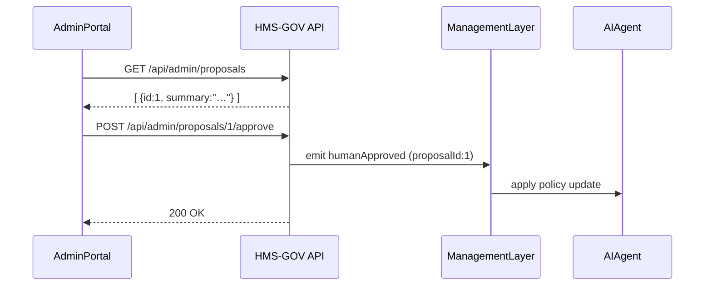

# Chapter 12: Administrative Portal (HMS-GOV)

In [Chapter 11: Human-In-The-Loop Oversight](11_human_in_the_loop_oversight_.md) we added a human review step for AI suggestions. Now we’ll build the **Administrative Portal (HMS-GOV)**—a control room where policy-makers, officials, and administrators see key metrics, pending AI proposals, and stakeholder feedback, then review, adjust, and approve AI-generated suggestions.

## Why an Administrative Portal?

Imagine the Bureau of Environmental Permits has dozens of AI-generated policy tweaks queued up and hundreds of citizen comments streaming in. Officials need one place to:

1. Check **key metrics** (pending permit count, average review time).  
2. Browse **AI proposals** awaiting sign-off.  
3. Read **stakeholder feedback** highlights.  
4. **Approve** or **tweak** each suggestion before it goes live.

Without this portal, they’d juggle spreadsheets, inboxes, and separate apps. HMS-GOV brings everything into one cohesive dashboard with Human-In-The-Loop oversight.

## Key Concepts

1. **Metrics Panel**  
   Live cards or charts showing system health (e.g. pending tasks, processing times).

2. **Proposal List**  
   A table of AI-generated policy proposals, each with a summary and status.

3. **Feedback Panel**  
   Recent stakeholder comments or survey results aggregated by topic.

4. **Review & Approval Controls**  
   Editable fields and “Approve”/“Reject” buttons for each proposal.

5. **Real-Time Updates**  
   WebSockets or Server-Sent Events keep metrics, proposals, and feedback in sync.

## How to Use HMS-GOV

### 1. Mounting the Admin Portal

```jsx
// src/admin/index.js
import React from 'react';
import ReactDOM from 'react-dom';
import AdminDashboard from './AdminDashboard';

ReactDOM.render(
  <AdminDashboard />,
  document.getElementById('admin-root')
);
```
This simple entry point assumes your server routes `/admin` to an HTML page with a `<div id="admin-root">`.

### 2. Fetching and Displaying Metrics

```jsx
// src/admin/MetricsPanel.js
import React, {useEffect, useState} from 'react';

export default function MetricsPanel() {
  const [data, setData] = useState({});
  useEffect(() => {
    fetch('/api/admin/metrics')
      .then(r => r.json())
      .then(setData);
  }, []);
  return (
    <div>
      <h2>Key Metrics</h2>
      <ul>
        <li>Pending Applications: {data.pendingApps}</li>
        <li>Avg. Review Time: {data.avgReviewTime} hrs</li>
      </ul>
    </div>
  );
}
```
After mounting, this panel calls `/api/admin/metrics` and shows live numbers.

### 3. Reviewing and Approving Proposals

```jsx
// src/admin/ProposalList.js
import React, {useEffect, useState} from 'react';

export default function ProposalList() {
  const [proposals, setProposals] = useState([]);
  useEffect(() => {
    fetch('/api/admin/proposals')
      .then(r => r.json())
      .then(setProposals);
  }, []);

  function approve(id) {
    fetch(`/api/admin/proposals/${id}/approve`, { method: 'POST' })
      .then(() => setProposals(p => p.filter(x => x.id !== id)));
  }

  return (
    <div>
      <h2>AI Proposals</h2>
      {proposals.map(p => (
        <div key={p.id}>
          <p>{p.summary}</p>
          <button onClick={() => approve(p.id)}>Approve</button>
        </div>
      ))}
    </div>
  );
}
```
Officials click **Approve** to sign off; the list refreshes to remove completed items.

## Sequence Diagram: Approving a Proposal



1. Portal fetches pending proposals.  
2. Admin clicks **Approve**.  
3. API emits a `humanApproved` event.  
4. Management Layer ([Chapter 4](04_management_layer__service_orchestration__.md)) drives the policy deployment.

## Under the Hood: API Endpoints

- **GET /api/admin/metrics**  
  Returns JSON like:  
  ```json
  { "pendingApps": 12, "avgReviewTime": 36, "openProposals": 3 }
  ```

- **GET /api/admin/proposals**  
  Returns:
  ```json
  [
    { "id": 1, "summary": "Auto-approve low-risk permits under $5K" },
    { "id": 2, "summary": "Expedite waiver renewals for veterans" }
  ]
  ```

- **POST /api/admin/proposals/:id/approve**  
  ```js
  // src/admin/routes.js
  router.post('/proposals/:id/approve', (req, res) => {
    // 1. Mark proposal as approved in DB
    // 2. Publish event for orchestrator
    bus.emit('humanApproved', { proposalId: req.params.id });
    res.sendStatus(200);
  });
  ```

## Conclusion

You’ve now seen how to build the **Administrative Portal (HMS-GOV)**—the specialized dashboard that brings together live metrics, AI-generated proposals, and stakeholder feedback into one control room. Policy-makers and administrators can review, adjust, and approve changes with full Human-In-The-Loop oversight.  

With HMS-GOV in place, you tie together all previous layers—[Interface Layer](01_interface_layer__user___admin_uis__.md), [Governance Layer](10_governance_layer__transparency___compliance__.md), [HITL Oversight](11_human_in_the_loop_oversight_.md), and [Management Layer](04_management_layer__service_orchestration__.md)—to empower real-time, transparent decision-making at scale.  

You’ve reached the end of our HMS-CUR tutorial. Thanks for following along, and congratulations on building a complete, human-centered government service platform!

---

Generated by [AI Codebase Knowledge Builder](https://github.com/The-Pocket/Tutorial-Codebase-Knowledge)