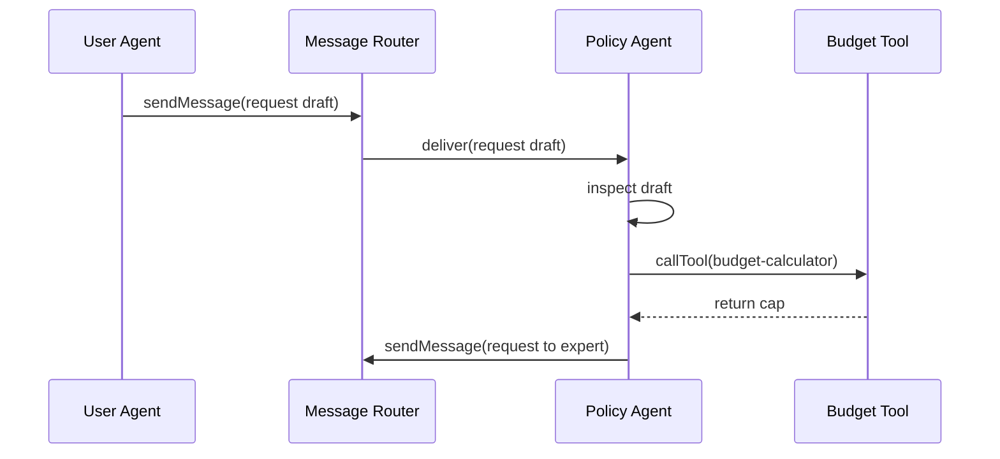

# Chapter 12: Agent-to-Agent Framework (HMS-A2A)

Welcome back! In [Chapter 11: AI Representative Agent](11_ai_representative_agent_.md), you learned how a single AI agent can help analyze data and propose improvements. Now we’ll expand that idea: multiple AI agents working together—sharing context, negoti­ating, and using tools—just like diplomats exchanging memos to hammer out a treaty. That’s what the **Agent-to-Agent Framework (HMS-A2A)** enables.

---

## 12.1 Motivation & Central Use Case

Imagine your state legislature is drafting a new **Housing Subsidy Bill**. You’ve got:

- A **User Agent** that collects citizen input.
- A **Policy Agent** that enforces legal rules.
- An **Expert Agent** that suggests funding models.

They need to exchange messages, share context (e.g., draft text, budget figures), call tools (like a calculator), and converge on a final proposal—all without humans juggling emails. HMS-A2A standardizes that communication so AI agents collaborate seamlessly.

---

## 12.2 Key Concepts

1. **AgentMessage**  
   A JSON object carrying `sender`, `receiver`, `type` (request/response), and `content`.

2. **Context Store**  
   Shared memory where agents read/write the current draft and variables.

3. **Tool Usage**  
   Agents can invoke external tools (e.g., budget calculator) via a standardized request.

4. **Message Router**  
   The central service that delivers messages to the right agent and handles sequencing.

5. **Collaboration Flow**  
   A defined sequence: User → Policy → Expert → User, until consensus.

---

## 12.3 Using HMS-A2A to Solve Our Use Case

Below is a minimal example showing how to set up two agents and send a message:

```js
// 1. Import the framework
import { A2AFramework, Agent } from 'hms-cdf/a2a/framework'

// 2. Define agents
const userAgent = new Agent({ id: 'user-agent' })
const policyAgent = new Agent({ id: 'policy-agent' })

// 3. Initialize the collaboration
const a2a = new A2AFramework({
  agents: [userAgent, policyAgent]
})
a2a.initialize()

// 4. Start by sending a draft proposal
a2a.sendMessage({
  sender: 'user-agent',
  receiver: 'policy-agent',
  type: 'request',
  content: { draftText: 'Subsidy up to $10k' }
})
```

Explanation:
- We create two `Agent` instances.
- `A2AFramework` wires up the router and context.
- `sendMessage()` delivers the draft to the Policy Agent.

Next, Policy Agent can inspect, modify, or call a tool:

```js
// Inside policy-agent handler (simplified)
policyAgent.onMessage(async msg => {
  // 1) Check legal constraints
  if (!msg.content.draftText.includes('income cap')) {
    // 2) Use a calculator tool
    const newCap = await msg.callTool('budget-calculator', { budget: 1_000_000 })
    msg.content.draftText += ` with income cap $${newCap}`
  }
  // 3) Reply to Expert Agent
  return {
    receiver: 'expert-agent',
    type: 'request',
    content: msg.content
  }
})
```

Explanation:
- `onMessage()` is the agent’s inbox handler.
- `callTool()` invokes an external service uniformly.
- The returned message goes to `"expert-agent"`.

---

## 12.4 Runtime Flow

Here’s a simple sequence when the User Agent sends a draft to the Policy Agent:



1. **User Agent** sends a draft via the **Message Router**.  
2. **Policy Agent** receives it, inspects and calls the **Budget Tool**.  
3. After the tool responds, Policy Agent forwards an updated draft for Expert review.

---

## 12.5 Under the Hood

### 12.5.1 Message Router Walkthrough

1. **sendMessage()** saves the message in the **Context Store**.  
2. It looks up the `receiver` and invokes its `onMessage()` handler.  
3. If the agent returns a new message, the router repeats the process until no pending requests.

### 12.5.2 Core Implementation Snippet

File: `a2a/framework.ts`

```ts
export class A2AFramework {
  constructor(private cfg) {}
  initialize() {
    // Persist config and wire up router
    Database.save('a2aConfig', this.cfg)
    this.router = new MessageRouter(this.cfg.agents)
  }
  sendMessage(msg) {
    this.router.route(msg)
  }
}

class MessageRouter {
  constructor(agents) {
    this.agents = new Map(agents.map(a => [a.id, a]))
  }
  async route(msg) {
    const agent = this.agents.get(msg.receiver)
    const reply = await agent.onMessage(msg)
    if (reply) this.route(reply) // chain messages
  }
}
```

Explanation:
- `A2AFramework.initialize()` sets up the agents and router.
- `MessageRouter.route()` finds the target agent, calls its handler, and handles chained replies.

---

## 12.6 Recap & Next Steps

You’ve learned how HMS-A2A lets multiple AI agents communicate, share context, and call tools—just like diplomats exchanging memos. You saw:

- Key concepts: `AgentMessage`, `Context Store`, `Tool Usage`, and `Message Router`.  
- A minimal code example setting up two agents and sending a draft proposal.  
- A sequence diagram showing message delivery and tool calls.  
- The internal structure of the framework.

Next, we’ll see how these agent collaborations feed into the core legislature logic in [Chapter 13: Legislative Engine (HMS-CDF)](13_legislative_engine__hms_cdf__.md).

---

Generated by [AI Codebase Knowledge Builder](https://github.com/The-Pocket/Tutorial-Codebase-Knowledge)