# Chapter 12: AI Representative Agent Framework (HMS-A2A)

*(continuing from [Chapter 11: Intent-Driven Navigation Engine](11_intent_driven_navigation_engine_.md))*  

---

## 1. Why Bother With an “AI Representative Agent”?

Picture the **Federal Maritime Commission (FMC)** during cruise-season.  
Hundreds of passengers file daily complaints:

* “Luggage lost.”  
* “Cabin flooded.”  
* “Refund taking too long.”  

Managers already drown in dashboards.  
What they **really** need is a digital aide who:

1. Reads system logs, citizen complaints, and KPI graphs 24 × 7.  
2. Spots patterns (“refund queue spikes every Friday”).  
3. Drafts a short, human-readable **process-improvement memo**:  
   > “Recommend auto-approve refunds < \$500 on weekends; estimated queue cut: 37 %.”

That tireless aide is **HMS-A2A**—an AI Representative Agent that **watches**, **thinks**, and **recommends**, but never deploys changes on its own.  
You can treat it like a junior policy analyst who sends memos upstairs for review.

---

## 2. Key Concepts—5 Friendly Bricks

| Brick | Analogy | Beginner Meaning |
|-------|---------|------------------|
| Watcher | Security camera | Streams logs & feedback into the agent |
| Synthesizer | Policy analyst brain | Turns raw data into drafts & metrics |
| Guardrails | Employee handbook | Rules that keep the agent from crazy ideas |
| Escalation Logic | “Who gets this?” list | Decides which human receives which memo |
| Learning Loop | Weekly performance review | Humans grade advice → agent improves next time |

Keep these bricks handy; we’ll assemble them soon.

---

## 3. Walk-Through Use Case: Faster Refunds for Cruise Passengers

Goal: Let the AI agent monitor refund processing and **suggest** a weekend rule change—without deploying anything automatically.

### 3.1 Data Sources the Agent Watches
* Service logs from **Refund API** (via [Observability Pipeline](14_observability___metrics_pipeline_.md)).  
* Citizen feedback tickets tagged *refund* in the help-desk queue.  
* KPI stream “average refund time” from [Process & Policy Engine](03_process___policy_engine_.md).

---

## 4. Using HMS-A2A (Beginner-Level)

### 4.1 Feed the Agent Raw Events (cURL, 2 lines)

```bash
curl -X POST https://a2a.hms.gov/events \
     -H "Authorization: Bearer $SERVICE_TOKEN" \
     -d '{"type":"refund_log","payload":{...}}'
```

Explanation  
1. Any backend can push JSON events.  
2. Authentication uses a **Service Token** from [IAM](06_identity___access_management__iam__.md).  
3. The agent stores events in its Watcher queue.

### 4.2 Ask for Today’s Recommendations (JavaScript, 15 lines)

```js
import { getMemos } from "hms-a2a-client";

async function dailyBrief() {
  const memos = await getMemos({
    since: "2024-06-10T00:00:00Z",
    tags: ["refunds"]
  });

  memos.forEach(m => console.log("📝", m.title));
}

dailyBrief();
/*
📝 Auto-approve <$500 weekend refunds
📝 Clarify “lost luggage” form field names
*/
```

Beginner takeaway: **two** tiny calls—one to push events, one to pull memos.

### 4.3 Sample Memo Returned

```json
{
  "id": "MEMO-8213",
  "title": "Auto-approve <$500 weekend refunds",
  "summary": "Average wait rises 37 % on Fri-Sun. Suggest temporary auto-approval cap.",
  "confidence": 0.82,
  "guardrailChecks": ["fiscalImpactOk", "noPrivacyRisk"],
  "nextStep": "Awaiting Manager Review"
}
```

You can forward this JSON straight into your issue tracker or policy review board.

---

## 5. What Happens Behind the Curtain?

```mermaid
sequenceDiagram
    participant EVT as Event Stream
    participant WAT as Watcher
    participant SYN as Synthesizer
    participant GRD as Guardrails
    participant MEM as Memo Store
    EVT->>WAT: refund_log, feedback, kpi
    WAT->>SYN: cleaned events
    SYN->>GRD: proposed memo
    GRD-->>SYN: ✅/❌
    SYN->>MEM: save memo (if ✅)
```



Five participants—easy to remember.

---

## 6. Peeking Into Each Brick (Code ≤ 20 lines)

### 6.1 Watcher (Python, 12 lines)

```python
# watcher.py
def ingest(evt):
    if evt["type"] not in ALLOWED_TYPES:
        return
    normalized = clean(evt)          # e.g., unify timestamps
    queue.put(normalized)            # in-memory or Redis
```

Explanation  
• Drops unknown event types.  
• Pushes normalized event into a queue for the Synthesizer.

### 6.2 Synthesizer Core (Node.js, 18 lines)

```js
// synth.js
import { llm } from "./openai_stub.js";    // tiny wrapper

export async function crunch(events) {
  const prompt = `
    You are a policy analyst. Summarize key issues and suggest improvements.
    Data:\n${JSON.stringify(events.slice(-500))}
  `;

  const draft = await llm(prompt, { maxTokens: 300 });
  return JSON.parse(draft);  // expects {title, summary, confidence}
}
```

### 6.3 Guardrail Check (Go, 14 lines)

```go
// guardrails.go
func Approve(m Memo) bool {
    if m.Confidence < 0.75 {
        return false
    }
    if FiscalImpactTooHigh(m) {
        return false
    }
    return true
}
```

Guardrails are **simple if-checks**—easy for auditors to read.

---

## 7. Configuring Escalation Logic (YAML, 10 lines)

```yaml
# escalation.yml
tags:
  refunds:
    to:  ["FMC_Mgr_Jones"]
    cc:  ["Budget_Office"]
  luggage:
    to:  ["CustomerCareLead"]
default:
  to: ["Ops_Manager"]
```

When a memo with tag `refunds` is created, HMS-A2A emails it to *Mgr. Jones* and cc’s Budget.

---

## 8. Learning Loop—How the Agent Improves

1. Manager clicks **👍 / 👎** on each memo in the Agent Console.  
2. Feedback event `memo_rated` goes back into the Watcher.  
3. Synthesizer fine-tunes its model weights weekly (simple A/B file swap).  
4. Accuracy trends appear in the [Observability Pipeline](14_observability___metrics_pipeline_.md).

No ML PhD required—just thumbs-up and thumbs-down.

---

## 9. Where HMS-A2A Fits in the Ecosystem

• **Input**: log/KPI streams from [Observability Pipeline](14_observability___metrics_pipeline_.md).  
• **Output**: drafts pushed to **Governance Portal** as change requests (optional).  
• **Supervision**: human review via the upcoming [Human-in-the-Loop Oversight](13_human_in_the_loop__hitl__oversight_.md).  
• **Security**: events and memos travel over the **Service Mesh** (Chapter 7) with IAM tokens (Chapter 6).  

One agent, many connections—but confined by strict guardrails.

---

## 10. Frequently Asked Beginner Questions

**Q: Can the agent deploy changes automatically?**  
No. HMS-A2A only drafts recommendations. Deployment requires human approval in [Governance Portal](02_governance_portal__hms_gov__.md).

**Q: Does it store citizen data?**  
Only anonymized or aggregated metrics. Raw PHI/PII stays in the [Privacy Vault](09_data_governance___privacy_vault_.md).

**Q: How do we stop hallucinations?**  
Guardrails block proposals that fail fiscal, legal, or privacy checks. Low-confidence drafts never leave the memo store.

**Q: What model runs under the hood?**  
A lightweight, on-prem LLM fine-tuned with public sector data; you can swap in any OSS model under 1 GB.

---

## 11. Summary & What’s Next

In this chapter you learned how **HMS-A2A** acts as a sleepless policy aide:

• **Watcher** ingests logs & feedback.  
• **Synthesizer** drafts improvement memos.  
• **Guardrails** keep ideas sane.  
• **Escalation Logic** routes drafts to the right human.  
• **Learning Loop** makes the agent smarter over time.

But AI should **never** run unchecked.  
In the next chapter we’ll place humans firmly in the driver’s seat with oversight dashboards, red-flag queues, and one-click rollbacks.  
Ready to meet the supervisors? ➜ [Chapter 13: Human-in-the-Loop (HITL) Oversight](13_human_in_the_loop__hitl__oversight_.md)

---

Generated by [AI Codebase Knowledge Builder](https://github.com/The-Pocket/Tutorial-Codebase-Knowledge)