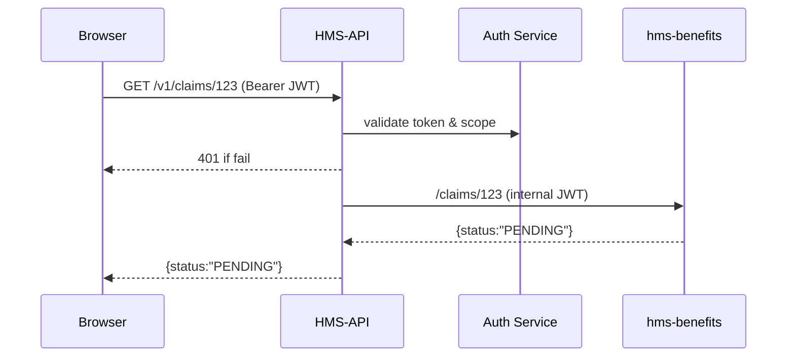

# Chapter 12: Backend API Gateway (HMS-API)

*(the secure drawbridge into the microservice castle)*  

[← Back to Chapter 11: Access & Authorization Framework](11_access___authorization_framework_.md)

---

## 1. Why Do We Need an API Gateway?

Picture **Carlos**, a veteran who just used the portal to:

1. Upload a **disability-claim form** (PDF)  
2. Check the **status** of his GI-Bill tuition payment  
3. Chat with the built-in **AI assistant** about housing allowances  

Behind the scenes, each task hits a different micro-service:

* `hms-docs` stores the PDF  
* `hms-benefits` returns claim status  
* `hms-payments` exposes tuition data  

Without one central **gate**, every browser, mobile app, or AI agent would have to know:

* 12 different hostnames  
* 5 different auth methods  
* Which endpoints are public vs. sensitive  

HMS-API stands in front of all that complexity.  
It is the **only URL** that outsiders ever see:

```
https://api.hms.gov/v1/...
```

Just like a real castle drawbridge, it checks IDs, limits the crowd, and inspects every parcel before letting anyone inside.

---

## 2. Key Ideas One-by-One

| Term | Plain-English Meaning |
|------|-----------------------|
| **Route** | Path the gateway exposes (`/v1/claims`) |
| **Upstream** | The hidden micro-service that really owns the data |
| **Policy Plug-in** | Re-usable mini-function (auth, throttle, validate) attached to a route |
| **Rate Limit** | Max calls per user / minute |
| **Schema Validation** | Auto-reject a bad JSON payload before it reaches upstream |

Keep these five in mind; everything else is just plumbing.

---

## 3. A 3-Step “Hello Gateway” Walk-Through

### 3.1 Citizen Portal Calls One URL (Front-End, 10 lines)

```js
// /widgets/claim-status/fetch.js
export async function getClaimStatus(claimId){
  const token = localStorage.getItem("hms_token");     // got in Chapter 11
  const res   = await fetch(`/api/v1/claims/${claimId}`,{
    headers:{ Authorization:`Bearer ${token}` }
  });
  return res.json();      // → {status:"PENDING", lastUpdate:"2024-06-01"}
}
```

**What happened?**  
Only the gateway URL (`/api/v1/...`) is exposed to the browser—no service sprawl.

---

### 3.2 Declare a Route in the Gateway (YAML, 12 lines)

```yaml
# /routes/claims.yaml
path: /v1/claims/:id
methods: [GET]
upstream: http://hms-benefits:7000/claims/:id
plugins:
  - auth: require_scope: read:claims
  - rate_limit: per_minute: 30
```

1. Matches `GET /v1/claims/123`  
2. Requires the `read:claims` scope issued in [Access & Authorization Framework](11_access___authorization_framework_.md)  
3. Forwards to the `hms-benefits` service  
4. Caps the same user at 30 requests/min

---

### 3.3 Run the Gateway Locally (CLI, 2 lines)

```bash
npx hms-gateway start --routes ./routes
# listens on http://localhost:9001
```

Open your browser to `http://localhost:9001/v1/claims/demo` and watch the magic.

---

## 4. What Happens Under the Hood?



• If auth or rate-limit fails, the request never touches `hms-benefits`.  
• Success returns a transparent proxy response.

---

## 5. Under-the-Hood Code Peek

*(Files trimmed to keep <20 lines each)*

### 5.1 Minimal Gateway Server (Node, 18 lines)

```js
// /gateway/index.js
import express from "express";
import routes   from "./loader.js";   // reads YAML files
import {auth}   from "./plugins/auth.js";
import {limit}  from "./plugins/limit.js";
import proxy    from "express-http-proxy";

const app = express();

for (const r of routes){
  const mid = [];
  if (r.plugins.auth)  mid.push(auth(r.plugins.auth));
  if (r.plugins.rate_limit) mid.push(limit(r.plugins.rate_limit));

  app[r.methods[0].toLowerCase()](r.path, ...mid,
    proxy(r.upstream, {
      proxyReqPathResolver: req => req.originalUrl.replace("/v1","")
    })
  );
}

app.listen(9001);
```

Explanation:  
1. Loads every YAML file in `/routes`.  
2. Wraps each with `auth` and `limit` plug-ins.  
3. Uses `express-http-proxy` to forward downstream.

### 5.2 Auth Plug-in (12 lines)

```js
// /gateway/plugins/auth.js
import jwt from "jsonwebtoken";
export const auth = opts => (req,res,next)=>{
  try{
    const token = req.headers.authorization?.split(" ")[1];
    const data  = jwt.verify(token, process.env.JWT_SECRET);
    if(!data.scopes.includes(opts.require_scope))
       return res.sendStatus(403);
    next();
  }catch(e){
    res.sendStatus(401);
  }
};
```

Same verification pattern you met in Chapter 11—code reuse FTW!

### 5.3 Rate-Limit Plug-in (14 lines)

```js
// /gateway/plugins/limit.js
const hits = new Map();   // {key → [timestamps]}
export const limit = ({per_minute}) => (req,res,next)=>{
  const key = req.user?.sub || req.ip;
  const now = Date.now();
  hits.set(key, (hits.get(key)||[]).filter(t=>now-t<60000).concat(now));
  if (hits.get(key).length > per_minute) return res.status(429).send("Too Many Requests");
  next();
};
```

Tiny in-memory throttle good for dev; prod swaps in Redis.

---

## 6. Helpful Extras

1. **Schema Validation**  
   Add a `schema: ./schemas/claim.json` plug-in that auto-rejects malformed JSON before upstreams see it.  
2. **Mock Mode**  
   Use `upstream: mock://claims-success.json` during front-end prototyping.  
3. **Circuit Breaker**  
   A `breaker` plug-in can pause a route if the upstream returns 50× errors too often, protecting the rest of HMS.

---

## 7. Where the Gateway Intersects Other Layers

| Layer | Interaction |
|-------|-------------|
| [Access & Authorization Framework](11_access___authorization_framework_.md) | Validates tokens & scopes via shared secret |
| [Governance Layer](04_governance_layer__hms_gov__.md) | Publishes allowed plug-ins & default rate rules |
| [Metrics & Monitoring Dashboard](14_metrics___monitoring_dashboard_.md) | Collects latency & 4xx/5xx counts from the gateway |
| [Compliance & Audit Trail](15_compliance___audit_trail_.md) | Stores every 401/403/429 for later review |

---

## 8. Common Pitfalls & Quick Fixes

| Symptom | Fix |
|---------|-----|
| “CORS blocked” errors | Enable `cors` plug-in on the gateway, **never** on each micro-service. |
| Flood of 429s | Raise `per_minute` or move to Redis-backed limiter; maybe your front-end is polling too often. |
| 504 Gateway Timeout | Add `timeout` plug-in or review upstream health in the [Metrics Dashboard](14_metrics___monitoring_dashboard_.md). |
| Leaked internal URLs in errors | Set `proxy-error-handler` to strip upstream hostnames. |

---

## 9. Try It Yourself (Full Demo in 60 Seconds)

```bash
# 1. clone & start the mock upstream
git clone hms-uhc-demo && cd hms-uhc-demo
npm run benefits:mock     # starts at :7000, always returns JSON status

# 2. run gateway with sample route
npm run gateway:dev       # loads /routes/*.yaml

# 3. call through gateway
curl -H "Authorization: Bearer $(cat sample.nurse.token)" \
     http://localhost:9001/v1/claims/abc
```

Expected: `{"status":"PENDING"}` from the mock service; remove the token and get **401 Unauthorized**.

---

## 10. What You Learned

✔️ HMS-API is the **single, secure doorway** for all external traffic.  
✔️ Five core ideas: Route, Upstream, Policy Plug-in, Rate Limit, Schema Validation.  
✔️ How to expose a route with a 12-line YAML file and protect it with mini plug-ins.  
✔️ Under-the-hood: Express + plug-in chain + proxy.  
✔️ Connection points to Auth, Governance, Metrics, and Audit layers.

The gateway now funnels clean, authenticated requests into dozens of micro-services.  
But how do we **see** what those services are doing and keep them in harmony?  
Time to orchestrate—and watch—our back end in [Chapter 13: Microservice Orchestration & Observability](13_microservice_orchestration___observability_.md).

---

Generated by [AI Codebase Knowledge Builder](https://github.com/The-Pocket/Tutorial-Codebase-Knowledge)