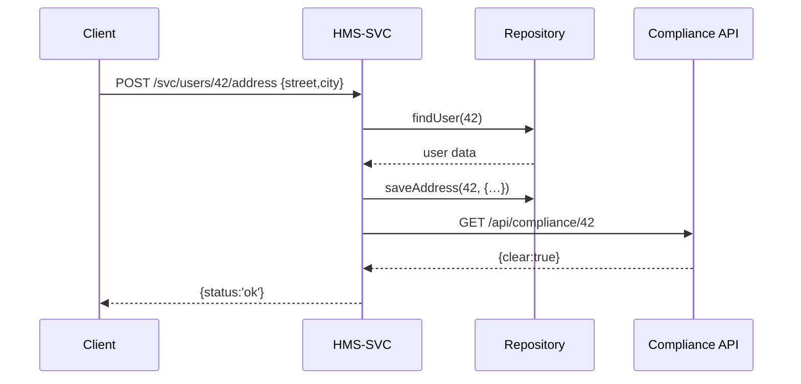

# Chapter 12: Backend Services (HMS-SVC)

In the last chapter, you learned how the [Interface Layer](11_interface_layer_.md) exposes public APIs, widgets, and SDKs for external apps. Now we dive into the “kitchen” behind the scenes: the **Backend Services (HMS-SVC)** that host your business logic, talk to databases, coordinate compliance checks, and power core workflows.

---

## 1. Motivation & Central Use Case

Imagine the **National Institute of Dental and Craniofacial Research** needs to manage citizen dental records. A citizen logs into a portal and submits an address-change request. Behind the scenes HMS-SVC must:  
1. Validate the citizen’s identity.  
2. Update the record in a database.  
3. Call a compliance service to ensure no outstanding issues.  
4. Return success or an error message.

Without a well-structured backend service layer, all this logic ends up tangled in one big app—hard to test, scale, or secure. HMS-SVC modularizes each “microservice” so you can develop, deploy, and maintain them independently.

---

## 2. Key Concepts

1. **Service Endpoint**  
   A network entry point (e.g. HTTP URL) that clients call to invoke business logic.

2. **Business Logic Layer**  
   Where you codify rules and workflows (identity check, compliance rules, etc.).

3. **Data Access Layer (Repository)**  
   Encapsulates database queries so your service code remains clean.

4. **Integration Clients**  
   Simple adapters that call other internal or external services (e.g., compliance checks).

5. **Error Handling & Retries**  
   Ensures transient failures (like a brief DB outage) don’t crash your service.

---

## 3. Hands-On: Building a Citizen Record Service

### 3.1 Service Endpoint

File: `server.js`
```
const express = require('express');
const { updateAddress } = require('./userService');
const app = express();
app.use(express.json());

app.post('/svc/users/:id/address', async (req, res) => {
  try {
    await updateAddress(req.params.id, req.body);
    res.json({ status: 'ok' });
  } catch (err) {
    res.status(400).json({ error: err.message });
  }
});

app.listen(5000, () => console.log('HMS-SVC running on port 5000'));
```
This small server handles POST requests to update a user’s address.

### 3.2 Business Logic Layer

File: `userService.js`
```
const repo = require('./repo');
const { checkCompliance } = require('./complianceClient');

async function updateAddress(userId, { street, city }) {
  const user = await repo.findUser(userId);
  if (!user) throw new Error('User not found');

  // 1) Update in DB
  await repo.saveAddress(userId, { street, city });

  // 2) Compliance check
  const ok = await checkCompliance(userId);
  if (!ok) throw new Error('Compliance check failed');
}

module.exports = { updateAddress };
```
Here we fetch the user, update the database, and then call a compliance service.

### 3.3 Data Access Layer

File: `repo.js`
```
const db = {}; // pretend in-memory DB

async function findUser(id) {
  return db[id]; // returns undefined if not present
}

async function saveAddress(id, addr) {
  db[id] = { ...db[id], address: addr };
}

module.exports = { findUser, saveAddress };
```
This “repository” abstracts away how we store and retrieve data.

### 3.4 Integration Client

File: `complianceClient.js`
```
const fetch = require('node-fetch');

async function checkCompliance(userId) {
  const res = await fetch(`http://hms-api/api/compliance/${userId}`);
  const data = await res.json();
  return data.clear; // true or false
}

module.exports = { checkCompliance };
```
This adapter calls the Compliance API and returns a simple boolean.

---

## 4. What Happens Under the Hood?



1. Client submits the address.  
2. HMS-SVC fetches and updates the DB.  
3. HMS-SVC calls Compliance API.  
4. Upon success, HMS-SVC returns confirmation.

---

## 5. Internal Implementation Walkthrough

Here’s how our files fit together:

```
/hms-svc
  ├── server.js            # HTTP entrypoint
  ├── userService.js       # business logic
  ├── repo.js              # data access layer
  └── complianceClient.js  # integration client
```

- **server.js**: Defines routes and error handling.  
- **userService.js**: Orchestrates the update flow.  
- **repo.js**: Encapsulates all DB operations.  
- **complianceClient.js**: Wraps external API calls.

This separation of concerns makes your code easy to read, test, and maintain.

---

## 6. Summary & Next Steps

You’ve seen how **HMS-SVC**:

- Exposes **Service Endpoints** for core workflows.  
- Encapsulates **Business Logic** in dedicated modules.  
- Uses a **Repository** to isolate database code.  
- Integrates external checks via **Integration Clients**.  

Up next: we’ll explore the foundation that keeps all these services running smoothly—our [Core Infrastructure (HMS-SYS)](13_core_infrastructure__hms_sys__.md).

---

Generated by [AI Codebase Knowledge Builder](https://github.com/The-Pocket/Tutorial-Codebase-Knowledge)