# Chapter 12: Continuous Delivery & Compliance Pipeline
*A friendly continuation from* [Microservice Registry & Discovery](11_microservice_registry___discovery_.md)

---

## 1  Why Another Pipeline? – A 60-Second Story  
At 7 p.m. on a Friday, the Centers for Disease Control and Prevention (CDC) receives new guidance for tracking a fast-moving pandemic strain.  
Developers code a **“Contact-Tracing v1.0”** microservice by 10 p.m., but:

* Federal law says **security scans** must run before anything touches production.  
* The agency’s **Authority-to-Operate (ATO)** package must carry the new code’s SBOM (Software Bill of Materials).  
* Auditors expect an **immutable trail** proving which policy version was in force when the service launched.

With a traditional, manual checklist the earliest go-live would be next week—far too late for a public-health emergency.

**Continuous Delivery & Compliance Pipeline (CD-C²)** is an *assembly line + robot inspector* that turns the 3 a.m. commit into a compliant, live service **before sunrise**.

---

## 2  Key Ideas in Plain English

| Term | Think of it as… | Why it matters |
|------|-----------------|----------------|
| Build Stage | Car chassis welding | Turns source code → container image |
| Test Stage | Brake & light inspection | Unit / integration tests prove it works |
| Sec-Scan Stage | Cybersecurity robot | Checks SBOM, CVEs, license compliance |
| ATO Docs Stage | DMV title paperwork | Auto-fills required forms & signatures |
| Promote Stage | Driving onto dealership lot | Pushes image, registers version, updates traffic |

---

## 3  Central Use Case – “Ship Pandemic Contact-Tracing v1.0 Tonight”

Desired flow:

1. **Developer** pushes `git commit -m "contact-tracing v1.0"`  
2. CI server builds & tests.  
3. Security robots scan for vulnerabilities, generate SBOM.  
4. ATO paperwork is auto-filled and sent to the reviewer queue.  
5. If reviewer approves (see [Human-in-the-Loop Oversight](06_human_in_the_loop__hitl__oversight_.md)), the image is promoted.  
6. Registry updates; traffic shifts—mission accomplished.

---

## 4  Hands-On: A 3-File Pipeline You Can Read

We’ll build a **minimal but real** pipeline using GitHub Actions syntax (works identically in GitLab / Jenkins).

### 4.1  `cdc-contact-tracing/.github/workflows/cdc.yml`  (≤ 20 lines)

```yaml
name: CDC Contact-Tracing CI

on: [push]

jobs:
  build_test_scan:
    runs-on: ubuntu-latest
    steps:
      - uses: actions/checkout@v4
      - name: Build image
        run: docker build -t cdc/contact-tracing:$GITHUB_SHA .
      - name: Run tests
        run: pytest -q
      - name: Security scan + SBOM
        uses: aquasecurity/trivy-action@v0.14
        with:
          image-ref: cdc/contact-tracing:$GITHUB_SHA
      - name: Upload SBOM to ATO bot
        run: curl -X POST https://ato-bot/api/sbom \
             -F sbom=@trivy.sbom.json
```

**What just happened?**

1. Code is checked out.  
2. Docker image built.  
3. Pytest ensures logic passes.  
4. Trivy scans CVEs **and** emits `trivy.sbom.json`.  
5. SBOM is sent to *ATO-bot*, a tiny service that assembles official paperwork.

### 4.2  `ato-bot/submit.py`  (15 lines)

```python
from fastapi import FastAPI, UploadFile
import httpx, os, datetime

app = FastAPI()
GOV_URL = os.getenv("HMS_GOV")

@app.post("/sbom")
async def sbom(file: UploadFile):
    data = await file.read()
    # 1. save immutable copy (S3/Git), attach timestamp
    sbom_id = f"sbom-{datetime.datetime.utcnow().isoformat()}"
    open(f"/tmp/{sbom_id}.json", "wb").write(data)

    # 2. Create draft ATO packet, post to HITL reviewer
    packet = {"sbom_id": sbom_id, "policy_v": "latest"}
    httpx.post("http://hitl/api/drafts", json=packet, timeout=5)

    return {"queued": True, "draft_id": packet["sbom_id"]}
```

Beginner notes:  
* Reads uploaded SBOM.  
* Saves it for audit.  
* Creates a **draft** that a security officer must bless (HITL).  
* Only 15 lines!

### 4.3  `promote.sh`  (13 lines)

```bash
#!/usr/bin/env bash
set -e
IMG="cdc/contact-tracing:$1"      # $1 = SHA

# 1. Push to secured registry
docker push $IMG

# 2. Register image version
curl -X PUT https://registry/api/services \
     -d '{"name":"contact-tracing","version":"1.0.0","url":"'$IMG'","ttl":30}'

# 3. Trigger 90/10 canary via mesh control-plane
curl -X POST https://mesh/api/traffic \
     -d '{"service":"contact-tracing","canary":"1.0.0","weight":10}'
```

Called by CI **only after** HITL reviewer clicks *Approve*.

---

## 5  Step-By-Step “What Happens Internally?”

```mermaid
sequenceDiagram
    participant Dev as Developer
    participant CI  as CI Runner
    participant Sec as Sec-Scan
    participant ATO as ATO-Bot
    participant HITL as Reviewer
    participant REG as Registry

    Dev->>CI: git push
    CI->>Sec: call Trivy scan
    Sec-->>CI: SBOM + scan report
    CI->>ATO: POST SBOM
    ATO->>HITL: POST /drafts
    HITL-->>ATO: approve ✅
    CI->>REG: promote.sh (image + version)
```



Only **6 hops** from push to production, with humans approving only the *compliance* part, not the mechanical build.

---

## 6  Under the Hood – Minimal Controller (≤ 18 lines)

_File: `pipeline/controller.py`_

```python
import subprocess, os, httpx

def run(step, *cmd):
    print(f"--- {step}")
    subprocess.check_call(cmd)

SHA = os.getenv("GITHUB_SHA")

run("build", "docker", "build", "-t", f"cdc/contact:{SHA}", ".")
run("test",  "pytest", "-q")
run("scan",  "trivy",  "image", "-f", "json", "-o", "sbom.json",
     f"cdc/contact:{SHA}")

resp = httpx.post("http://ato-bot/sbom", files={"sbom":"sbom.json"})
if resp.json().get("queued"):
    print("Waiting for approval…")   # 👈 real code polls HITL status
    # …simplified: assume approved
    subprocess.check_call(["./promote.sh", SHA])
```

Explanation:

* `run()` wrapper prints stage name then executes command.  
* Builds, tests, scans.  
* Uploads SBOM → waits (omitted poll for brevity).  
* Calls `promote.sh`.

---

## 7  Where Other HMS-UTL Layers Plug In

* **Policy Version Tag** – ATO-bot pulls `X-Policy-Version` from [Governance Layer](01_governance_layer__hms_gov__.md) to lock in compliance context.  
* **HITL Reviewer** – Same approval queue described in [Human-in-the-Loop Oversight](06_human_in_the_loop__hitl__oversight_.md).  
* **RBAC** – Only accounts with `SECURITY_OFFICER` role can click *Approve* (see [RBAC](08_role_based_access___permissions__rbac__.md)).  
* **Registry Update** – Final `PUT /services` hits the phonebook you built in [Microservice Registry & Discovery](11_microservice_registry___discovery_.md).  
* **Metrics** – Each stage emits timings/status to [Metrics & Monitoring Dashboard](15_metrics___monitoring_dashboard_.md).

---

## 8  Frequently Asked Questions

**Q: How long does a typical run take?**  
• Build: 1-2 min  
• Tests: 30 s  
• Sec-Scan: 45 s  
• Human approval: variable (pager duty!)  
Pipeline *minus human* ≈ 3 min.

**Q: What if the scan finds a critical CVE?**  
CI marks the job *failed*; the image is never pushed, and HITL receives a red-flagged report.

**Q: Does the ATO paperwork still need wet signatures?**  
No. Digitally-signed PDFs with PIV/CAC credentials are attached automatically, satisfying OMB M-22-18 e-signature guidance.

**Q: Can multiple agencies share one pipeline?**  
Yes—each repo has its own workflow file but reuses the shared **Sec-Scan** and **ATO-bot** services.

---

## 9  What You Learned

• CD-C² turns a single `git push` into a fully-scanned, ATO-ready, production deployment—often in minutes.  
• Builds, tests, scans, and paperwork generation are codified in YAML, not tribal knowledge.  
• Human reviewers still hold the **big red button** via HITL, preserving accountability.  
• Every promotion auto-registers the new version, letting the service mesh and registry route traffic instantly.  
• The pipeline weaves together governance, security, registry, and metrics layers you’ve already mastered.

Ready to sync live data across all these freshly-deployed services?  
Jump to [Real-Time Sync Engine](13_real_time_sync_engine_.md).

---

Generated by [AI Codebase Knowledge Builder](https://github.com/The-Pocket/Tutorial-Codebase-Knowledge)