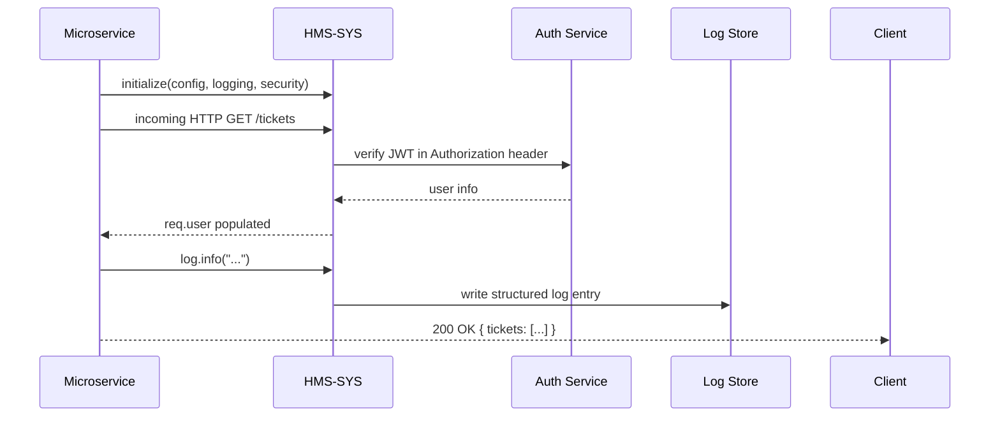

# Chapter 12: Core Infrastructure (HMS-SYS)

In [Chapter 11: Backend Services (HMS-SVC)](11_backend_services__hms_svc__.md) we built domain-specific services for healthcare, education, finance, and more. Now it’s time to lay down the **roads**, **power grid**, and **data centers** that every service depends on. That’s what **Core Infrastructure (HMS-SYS)** provides: shared utilities like logging, security, configuration, and service-health checks so you don’t reinvent the wheel in each microservice.

---

## 1. Why Core Infrastructure?

Imagine each FOIA microservice rolling its own:

- Authentication code  
- Config parsing  
- Logging setup  
- Retry logic  

You’d end up with inconsistent JWT checks, mismatched log formats, and scary outages when one module mis-configures. HMS-SYS centralizes these cross-cutting concerns so you can focus on business logic—just wire in the core modules and you’re guaranteed consistent behavior across the platform.

**Use Case**: A new FOIA “ticket‐search” service wants uniform request tracing, secure endpoints, and feature toggles. Instead of copy-pasting, it includes HMS-SYS libraries and instantly gets logging, token validation, and config loaded from the same source as every other service.

---

## 2. Key Concepts

1. **Configuration Management**  
   Load environment variables, defaults, and secrets in one place.

2. **Security & Authentication**  
   Central middleware for JWT verification, role checks (RBAC), and token refresh.

3. **Logging & Monitoring**  
   Structured logs, request tracing IDs, and optional integration with a central log store.

4. **Health Checks & Service Discovery**  
   A standard `/health` endpoint and utilities to register with a service registry.

5. **Utilities**  
   Retry helpers, error wrappers, and feature-toggle hooks.

---

## 3. Getting Started: Wiring Up HMS-SYS

Below is a minimal “FOIA‐Search” service that uses HMS-SYS for config, security, and logging.

```js
// services/foia-search/index.js
const express = require('express');
const config       = require('hms-sys/config');
const { authenticate } = require('hms-sys/security');
const { loggerMiddleware, log } = require('hms-sys/logging');

const app = express();
app.use(express.json());
app.use(loggerMiddleware);   // attach request IDs & structured logs
app.use(authenticate);       // verify JWT, set req.user

app.get('/svc/foia/tickets', (req, res) => {
  log.info(`User ${req.user.id} listing tickets`);
  // ... fetch from your domain service
  res.json({ tickets: [] });
});

app.listen(config.port, () => {
  log.info(`FOIA Search running on port ${config.port}`);
});
```

Explanation:  
- `hms-sys/config` reads `PORT` and other settings.  
- `hms-sys/security` ensures only valid tokens reach your routes.  
- `hms-sys/logging` tags each request with a trace ID and prints structured logs.

---

## 4. Under the Hood: Request Flow



1. **Initialize**: on startup, HMS-SYS loads config, logging, and security.  
2. **Authenticate**: every request runs through the security middleware.  
3. **Log**: each log call goes through a structured logger with request IDs.  
4. **Respond**: your business code never worries about these steps—they just work.

---

## 5. Core Implementation Snippets

### 5.1 Configuration Loader

_File: `hms-sys/config/index.js`_

```js
const dotenv = require('dotenv');
dotenv.config();            // load .env
module.exports = {
  port: process.env.PORT || 3000,
  logLevel: process.env.LOG_LEVEL || 'info',
  jwtSecret: process.env.JWT_SECRET || 'dev-secret'
};
```

Explanation: reads environment with sensible defaults.

---

### 5.2 Security Middleware

_File: `hms-sys/security/index.js`_

```js
const jwt = require('jsonwebtoken');
const { jwtSecret } = require('../config');

function authenticate(req, res, next) {
  const token = req.headers.authorization?.split(' ')[1];
  try {
    req.user = jwt.verify(token, jwtSecret);
    next();
  } catch {
    res.sendStatus(401);
  }
}

module.exports = { authenticate };
```

Explanation: verifies a Bearer token and attaches `req.user`.

---

### 5.3 Logging Utility

_File: `hms-sys/logging/index.js`_

```js
const { createLogger, transports, format } = require('winston');
const { logLevel } = require('../config');

const logger = createLogger({
  level: logLevel,
  format: format.json(),
  transports: [ new transports.Console() ]
});

function loggerMiddleware(req, res, next) {
  const traceId = Date.now().toString(36);
  req.traceId = traceId;
  logger.defaultMeta = { traceId };
  next();
}

module.exports = {
  loggerMiddleware,
  log: logger
};
```

Explanation: adds a `traceId` to all logs so you can correlate events per request.

---

## 6. What We’ve Learned

- **HMS-SYS** gives you one source of truth for configuration, authentication, logging, and health checks.  
- By simply including `hms-sys` modules, every microservice—whether it’s FOIA, scheduling, or payments—gets consistent behavior and shared utilities.  
- You never have to re-implement JWT verification, environment parsing, or structured logging in each service.

Next up is the [Management Layer](13_management_layer_.md), where we’ll build dashboards, admin consoles, and orchestration tools on top of our solid infrastructure.

---

Generated by [AI Codebase Knowledge Builder](https://github.com/The-Pocket/Tutorial-Codebase-Knowledge)