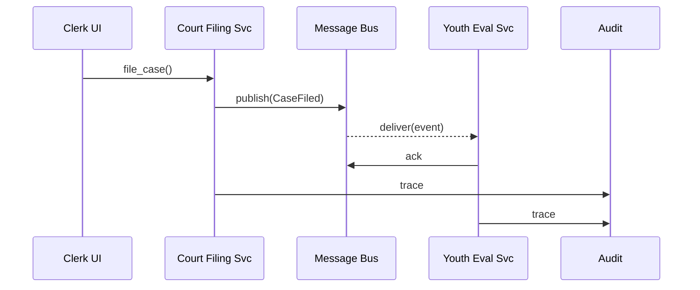

# Chapter 12: Event-Driven Microservices Architecture  
*(File: 12_event_driven_microservices_architecture_.md)*  

[← Back to External System Synchronization Bus](11_external_system_synchronization_bus_.md)

---

## 1. Why Go “Event-Driven”? — A 60-Second Story  

Picture the **Office of Juvenile Justice**.  
Yesterday we shipped a new “Youth Evaluation” micro-service.  The dev team did **NOT**:

* Touch the old “Case-Filing” service.  
* Edit the API Gateway routing table.  
* Ask the DBA for joins on four tables.

Instead, they just told their service to **listen** to an existing event topic:

```
Topic: court.case.filed
```

Now, whenever a new juvenile case is filed, the Evaluation service reacts within milliseconds—no brittle, point-to-point integrations. That is the magic of an **Event-Driven Microservices Architecture (EDMA)**.

---

## 2. High-Level Goal for This Chapter  

You will:

1. Publish a **`CaseFiled`** event from one service.  
2. Subscribe to that event in a second service and add business logic.  
3. See how governance, security, and auditing still apply automatically.  

All code fits in **two Python files** — perfect for beginners.

---

## 3. Key Concepts (Plain English)  

| Word | What it really means | Friendly Analogy |
|------|----------------------|------------------|
| Event | A fact that already happened (`CaseFiled`) | “Breaking-news” headline |
| Topic | Named channel events travel on (`court.case.filed`) | TV station frequency |
| Producer | Service that **publishes** events | News reporter |
| Consumer | Service that **subscribes** to events | Your living-room TV |
| Message Bus | Infrastructure that routes events (Kafka, NATS) | Cable network |
| At-Least-Once Delivery | The bus retries until the consumer says “got it” | Certified mail |
| Idempotent Handler | Code that won’t break if the same event arrives twice | Counting ballots twice but storing only one total |
| Schema Registry | Catalog that defines every event’s JSON shape | AP style guide |

Keep in mind: **Producers and consumers never see each other—only the bus.**

---

## 4. Quick-Start (15 Lines Per Service)  

### 4.1 Producer: Court Filing Service  

```python
# file: court_filing.py
from hms_events import publish, new_event_id
from hms_gov    import check_permission   # Chapter 1

def file_case(case_id, juvenile_id):
    check_permission(role="Clerk",
                     action="create",
                     resource="JuvenileCase")
    event = {
      "id":         new_event_id(),     # unique UUID
      "type":       "CaseFiled",
      "case_id":    case_id,
      "juvenile_id":juvenile_id
    }
    publish(topic="court.case.filed", event=event)
    return "✅ Case filed"
```

Explanation  
1. Governance confirms the **clerk** may create a case.  
2. `publish` sends the event to the message bus—end of story for this service.  

---

### 4.2 Consumer: Youth Evaluation Service  

```python
# file: youth_eval.py
from hms_events import subscribe, ack
from hms_ppe     import evaluate        # Chapter 10
from rbac_table  import RBAC            # Chapter 4

def handle_case(evt):
    # Idempotency guard (skip if we've seen id before)
    if _already_processed(evt["id"]):
        return ack(evt)

    risk = evaluate("YOUTH-RISK", {"juvenile_id": evt["juvenile_id"]})
    _store_eval(evt["case_id"], risk)
    ack(evt)

subscribe(topic="court.case.filed", callback=handle_case)
```

Explanation  
• The service **listens**; when an event arrives, it calls the Policy & Process Engine to assess risk and stores the result.  
• `ack` tells the bus delivery succeeded.  
• Duplicate events do no harm because of the `_already_processed` test.

---

#### What will users see?

1. Clerk creates case → receives “✅ Case filed”.  
2. Within seconds the new Evaluation row appears in the dashboard—no extra API calls.

---

## 5. Life of a `CaseFiled` Event  



Five actors, four steps: **publish ➜ deliver ➜ handle ➜ ack**.

---

## 6. Under the Hood (Tiny Implementation)  

### 6.1 Message Bus Stub (`hms_events/bus.py` — <20 lines)

```python
SUBS = {}          # topic -> [callbacks]
QUEUE = []

def publish(topic, event):
    QUEUE.append((topic, event))

def subscribe(topic, callback):
    SUBS.setdefault(topic, []).append(callback)

def ack(evt):      # placeholder, real bus tracks offsets
    pass

def _pump():       # call in a background thread
    while True:
        if not QUEUE: continue
        topic, evt = QUEUE.pop(0)
        for cb in SUBS.get(topic, []):
            cb(evt)
```

Beginners’ takeaway: a **dict** holds subscribers; a **list** buffers events; `_pump()` delivers.

### 6.2 Id Generator (`hms_events/utils.py`)  

```python
import uuid
def new_event_id():
    return "EVT-" + uuid.uuid4().hex[:8]
```

### 6.3 Governance Hook (reuse)  

`publish()` internally calls  

```python
from hms_gov import check_permission
check_permission(role=current_role(), action="publish", resource=topic)
```

so only approved roles can send events.

---

## 7. How EDMA Connects with Other HMS-EHR Layers  

| Concern | Layer | Chapter |
|---------|-------|---------|
| Who may publish/subscribe? | Governance + RBAC | [Governance Layer](01_governance_layer__hms_gov__.md), [Role-Based Access Control](04_role_based_access_control__rbac__.md) |
| External partners need the same events | Sync Bus fan-outs | [External System Synchronization Bus](11_external_system_synchronization_bus_.md) |
| Long-term storage & analytics | Data Lake ingest each event | [Data Lake & Analytics Hub](13_data_lake___analytics_hub_.md) |
| Monitoring lag or failures | Observability dashboards | [Observability & Continuous Monitoring](14_observability___continuous_monitoring_.md) |
| Deployment safety | Canary streams in Sandbox | [Deployment Pipeline & Sandbox Environments](15_deployment_pipeline___sandbox_environments_.md) |

---

## 8. Common Pitfalls & Quick Fixes  

| Pitfall | Symptom | Quick Fix |
|---------|---------|-----------|
| Handler not idempotent | Duplicate DB rows | Store `event.id` in a “processed” table before logic |
| Topic names inconsistent | Consumers miss events | Follow `agency.domain.action` naming (`court.case.filed`) |
| Oversized events (>1 MB) | Bus rejects | Put blob in object storage, send link in event |
| No ACK sent | Endless retries | Always call `ack(evt)` even after error handling |
| Unversioned schemas | Parsing breaks on change | Register every schema version in a **Schema Registry** folder |

---

## 9. Try It Yourself  

1. Clone repo → `cd examples/edma/`  
2. In Terminal A: `python youth_eval.py`  
3. In Terminal B: `python court_filing.py` and call `file_case("CASE-123","JUV-9")`  
4. Watch Terminal A print the risk score immediately.  
5. Kill Terminal A, file another case, restart Terminal A — events filed while it was down replay automatically (at-least-once).  

---

## 10. What You Learned  

✓ Events = immutable facts; services react, not ask.  
✓ Producers and consumers are **loosely coupled** by a message bus.  
✓ Governance, RBAC, and audit logs still wrap every publish/subscribe.  
✓ A beginner-sized implementation you can extend to Kafka or NATS later.  

Next we will store all these events—and every other datum—inside a scalable analytics platform:  
[Data Lake & Analytics Hub](13_data_lake___analytics_hub_.md)

---

---

Generated by [AI Codebase Knowledge Builder](https://github.com/The-Pocket/Tutorial-Codebase-Knowledge)