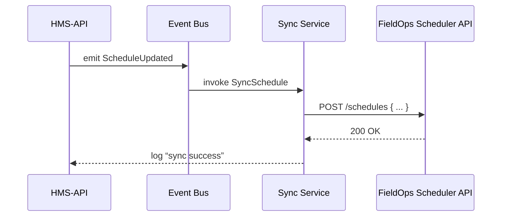

# Chapter 12: External System Sync

In [Chapter 11: Core System Platform (HMS-GOV)](11_core_system_platform__hms_gov__.md) we saw how HMS-GOV orchestrates internal workflows. Now let’s look at how HMS-API talks in real time with **outside** systems—like a digital fax that instantly pushes new schedules or policies to third-party platforms. This is **External System Sync**.

---

## Why External System Sync?

Many federal agencies depend on external tools:

- The Employment and Training Administration (ETA) uses a separate scheduling system for job-training appointments.  
- A state archives department manages documents in an external DMS (Document Management System).  
- The Northern Border Regional Commission coordinates with partner portals to show grant application deadlines.

Each time we update a schedule or policy in HMS-API, those third-party systems must stay in sync. Without an automated link, staff send emails or run manual exports—slow and error-prone.

**Central Use Case**  
> After the Mine Safety and Health Administration (MSHA) publishes a new inspection schedule in HMS, automatically push it to the external “FieldOps Scheduler” so inspectors’ calendars update instantly.

---

## Key Concepts

1. **Connector**  
   A small adapter that knows how to talk to one external system (e.g., scheduling API, document store).  

2. **Event Trigger**  
   HMS-API emits an event (e.g., `ScheduleUpdated`) whenever relevant data changes.  

3. **Sync Service**  
   Listens for events and calls the right Connector to push updates.  

4. **Retries & Error Handling**  
   Ensures temporary failures (network hiccups) don’t drop important updates.  

5. **ID Mapping**  
   Keeps track of which HMS record maps to which external record ID.

---

## How to Use External System Sync

### 1. Configure a Connector

In your config file, define the external endpoint and credentials:

```php
// config/external_sync.php
return [
  'field_ops' => [
    'base_url' => env('FIELDOPS_URL'),
    'api_key'  => env('FIELDOPS_API_KEY'),
  ],
];
```
*Explanation:* We name our connector `field_ops` and provide its URL and key.

### 2. Emit an Event in Your Controller

Whenever you update a schedule:

```php
// app/Http/Controllers/ScheduleController.php
public function update($id, Request $req)
{
    // ... update HMS schedule ...
    event(new \App\Events\ScheduleUpdated($schedule));
    return response()->json($schedule);
}
```
*Explanation:* Firing `ScheduleUpdated` lets our Sync Service know something changed.

### 3. Sync Service Listens & Pushes

```php
// app/Listeners/SyncSchedule.php
public function handle(ScheduleUpdated $e)
{
    \App\Services\Sync\ExternalSystemSync::push(
      'field_ops',
      'schedule',
      $e->schedule->toArray()
    );
}
```
*Explanation:* This listener calls our sync helper to send the schedule data to the external system.

---

## What Happens Under the Hood



1. HMS-API updates the schedule and emits `ScheduleUpdated`.  
2. The **Sync Service** (via listener) picks up the event.  
3. It calls the external API adapter (Connector) to `POST` the new schedule.  
4. Logs success or retries on failure.

---

## Inside ExternalSystemSync

### Service API

```php
// app/Services/Sync/ExternalSystemSync.php
namespace App\Services\Sync;

use Illuminate\Support\Facades\Http;

class ExternalSystemSync
{
    public static function push($connector, $type, array $payload)
    {
        $cfg = config("external_sync.$connector");
        $url = "{$cfg['base_url']}/api/{$type}s";
        Http::withHeaders([
            'Authorization' => "Bearer {$cfg['api_key']}"
        ])->post($url, $payload)
          ->throw(); // throws on HTTP error
    }
}
```
*Explanation:*  
- Loads connector settings from `config/external_sync.php`.  
- Builds the target URL (e.g., `/api/schedules`).  
- Sends an authenticated `POST` with our data.  

### Retry Logic (Optional)

You can wrap the call in a retry loop:

```php
// inside ExternalSystemSync::push()
retry(3, function() use ($url, $payload, $cfg) {
    Http::withHeaders([...])->post($url, $payload)->throw();
}, 100); // retry up to 3 times with 100ms delay
```
*Explanation:* `retry()` will attempt the request multiple times before failing.

### ID Mapping Store

To update vs. create, we store external IDs:

```php
// app/Models/ExternalMapping.php
protected $fillable = ['connector','hms_type','hms_id','external_id'];
```
When `push()` returns an `external_id`, you save it:

```php
$resp = Http::post(...)->json();
ExternalMapping::updateOrCreate([
  'connector'=>'field_ops',
  'hms_type'=>'schedule',
  'hms_id'=>$payload['id']
],['external_id'=>$resp['id']]);
```
*Explanation:* This lets future syncs `PUT` the existing record instead of always creating a new one.

---

## Summary

In this chapter you learned:

- **What** External System Sync is: a real-time link between HMS and third-party systems, like an interagency fax that’s always on.  
- **Key pieces**: Connectors, Event Triggers, Sync Service, Retries, ID Mapping.  
- **How to set it up**: define connectors in config, emit events, write a listener using `ExternalSystemSync::push()`.  
- **What’s under the hood**: HTTP calls with authentication, optional retry loops, and storing external IDs.

With this in place, your schedules, policies, and documents stay in sync across every system—instantly and automatically.

Congratulations! You’ve reached the end of our tutorial. Feel free to explore the code samples, experiment with new connectors, and build seamless integrations across your agency’s ecosystem.

---

Generated by [AI Codebase Knowledge Builder](https://github.com/The-Pocket/Tutorial-Codebase-Knowledge)