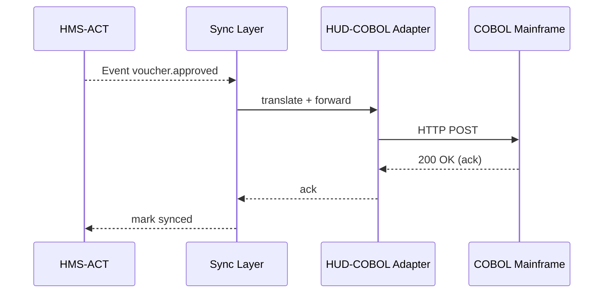

# Chapter 12: External System Synchronization Layer  
*(HMS-MKT Project)*  

[← Back to Chapter 11: HMS-DTA Unified Data Lake & Catalog](11_hms_dta_unified_data_lake___catalog_.md)

---

## 1. Why Do We Need a “Diplomatic Radio”?

Picture the **U.S. Department of Housing & Urban Development (HUD)**.  
Inside HMS they just published a brand-new **“Emergency Housing Voucher”** workflow (see [HMS-ACT Orchestration & Workflow Engine](08_hms_act_orchestration___workflow_engine_.md)).  

But HUD still runs:

* a **COBOL mainframe** that issues physical vouchers,
* an **Oracle database** owned by Treasury for payments, and
* a **county-level portal** that shows voucher status.

If HMS pushes a status **“Approved”**, each legacy system expects a different phrase:

| Legacy System | Phrase for “Approved” |
|---------------|-----------------------|
| COBOL         | `03` (two-digit code) |
| Oracle        | `APPROVED_PENDING_FUNDS` |
| County Portal | `✔️ Approved` |

Manually wiring every HMS change into three formats is brittle and slow.  
**The External System Synchronization Layer (ESSL)** is our **air-traffic radio**:

1. **Translates** new HMS events into each legacy dialect.  
2. **Relays** replies back into HMS in real-time.  
3. Keeps a **single source of truth** so no voucher falls through the cracks.

By the end of this chapter you will:

1. Create a tiny mapping file that turns HMS events into legacy codes.  
2. Watch ESSL push updates to a mock COBOL API and listen for a response.  
3. Peek under the hood to see the 15-line loop doing the magic.

---

## 2. Key Concepts (plain English)

| Word / Icon | Think of it as … |
|-------------|------------------|
| **Source Event** 📤 | A fact produced inside HMS (e.g., `voucher.approved`). |
| **Adapter** 🔌 | A small Node script that knows how to talk to ONE external system. |
| **Mapping Table** 🗺️ | YAML file that pairs HMS fields → legacy fields/codes. |
| **Change Feed** 📻 | Continuous stream of HMS events delivered to adapters. |
| **Ack / Nack** ✅/❌ | External system replies; `ack` means “got it,” `nack` means “try again.” |
| **Replay** 🔄 | Re-sending missed messages after downtime. |

Remember these six words—you already understand 80 % of ESSL!

---

## 3. Quick-Start Lab: Synchronise one “Approved” Voucher

### 3.1 Describe the Mapping (6 lines)

```yaml
# mappings/hud_cobol.yaml
event: voucher.approved
target: HUD-COBOL
fields:
  id: VCHR_ID
  citizenId: APPL_NUM
  status: '03'          # constant value the mainframe expects
```

### 3.2 Write the Adapter (≤ 20 lines)

```js
// adapters/hudCobol.js
const fetch = require('node-fetch')

module.exports = async function sendToCobol(payload) {
  /* COBOL mainframe exposes a simple REST bridge */
  await fetch('https://cobol.hud.gov/voucher', {
    method: 'POST',
    body: JSON.stringify(payload),
    headers: { 'x-api-key': process.env.COBOL_KEY }
  })
}
```

What it does: one HTTP POST—nothing fancy.

### 3.3 Register Everything (CLI)

```bash
hms-sync add-adapter HUD-COBOL ./adapters/hudCobol.js
hms-sync add-mapping  ./mappings/hud_cobol.yaml
```

Console output:

```
✅ Adapter HUD-COBOL registered
✅ Mapping voucher.approved ➜ HUD-COBOL loaded
```

### 3.4 Trigger an HMS Event

```bash
curl -X POST https://act.hms.gov/dev/fire \
     -d '{ "type":"voucher.approved", "id":"V123", "citizenId":"C888" }'
```

Terminal running ESSL shows:

```
[ESSL] voucher.approved picked up
[ESSL] Translated → { VCHR_ID:'V123', APPL_NUM:'C888', status:'03' }
[ESSL] Sent to HUD-COBOL ✅ ack
```

Boom—legacy world is in sync!

---

## 4. What Happens Behind the Curtain? (No heavy code)



Five actors—easy to keep in your head 🙂

---

## 5. Tiny Peek at the Engine (15 lines)

_File: `sync/src/runner.js`_

```js
import bus from './eventBus.js'          // receives HMS events
import { mappings, adapters } from './registry.js'

bus.on('*', async (evt) => {
  const map = mappings[evt.type]
  if (!map) return                       // nothing to do

  // 1️⃣ Translate
  const payload = {}
  for (const [src, dest] of Object.entries(map.fields))
    payload[dest] = src in evt ? evt[src] : dest   // const value OR copy

  // 2️⃣ Send
  try {
    await adapters[map.target](payload)
    bus.emit('sync.ack', { evt, target: map.target })
  } catch (e) {
    bus.emit('sync.nack', { evt, target: map.target, error: e })
  }
})
```

Line-by-line:

1–3   Import event bus & registries.  
5–6   Ignore events with no mapping.  
9–11  Build the translated payload.  
14–18 Send via adapter; emit `ack` or `nack` for monitoring.

That’s the whole core!

---

## 6. Handling Failures & Replay (Conceptual)

* Every `nack` is stored in a **Retry Table**.  
* A cron job replays unsent messages every 5 minutes **until acked**.  
* If 5 retries fail, HMS-GOV gets an alert in its **Override Panel** (see [HMS-GOV Admin / Policy-Maker Portal](05_hms_gov_admin___policy_maker_portal_.md)).

---

## 7. How ESSL Talks to Other HMS Pieces

Component | Relationship
----------|-------------
[HMS-ACT Workflow Engine](08_hms_act_orchestration___workflow_engine_.md) | Produces most **Source Events** (`voucher.approved`, `payment.sent`…).
[HMS-DTA Unified Data Lake](11_hms_dta_unified_data_lake___catalog_.md) | Stores **ack/nack logs** for auditors.
[Security & Legal Reasoning (HMS-ESQ)](10_security__compliance___legal_reasoning__hms_esq__hms_sys__.md) | Scans each adapter for data-handling guardrails.
[Human-in-the-Loop Framework](14_human_in_the_loop__hitl__oversight_framework_.md) | Can insert a manual checkpoint before certain external pushes.

---

## 8. 60-Second Playground

```bash
# 1. Start sync layer
npm run dev --workspace=hms-sync

# 2. Fire demo event
hms-sync fire voucher.approved --id V999 --citizenId C111
```

Watch the console for instant translation and ack.

---

## 9. Recap

You just:

• Learned why we need a **diplomatic radio** between shiny HMS services and crusty legacy systems.  
• Built a 6-line mapping and 20-line adapter to sync a voucher status.  
• Saw the 15-line engine that listens, translates, and retries.  
• Understood how acknowledgements, retries, and audit logs keep everyone honest.

In the next chapter we will zoom into how **AI models themselves describe their context and assumptions** so every adapter, workflow, and agent stays on the same page:  
[Next Chapter: HMS-MCP Model Context Protocol](13_hms_mcp_model_context_protocol_.md)

---

Generated by [AI Codebase Knowledge Builder](https://github.com/The-Pocket/Tutorial-Codebase-Knowledge)