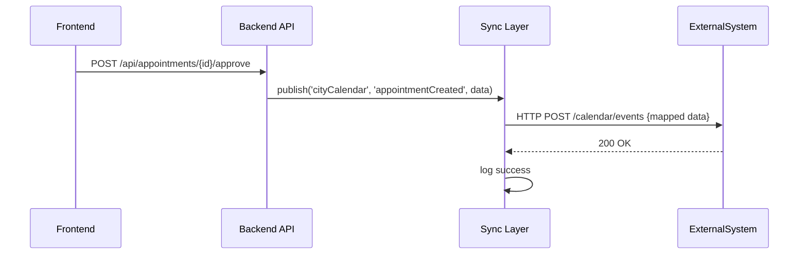

# Chapter 12: External System Synchronization

In [Chapter 11: Backend API Service](11_backend_api_service_.md), we learned how to expose our business workflows as HTTP endpoints. Now, we’ll build the **External System Synchronization** layer—the integration “bridge” that keeps third-party tools (like scheduling or records systems) in sync with our core platform in real time.

---

## 1. Motivation

Imagine a citizen schedules an inspection for a building permit in our portal. We need that appointment to appear instantly in the city’s external calendar system so inspectors don’t miss it. Without a sync layer, staff would log into two systems or copy data manually.

**External System Synchronization** automates this: whenever an approved appointment is created, updated, or canceled, our platform publishes an event to the sync layer, which transforms it and calls the external API. Likewise, changes in the external system (e.g., rescheduled by an inspector) can come back into our platform.

---

## 2. Key Concepts

1. **Connector**  
   Configuration for each external system (endpoint URL, auth, data mapping).

2. **Event Publisher**  
   Parts of our app that emit “domain events” (e.g., `appointmentCreated`).

3. **Event Subscriber**  
   API endpoints to receive callbacks or webhooks from third-party systems.

4. **Transformer**  
   Logic to convert our event payload into the external system’s format (and vice versa).

5. **Retry & Logging**  
   Mechanism to retry failed calls and record sync history for troubleshooting.

---

## 3. How to Use External System Synchronization

Below is a minimal example showing how to configure a connector and publish an event when an appointment is approved.

### 3.1 Define Connectors

Create a simple config file listing your external systems:

```js
// src/sync/connectors.js
export const connectors = {
  cityCalendar: {
    url: 'https://api.city.gov/calendar',
    apiKey: process.env.CITY_CAL_API_KEY
  }
}
```
This tells our sync layer where to send events for the “cityCalendar” system.

### 3.2 Publish an Event

In your appointment approval handler:

```js
// src/services/AppointmentService.js
import { syncPublisher } from '../sync/Publisher'

async function approveAppointment(appointment) {
  // ... your approval logic ...
  await syncPublisher.publish('cityCalendar', 'appointmentCreated', {
    id: appointment.id,
    start: appointment.startTime,
    end: appointment.endTime
  })
}
```
Here, `syncPublisher.publish` takes the connector name, event type, and a minimal payload. It handles transforming and sending the request.

---

## 4. What Happens Step-by-Step



1. The Frontend calls our **Backend API Service**.  
2. The handler emits an `appointmentCreated` event.  
3. The **Sync Layer** looks up the connector, transforms the payload, and posts to the external API.  
4. On success, it logs the result; on failure, it retries or records an error.

---

## 5. Internal Implementation

Let’s peek under the hood at the sync layer’s core files.

### 5.1 Publisher (`src/sync/Publisher.js`)

```js
import fetch from 'node-fetch'
import { connectors } from './connectors'
import { transformToExternal } from './Transformer'

export const syncPublisher = {
  async publish(connName, eventType, payload) {
    const cfg = connectors[connName]
    const body = transformToExternal(eventType, payload)
    // send to external system
    await fetch(cfg.url, {
      method: 'POST',
      headers: { 'X-API-Key': cfg.apiKey, 'Content-Type': 'application/json' },
      body: JSON.stringify(body)
    })
    // log or retry logic omitted
  }
}
```

- We load the connector config.  
- We transform our payload to the format the external system expects.  
- We `POST` it with authentication headers.

### 5.2 Transformer (`src/sync/Transformer.js`)

```js
export function transformToExternal(eventType, payload) {
  if (eventType === 'appointmentCreated') {
    return {
      eventName: 'createEvent',
      eventData: {
        title: `Inspection ${payload.id}`,
        startTime: payload.start,
        endTime: payload.end
      }
    }
  }
  // add other event mappings here
}
```

- Based on `eventType`, we map fields to the external schema.  
- You can extend this with other events or connectors.

---

## 6. Handling Callbacks

If the external system sends us updates (e.g., inspector reschedules), we add a subscriber endpoint:

```js
// src/sync/Subscriber.js
import express from 'express'
import { updateAppointment } from '../services/AppointmentService'

export const syncRouter = express.Router()

syncRouter.post('/webhook/calendar', (req, res) => {
  const { eventType, eventData } = req.body
  if (eventType === 'eventUpdated') {
    // map external fields back to our model
    updateAppointment({
      id: eventData.externalId,
      startTime: eventData.newStart,
      endTime: eventData.newEnd
    })
  }
  res.sendStatus(200)
})
```
- We mount `syncRouter` in our API under `/api/sync`.  
- We trust and parse the incoming payload and update our records.

---

## 7. Analogy: The Postal Bridge

Think of **External System Synchronization** like a postal “bridge” between two cities:

- **Connectors** are the address books with postal codes and routes.  
- **Publisher** is the mail clerk who stamps and sends your letter across the bridge.  
- **Transformer** is the translator who rewrites your letter in the local language.  
- **Subscriber** is the postman on the other side who delivers incoming letters back to you.

With this bridge, your messages flow both ways without you running back and forth.

---

## 8. Summary

In this chapter, you learned how to:

- Configure **connectors** for each external system.  
- Use `syncPublisher.publish` to send events in real time.  
- Write a **Transformer** to map payloads to the external schema.  
- Handle incoming **webhook** callbacks with a subscriber route.

With **External System Synchronization** in place, your HMS-MKT platform stays in lock-step with third-party tools—no manual copying, no data gaps.

---

Generated by [AI Codebase Knowledge Builder](https://github.com/The-Pocket/Tutorial-Codebase-Knowledge)