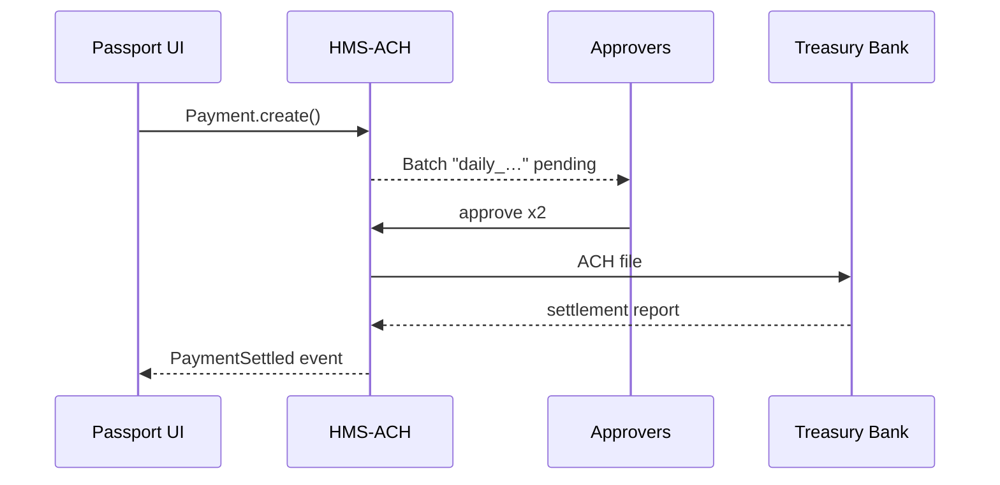

# Chapter 12: Financial Transaction Core (HMS-ACH)

*(continuing from [External System Sync & Integration Layer](11_external_system_sync___integration_layer_.md))*  

---

## 1 · Why Do We Need a “Money Mover”?

> Scenario — A citizen finishes the **“Renew Passport”** journey.  
> 1. They pay \$130 with a credit card.  
> 2. Two days later the State Department must see the money in its **Treasury** account.  
> 3. If the application is rejected, the citizen needs a refund.  
> 4. Auditors demand proof that every cent was handled under **NACHA / PCI** rules.

Doing that by hand is impossible at national scale.  
**HMS-ACH** is the platform’s **financial piping**:

1. Accepts payments from cards, bank accounts, or digital wallets.  
2. Bundles them into **settlement batches** that Treasury can clear.  
3. Supports refunds and chargebacks.  
4. Keeps an immutable **audit trail** and runs continuous **reconciliation** with the Central Accounting System.

Beginners can think “payments API”; experts see dual-control approvals, segregation of duties, and real-time ledger sync.

---

## 2 · Key Concepts (Plain Words)

| Term | Friendly Analogy | Why It Matters |
|------|------------------|----------------|
| Payment Request | Movie ticket stub | One intent to move money |
| Batch | Cash pouch sent to the bank | Groups many requests for settlement |
| Dual-Control | Two keys to open a safe | No single person can release funds |
| Reconciliation | Balancing checkbook nightly | Confirms ledger == bank report |
| Refund Token | Return label | Ties money back to the original payment |

---

## 3 · Five-Minute Quick-Start

### 3.1 Collect a Passport Fee

```python
# collect_passport_fee.py  (18 lines)
from hms_ach import Payment, Approver, Settlement

# 1️⃣ Citizen enters card info in the UI -> tokenized by PCI gateway
tok = "card_tok_9ab3"

# 2️⃣ Create a payment request (no money moves yet)
pay = Payment.create(
    amount    = 130_00,            # cents
    currency  = "USD",
    purpose   = "Passport Renewal",
    payer_id  = "citizen_782",
    token     = tok
)
print("Request:", pay.id)          # e.g., pay_123

# 3️⃣ Queue appears in the “Daily Batch” for dual approval
```

What just happened?  
1. **No** card numbers touched your server (PCI token only).  
2. The request sits in an internal queue waiting for two approvers.

### 3.2 Approve & Settle

```python
# approve_and_settle.py  (≤15 lines)
from hms_ach import Batch

# Officer 1 & 2 approve in HMS-GOV UI or SDK
Batch.approve("daily_2024_05_06", by="officer_A")
Batch.approve("daily_2024_05_06", by="officer_B")

# Auto-settle
Batch.settle("daily_2024_05_06")          # returns bank trace #
```

After **both** approvals, HMS-ACH:

1. Sends an ACH file to Treasury.  
2. Updates the local ledger.  
3. Emits `PaymentSettled` → [Activity & Workflow Orchestrator](08_activity___workflow_orchestrator__hms_act___hms_oms__.md).

---

## 4 · Life of One Payment (Step-By-Step)



Only **four** actors, each message signed & timestamped.

---

## 5 · Peek Under the Hood

### 5.1 Tiny Ledger Entry (12 lines)

```python
# hms_ach/ledger.py
from datetime import datetime
ledger = []                         # in real life: DB table

def record(txn_id, kind, amt):
    ledger.append({
        "id":        txn_id,
        "type":      kind,          # PAY / REFUND
        "amount":    amt,
        "ts":        datetime.utcnow()
    })
```

Every state change (`PAY_AUTH`, `PAY_SETTLED`, `REFUND`) is one immutable row.

### 5.2 Settlement Scheduler (15 lines)

```python
# hms_ach/settle.py
import time, bank_api, ledger

def nightly_batch():
    while True:
        batch = collect_ready_payments()
        if not batch: time.sleep(60); continue
        file = make_nacha_file(batch)
        trace = bank_api.upload(file)
        for p in batch:
            ledger.record(p.id, "PAY_SETTLED", p.amount)
        notify_workflow(batch)      # event to ACT
```

*Beginner takeaway*: the loop is plain Python; complexity lives in **policies**, not code.

### 5.3 Continuous Reconciliation (9 lines)

```python
# hms_ach/reconcile.py
def reconcile():
    bank = bank_api.yesterday_report()
    local = sum(r["amount"] for r in ledger if r["type"]=="PAY_SETTLED")
    if bank.total != local:
        alert_ops(f"Mismatch ${bank.total-local}")
```

Runs hourly; raises an alert in [Monitoring & Operations Center](20_monitoring___operations_center__hms_ops__.md) if pennies go missing.

---

## 6 · Handling Refunds

```python
# refund_passport_fee.py  (≤14 lines)
from hms_ach import Refund

# Create refund token tied to original payment
r = Refund.initiate(orig_pay_id = "pay_123",
                    reason      = "Photo too dark",
                    officer     = "state_officer_4")

# Waits for dual approval, then money flows back
print("Refund ticket:", r.id)
```

Ledger will now show `REFUND_PENDING` → `REFUND_SETTLED`.

---

## 7 · Frequently Asked Beginner Questions

**Q: Is HMS-ACH a full banking system?**  
A: No. It **orchestrates** payments; real money sits in commercial banks or Treasury.

**Q: What if only one officer approves the batch?**  
A: Nothing moves. After a configurable timeout the batch expires and re-queues.

**Q: Does it support cards *and* ACH debits?**  
A: Yes. The `token` field hides whether it’s a card, bank account, or wallet.

**Q: Where is the PCI data stored?**  
A: Nowhere—HMS-ACH only stores opaque tokens from a PCI-compliant gateway.

---

## 8 · How HMS-ACH Connects Elsewhere

* **Front-End** – Payment widgets in [HMS-MFE](04_micro_frontend_interface_layer__hms_mfe__.md) call `Payment.create`.  
* **Workflows** – `PaymentSettled` events advance steps in [HMS-ACT](08_activity___workflow_orchestrator__hms_act___hms_oms__.md).  
* **Inter-Agency Transfers** – Large disbursements to FEMA or DoD ride through [Inter-Agency Communication Hub](10_inter_agency_communication_hub__hms_a2a__.md).  
* **Sync Layer** – Monthly totals post to external accounting suites via [External System Sync & Integration Layer](11_external_system_sync___integration_layer_.md).  
* **Oversight** – Any mismatch triggers a **Take-Over** ticket in [Human-in-the-Loop Oversight](07_human_in_the_loop_oversight__hitl__.md).

---

## 9 · Hands-On Exercise

1. `pip install hms-ach`  
2. Run `collect_passport_fee.py` then `approve_and_settle.py`.  
3. Check HMS-GOV’s **Financial Ledger** tab—you will see the transaction with status **“Settled”**.  
4. Try `refund_passport_fee.py` and watch the dual-control flow.

---

## 10 · What You Learned

1. HMS-ACH is the **money mover**—payments, settlements, refunds.  
2. Dual-control approvals and immutable ledger keep auditors happy.  
3. A full passport fee cycle took **under 40 lines** of code.  
4. Continuous reconciliation guarantees the books always balance.

Ready to see how these financial capabilities integrate with national health coverage and insurance reimbursements?  
Jump to [Universal Health Care Integration (HMS-UHC / HMS-MED)](13_universal_health_care_integration__hms_uhc___hms_med__.md).

---

Generated by [AI Codebase Knowledge Builder](https://github.com/The-Pocket/Tutorial-Codebase-Knowledge)