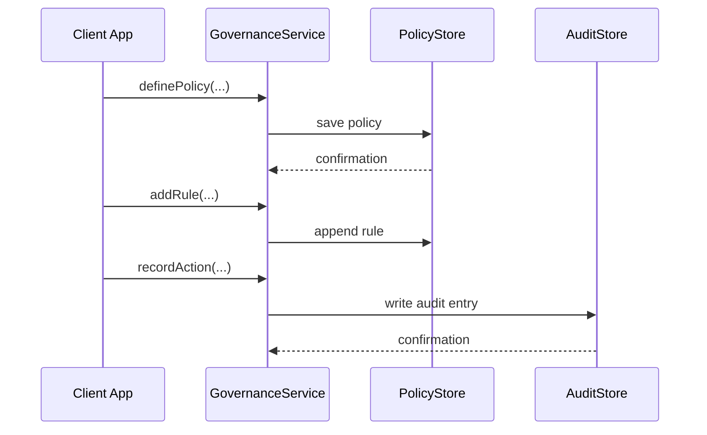

# Chapter 12: Governance Layer

Welcome to the final chapter! In [Chapter 11: Management Layer](11_management_layer_.md) we saw how policies get loaded, orchestrated, and monitored across services. Now, we’ll introduce the **Governance Layer**—the “board of directors” of HMS-MFE—that defines high-level policies, compliance standards, and audit trails to keep everything transparent, ethical, and aligned with regulations.

## Why the Governance Layer Matters

Imagine the Environmental Protection Agency (EPA) is rolling out a new **Air Quality Standard**. Before any system enforces the rule, you need:

1. A clear policy document.
2. A list of compliance criteria (e.g., pollutant limits, reporting intervals).
3. A way to log every change for audits.
4. Version control and sign-off by authorized officials.

The **Governance Layer** is your digital legislative body—it sets these rules, tracks every action, and makes sure nothing goes live without proper review.

## Key Concepts

1. **Policy Definitions**  
   High-level descriptions (e.g., “Air Quality Standard v1.0”).

2. **Compliance Rules**  
   Concrete checks (e.g., “NO2 < 100 ppm”, “monthly emissions report filed”).

3. **Audit Trail**  
   Immutable log entries of every governance action (who, what, when).

4. **Versioning & Approval**  
   Ability to draft multiple versions and record official sign-off.

## How to Use This Abstraction

Here’s a minimal example. We’ll define an air-quality policy, add rules, record a deployment, and view the audit log.

```ts
// 1. Create a governance manager
const gov = new GovernanceManager()

// 2. Define a new policy
gov.definePolicy(
  'AirQualityStandard',
  'Sets maximum allowable NO2 emissions'
)

// 3. Add compliance rules
gov.addRule('AirQualityStandard', 'NO2 < 100 ppm')
gov.addRule('AirQualityStandard', 'Monthly report required')

// 4. Record a governance action
gov.recordAction({
  policy: 'AirQualityStandard',
  action: 'approve',
  actor: 'alice@epa.gov'
})

// 5. View the audit trail
console.log(gov.getAuditLog('AirQualityStandard'))
// ➜ [ { policy:'AirQualityStandard', action:'approve', actor:'alice@epa.gov', timestamp:'…' } ]
```

Explanation:
- We created a `GovernanceManager`.
- We defined a policy and attached rules.
- We recorded an “approve” action by an EPA official.
- Finally, we fetched the audit log to see who did what and when.

## What Happens Behind the Scenes



1. The client calls `definePolicy` or `addRule`.  
2. The `GovernanceService` persists data in the **PolicyStore**.  
3. On `recordAction`, it logs to the **AuditStore**.  
4. Each step is confirmed, ensuring nothing is lost.

## Under the Hood: Implementation Details

### GovernanceService

File: `src/governance/GovernanceService.ts`

```ts
export class GovernanceService {
  private policies = new Map<string, any>()
  private auditLog: any[] = []

  definePolicy(name: string, desc: string) {
    this.policies.set(name, { name, desc, rules: [] })
  }

  addRule(policy: string, rule: string) {
    this.policies.get(policy)?.rules.push(rule)
  }

  recordAction(entry: {policy:string,action:string,actor:string}) {
    this.auditLog.push({ ...entry, timestamp: new Date().toISOString() })
  }

  getAuditLog(policy: string) {
    return this.auditLog.filter(e => e.policy === policy)
  }
}
```

Explanation:
- `policies` holds definitions and rules.
- `auditLog` is an in-memory list of actions.
- Each method updates the correct store.

### PolicyStore & AuditStore

For now, both are in-memory arrays and maps. In production you’d swap these for a database or ledger to ensure immutability and scale.

```ts
// File: src/governance/PolicyStore.ts
// (Imagine this wraps a real DB)
export class PolicyStore { /* save/retrieve policies */ }

// File: src/governance/AuditStore.ts
// (Imagine this writes to an append-only ledger)
export class AuditStore { /* write/read audit entries */ }
```

## Summary

In this chapter you learned how the **Governance Layer**:

- Defines high-level **policies** and **compliance rules**.  
- Records every action in an **audit trail** for full transparency.  
- Supports **versioning** and **official sign-off** before any rule goes live.

Congratulations—you’ve now seen every layer of HMS-MFE, from user roles to governance. Thank you for following along!

---

Generated by [AI Codebase Knowledge Builder](https://github.com/The-Pocket/Tutorial-Codebase-Knowledge)