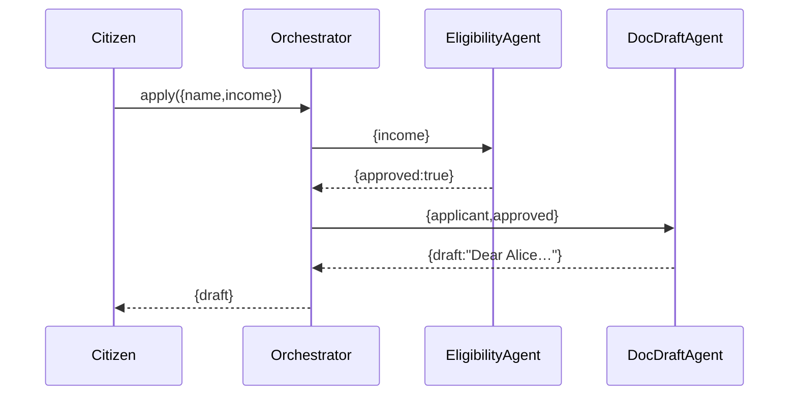
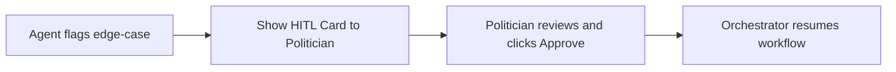

# Chapter 12: HMS-A2A (Agent-to-Agent AI System)

In the previous chapter we broke our frontends into independent pieces using micro-frontends in [Chapter 11: HMS-MFE (Micro-Frontends)](11_hms_mfe__micro_frontends__.md). Now we’ll connect a whole **team** of AI agents—like digital clerks working together in a government office—using **HMS-A2A**, our Agent-to-Agent orchestration layer.

---

## 1. Motivation & Central Use Case

Imagine a citizen applies for a housing grant. Behind the scenes:

1. An **Eligibility Agent** checks income rules.  
2. A **Document Drafting Agent** prepares the application letter.  
3. A **Scheduler Agent** books an interview slot.  

They pass information and suggestions to each other—and to a human overseer in case of doubt. Politicians carry **HITL (Human-In-The-Loop) Agent Cards** to step in, while citizens get friendly prompts as they move step-by-step through a [program workflow](03_core_models__program___protocol__.md).

HMS-A2A is the “air-traffic controller” for these agents, making sure messages, tasks, and human approvals flow smoothly.

---

## 2. Key Concepts

1. **Orchestrator**  
   The central dispatcher that registers agents and routes messages.  
2. **Agent**  
   A digital assistant with a name and set of skills (e.g., `eligibilityAgent`, `docDraftAgent`).  
3. **Agent Card (HITL)**  
   A human-in-the-loop interface card that lets a human review or override an agent’s suggestions.  
4. **Message/Task**  
   A simple JSON payload an agent sends to another—e.g., `{ applicantId, incomeData }`.  
5. **Proactive Guidance**  
   Agents can push hints or reminders to users as they progress through a workflow.

---

## 3. Using HMS-A2A

Below is a minimal example showing how to register two agents and start a simple “apply” workflow.

```js
// src/a2a/orchestrator.js
class Orchestrator {
  constructor() { this.agents = {} }
  register(name, fn) { this.agents[name] = fn }
  async send(to, msg) {
    const agent = this.agents[to]
    return agent ? await agent(msg) : null
  }
}
module.exports = Orchestrator
```
_Explanation:_  
- We store agents in a registry.  
- `send` finds the agent by name and calls it with a message.

```js
// src/a2a/agents.js
async function eligibilityAgent({ income }) {
  const ok = income <= 20000
  return { approved: ok, reason: ok ? null : 'Income too high' }
}
async function docDraftAgent({ applicant, approved }) {
  if (!approved) return { draft: null }
  return { draft: `Dear ${applicant}, your grant is approved.` }
}
module.exports = { eligibilityAgent, docDraftAgent }
```
_Explanation:_ Each agent is a function that processes input and returns a result.

```js
// src/a2a/runWorkflow.js
const Orchestrator = require('./orchestrator')
const { eligibilityAgent, docDraftAgent } = require('./agents')

async function start(workflowMsg) {
  const orch = new Orchestrator()
  orch.register('eligibility', eligibilityAgent)
  orch.register('docDraft',    docDraftAgent)

  const result1 = await orch.send('eligibility', workflowMsg)
  const result2 = await orch.send('docDraft', {
    applicant: workflowMsg.name,
    approved : result1.approved
  })
  console.log(result2.draft)
}
start({ name: 'Alice', income: 18000 })
```
_Explanation:_  
1. We register two agents.  
2. We send the initial message to the eligibility agent.  
3. We forward results to the document drafting agent.  
4. We print the final draft.

---

## 4. Under the Hood: Agent Interaction Flow



1. **Citizen** calls the orchestrator with application data.  
2. **Orchestrator** routes to **EligibilityAgent**.  
3. **EligibilityAgent** returns approval.  
4. **Orchestrator** routes to **DocDraftAgent**.  
5. **DocDraftAgent** returns a letter draft.  
6. **Orchestrator** returns final draft to the citizen.

---

## 5. Internal Implementation Details

### 5.1 Agent Base & Registry

```js
// src/a2a/agent.js
class Agent {
  constructor(name, handler) {
    this.name = name
    this.handle = handler
  }
}
module.exports = Agent
```

```js
// src/a2a/registry.js
const Agent = require('./agent')
class Registry {
  constructor() { this.map = new Map() }
  add(name, fn) { this.map.set(name, new Agent(name, fn)) }
  get(name) { return this.map.get(name) }
}
module.exports = new Registry()
```
_Explanation:_ We wrap each agent in a simple class and store them in a map.

### 5.2 Orchestrator with Registry

```js
// src/a2a/orchestrator.js
const registry = require('./registry')
class Orchestrator {
  async send(to, msg) {
    const agent = registry.get(to)
    if (!agent) throw new Error(`No agent: ${to}`)
    return agent.handle(msg)  // call the handler
  }
}
module.exports = Orchestrator
```
_Explanation:_ Now the orchestrator looks up agents in a central registry.

---

## 6. Proactive Guidance & HITL Agent Cards

- **Proactive Guidance**: Agents can `push` messages to a user’s queue at any time—e.g., “Remember to upload your ID.”
- **HITL Agent Cards**: A simple UI component (e.g., `notyf-green`) that pops up a card for a human reviewer when an agent flags a case.



---

## 7. Conclusion

In this chapter, you learned how **HMS-A2A**:

- Acts as an **orchestration layer** connecting agents and users.  
- Registers and dispatches messages to specialized **digital assistants**.  
- Supports **Human-In-The-Loop** reviews via agent cards.  
- Provides **proactive guidance** as citizens move through workflows.

With HMS-A2A, you can build a network of cooperating AI agents—just like a team of clerks in a government office—while keeping humans in control. This completes our HMS-NFO tutorial series. Happy orchestrating!

---

Generated by [AI Codebase Knowledge Builder](https://github.com/The-Pocket/Tutorial-Codebase-Knowledge)