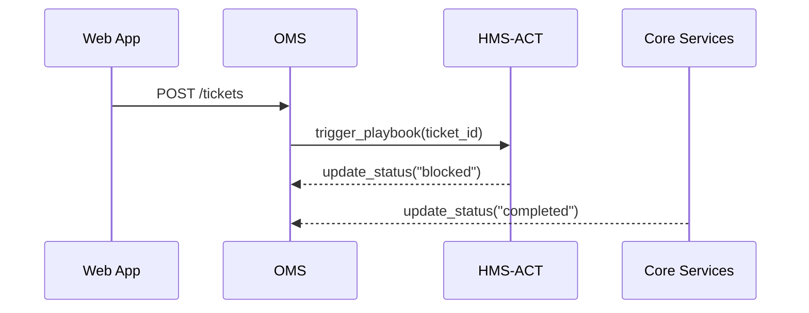

# Chapter 12: HMS-OMS (Operational Workflow Manager)
*[← Back to Chapter&nbsp;11 – HMS-ACT (Agent Action Orchestrator)](11_hms_act__agent_action_orchestrator__.md)*  

---

## 1. Why Do We Need HMS-OMS?

Picture **Springfield City Hall** after a major storm:

1. Citizens file 700 “Fix Pothole” requests.  
2. An AI agent (from [HMS-AGT](09_hms_agt___hms_agx__core___extended_ai_agent_framework__.md)) ranks them by danger.  
3. Human inspectors confirm photos on tablets.  
4. Public-Works crews patch asphalt and close the request.  

Without a *single* board to track every step, the city quickly forgets:

* Which potholes are still waiting on asphalt delivery?  
* Which inspector approved the “5th Street” ticket?  
* Whether the 48-hour SLA is about to be breached.

**HMS-OMS is that board.**  
Think **Trello® + service-desk + AI glue**: every request flows through statuses like **queued → in-progress → blocked → completed**, with automatic suggestions, human approvals, and system tasks stitched into one clear timeline.

---

## 2. Key Concepts (Plain English)

| Term          | Friendly Analogy        | One-Sentence Meaning |
|---------------|-------------------------|----------------------|
| Board         | Cork bulletin board     | Collection of related tickets (e.g., “City Potholes”). |
| Ticket        | Sticky note             | Single citizen request or system task. |
| Status        | Column on the board     | Where a ticket currently lives (queued, blocked, etc.). |
| Swim-lane     | Row for ownership       | Groups tickets by crew, district, or priority. |
| Trigger       | Motion sensor           | Auto-move or notify when conditions are met. |
| SLA           | Kitchen timer           | Time limit before a ticket flashes red. |
| Dashboard     | Wall scoreboard         | Real-time charts of throughput, backlog, SLA hits. |

---

## 3. The 5-Minute “Hello-OMS”

Goal: spin up a board, add one ticket, and watch it flow.

```python
# file: hello_oms.py  (≤20 lines)
from hms_oms import Board, Ticket

# 1) Create a board
potholes = Board(name="City Potholes")        # auto-saves

# 2) File a citizen ticket
t = Ticket(
    title="Pothole on 5th Street",
    data={"photo": "img_001.jpg", "gps": "39.763,-89.653"},
    sla="48h"                                 # SLA timer
)
potholes.add(t)

# 3) Move ticket when inspector starts work
potholes.move(ticket_id=t.id, to="in-progress")

print("Current status:", potholes.get(t.id).status)
```

Expected console output:

```
Current status: in-progress
```

Explanation  
1. `Board` instantly appears in the OMS UI.  
2. `Ticket` shows up in the **“queued”** column, red SLA clock ticking.  
3. After `move`, it jumps to **“in-progress.”**

---

## 4. How HMS-OMS Talks to Other Layers



1. Citizen form in [HMS-MFE](02_hms_mfe__micro_frontend_experience__.md) posts a ticket.  
2. OMS calls the **Playbook** from [HMS-ACT](11_hms_act__agent_action_orchestrator__.md).  
3. Playbook results push status changes back to OMS.  

---

## 5. Triggers & AI Suggestions in One Line

```python
# file: suggest.py  (≤15 lines)
from hms_oms import Trigger
from hms_agt import Agent

# AI agent that predicts priority 0-3
prio_bot = Agent.load("Pothole-Ranker")

Trigger(
    name="auto-rank",
    when=lambda t: t.status == "queued",
    then=lambda t: t.set_priority(prio_bot.call(t.data["photo"]))
).register(board="City Potholes")
```

Now every new ticket is auto-ranked the moment it lands.

---

## 6. What Happens Inside OMS?

### Step-by-Step (non-code)

1. **Add Ticket** → write row to `tickets.db`, status = queued, start SLA timer.  
2. **Trigger Scan** → any `when` rules that match run their `then` actions.  
3. **Status Change** → emits a WebSocket event so dashboards update instantly.  
4. **SLA Timer** → cron job flips `ticket.sla_status = "breach"` if deadline passes.  

### Tiny Internal Store

```python
# file: oms/store.py  (≤12 lines)
class Store:
    def __init__(self):
        self.rows = {}      # id → dict

    def insert(self, row):
        self.rows[row["id"]] = row

    def update(self, id, **changes):
        self.rows[id].update(changes)
```

Even the demo fits on a napkin!

---

## 7. Quick Recipes

### 7.1 Escalate Blocked Tickets After 24 h

```python
Trigger(
    name="escalate_blocked",
    when=lambda t: t.status == "blocked" and t.age() > 24*60,
    then=lambda t: t.assign("senior_supervisor")
).register("City Potholes")
```

### 7.2 Simple Dashboard Query

```python
from hms_oms import metrics
print(metrics.board("City Potholes").to_json())
```

Returns:

```json
{"queued": 12, "in_progress": 5, "blocked": 2, "completed": 43}
```

Feed this JSON into a React chart or Grafana panel.

---

## 8. FAQ & Troubleshooting

| Symptom | Likely Cause | Quick Fix |
|---------|--------------|-----------|
| Ticket never moves out of “queued” | No trigger or manual action | Call `potholes.move()` or add a Trigger. |
| SLA indicator wrong timezone | Server clock skew | Sync with NTP or set `Board(tz="America/Chicago")`. |
| Duplicate tickets for same GPS | No dedup rule | Add Trigger `when gps match -> merge`. |
| Dashboard numbers stale | WebSocket blocked | Check firewalls or call `metrics.refresh()` API. |

---

## 9. What You Learned

You now can:

1. Spin up a **Board** and **Ticket** in seconds.  
2. Auto-progress work with **Triggers** or manual moves.  
3. Attach **AI suggestions**, **SLA timers**, and real-time dashboards.  
4. See how HMS-OMS glues together forms, agents, humans, and services.

Next we’ll zoom into how large language models know *exactly* which ticket, law, or dataset you’re talking about through the **Model Context Protocol (MCP)**.  

→ *Continue to [HMS-MCP (Model Context Protocol)](13_hms_mcp__model_context_protocol__.md)*

---

Generated by [AI Codebase Knowledge Builder](https://github.com/The-Pocket/Tutorial-Codebase-Knowledge)