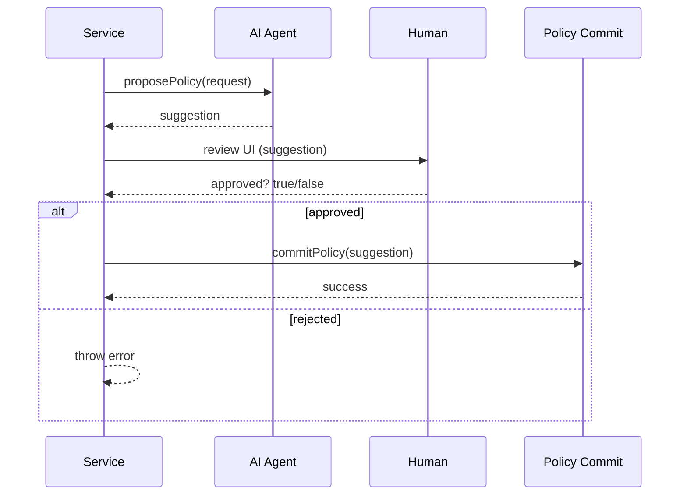

# Chapter 12: Human-in-the-Loop (HITL)

Welcome back! In [Chapter 11: External System Sync](11_external_system_sync_.md) we learned how events flow out to outside systems. Now we’ll put the “senior supervisor” in charge: **Human-in-the-Loop (HITL)**. This is the safety brake that lets a human review and override AI-driven recommendations, ensuring accountability and ethical compliance.

---

## 1. Motivation & Central Use Case

Imagine the **Department of Homeland Security** uses an AI model to flag suspicious cargo shipments. The AI suggests inspecting certain containers based on risk scores. But before scanners and officers are dispatched, a human analyst must review and confirm:

1. The AI ranks Container #A123 as “high risk.”  
2. A human analyst inspects the AI’s reasoning and data.  
3. The analyst **approves** or **overrides** the AI suggestion.  
4. The final decision is logged for audit.

Without HITL, the system might act on mistakes, causing delays or rights violations. With HITL, you get the speed of AI plus the judgment of a human.

---

## 2. Key Concepts

1. **Safety Brake**  
   A pause point where AI output cannot proceed until a human signs off.  

2. **Decision Maker**  
   The person (or UI component) that views AI suggestions and chooses “approve” or “reject.”  

3. **Audit Trail**  
   Every suggestion, review decision, and override reason is recorded for compliance.  

4. **Override Mechanism**  
   The ability to alter AI recommendations before they become final actions.

---

## 3. Using HITL in HMS-SME

Below is a minimal example showing how to integrate HITL into a policy-change workflow. We assume you have an `aiAgent` that proposes a change and a `hitl` helper for review.

```js
// services/policyService.js
import { aiAgent } from './aiAgent';
import { hitl }    from './hitl';

export async function applyPolicyChange(request) {
  // 1. AI proposes a policy update
  const suggestion = await aiAgent.proposePolicy(request);

  // 2. Human reviews and approves or rejects
  const approved = await hitl.review('policy-change', suggestion);

  // 3. If approved, commit; else, throw an error
  if (!approved) {
    throw new Error('Policy change rejected by human reviewer');
  }
  return commitPolicy(suggestion);
}
```

Explanation:

- `aiAgent.proposePolicy(request)` asks the AI for a recommended update.  
- `hitl.review('policy-change', suggestion)` sends that suggestion to a human UI and returns a Boolean.  
- If approved, we run `commitPolicy`; otherwise, we stop the workflow.

---

## 4. What Happens Step-by-Step



1. **Service** calls the **AI Agent** for a suggestion.  
2. The **AI Agent** returns a `suggestion` object.  
3. The **Service** passes it to a **Human** via the HITL UI.  
4. The **Human** responds with approve/reject.  
5. If approved, the service commits the change; if not, it aborts.

---

## 5. Inside the HITL Helper

Here’s a simplified view of how `hitl` might be implemented. It handles sending suggestions to a review UI and logging the decision.

```js
// hitl/index.js
export class HITL {
  constructor(uiClient, auditClient) {
    this.ui    = uiClient;   // e.g., WebSocket or REST to a review dashboard
    this.audit = auditClient; // e.g., centralized audit logger
  }

  // Send to human and wait for a decision
  async review(action, suggestion) {
    // 1. Log the pending suggestion
    this.audit.log({ action, suggestion, stage: 'pending' });

    // 2. Send to the UI and wait for human input
    const approved = await this.ui.promptReview({ action, suggestion });

    // 3. Log the human decision
    this.audit.log({ action, approved, timestamp: Date.now() });
    return approved;
  }
}

// Instantiate in your app
import { HITL } from './hitl';
import { uiClient } from './uiClient';
import { auditClient } from './auditClient';

export const hitl = new HITL(uiClient, auditClient);
```

Explanation:

- `review()` logs the suggestion, sends it to the UI, waits for the human’s Boolean response, then logs the final decision.  
- `uiClient.promptReview()` could open a modal for a human officer to click “Approve” or “Reject.”

---

## 6. What You’ve Learned

- **Why** HITL acts like a safety brake, blending AI speed with human judgment.  
- **How** to write a simple service that:  
  1. Gets an AI suggestion.  
  2. Calls `hitl.review()` for human approval.  
  3. Commits or cancels based on the response.  
- A **sequence diagram** showing the flow from service to AI to human and back.  
- A peek under the hood at a `HITL` helper that logs each stage and prompts the UI.

---

You’ve now seen how to bring humans back into automated processes, ensuring accountability and ethical compliance. Thanks for following along this far—this wraps up our core HMS-SME tutorial!

---

Generated by [AI Codebase Knowledge Builder](https://github.com/The-Pocket/Tutorial-Codebase-Knowledge)