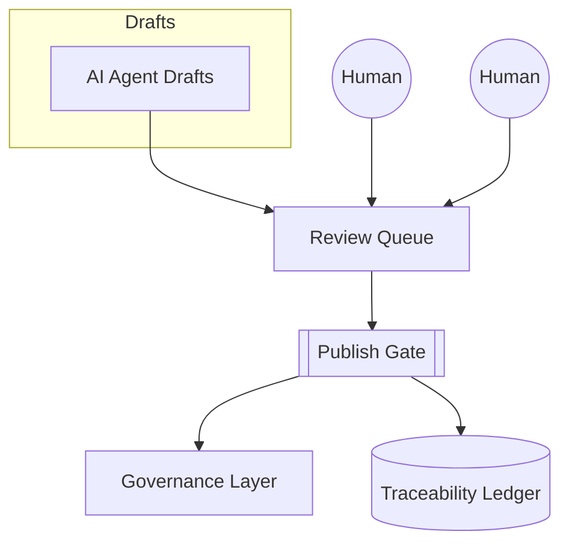
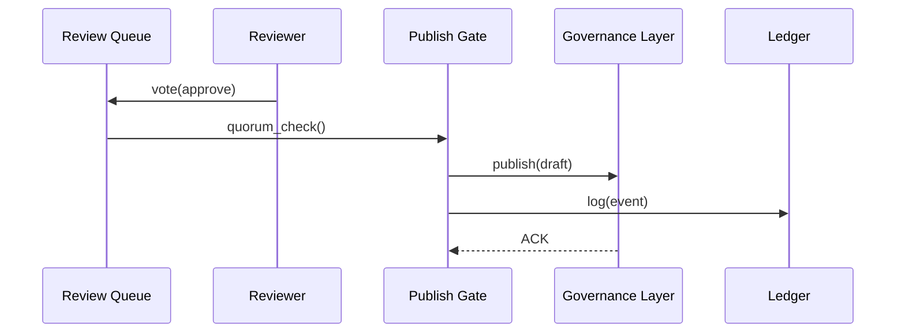

# Chapter 12: Human-In-The-Loop Oversight (HITL)

*[Jump back to Chapter&nbsp;11: AI Representative Agent (HMS-A2A)](11_ai_representative_agent__hms_a2a__.md)*  

---

## 1. Why Do We Need HITL?

Picture this night-shift scene at the **Department of Labor**:

1. The **AI Representative Agent** (Chapter 11) sees overtime claims piling up.  
2. It drafts a rule patch to speed things up.  
3. At 02:14 AM the agent politely parks that draft in a **queue**.

Great! …but **no algorithm should be allowed to change federal policy on its own**.  
We need a quick, transparent checkpoint—much like a **Congressional committee mark-up session**—where real humans can:

* read the draft,  
* tweak wording,  
* vote **Approve** or **Reject**,  
* and leave a signature trail.

That checkpoint is **Human-In-The-Loop Oversight (HITL)**.

---

## 2. Key Concepts (Plain-English Cheatsheet)

| Term | Friendly Analogy |
|------|------------------|
| Review Queue | The committee inbox of pending bills |
| Reviewer | A committee member (policy lead, lawyer, CISO) |
| Decision Panel | The “yea / nay / amend” voting screen |
| Amendment | A red-pen edit on the bill’s margin |
| Publish Gate | The final gavel strike—moves the policy live |
| Action Log | The Congressional Record for every click |

---

## 3. 60-Second Mental Model



1. **AI** (or any service) creates a draft.  
2. Draft waits in the **Review Queue**.  
3. One or more **Reviewers** read / amend / vote.  
4. When quorum is met, **Publish Gate** pushes the final artifact into the [Governance Layer](01_governance_layer__hms_gov__.md) **and** writes every keystroke to the [Auditing & Traceability Ledger](13_auditing___traceability_ledger_.md).

---

## 4. Hands-On Walk-Through: Approving the Overtime Patch

### 4.1 List Pending Items

```bash
hms-hitl queue list
```

Example output:

```
#  ID  TYPE     TITLE                              STATUS    AGE
#  17  POLICY   "Split document-upload to async"   PENDING   4h
```

### 4.2 Open the Draft & Suggest Edits

```bash
hms-hitl draft edit 17
```

Opens `$EDITOR` with a diff:

```diff
 mode: "async"
 notify: "email"
+sla:   "48h"   # ← your amendment
```

Save & exit—the draft now carries your amendment.

### 4.3 Cast Your Vote

```bash
hms-hitl vote 17 --approve --comment "Add 48h SLA, looks good."
```

Console:

```
✔ Vote recorded (you: APPROVE)
✔ Waiting for 1 more reviewer (CISO)
```

### 4.4 Publish After Quorum

Later, the CISO approves via the web UI.  
The queue auto-publishes:

```
[DRAFT-17] Quorum reached → publishing…
✔ Stored in Governance as overtime-workflow@2
✔ Logged to Traceability Ledger (hash 0xa5…)
```

No runaway automation; humans stayed in charge.

---

## 5. What Happens Under the Hood?

### 5.1 Five-Step Sequence



1. Reviewer’s vote updates the queue item.  
2. Queue asks Publish Gate if quorum rules are met.  
3. Gate forwards the *final draft* to Governance.  
4. Every step is immutably logged.

---

## 6. Peek Inside the Code (All ≤ 18 Lines)

### 6.1 Voting Endpoint

```js
// file: api/routes/vote.js
router.post("/draft/:id/vote", async (req, res) => {
  const { id }     = req.params;
  const { choice } = req.body;          // "APPROVE" | "REJECT"
  const user       = req.auth.user;     // from mTLS token

  await queue.addVote(id, { user, choice });
  ledger.record({ id, user, choice });  // transparency

  res.sendStatus(204);
});
```

Beginner notes  
* `queue.addVote` stores the choice and re-calculates quorum.  
* Every vote is instantly mirrored to the Ledger.

### 6.2 Simple Quorum Check

```python
# file: queue/quorum.py
def has_quorum(votes, requires=2):
    approves = [v for v in votes if v=="APPROVE"]
    return len(approves) >= requires
```

Tiny but testable.

---

## 7. Common Pitfalls & Quick Fixes

| Symptom | Likely Cause | Quick Fix |
|---------|--------------|-----------|
| Draft auto-expired | Reviewers missed deadline | Re-queue: `hms-hitl queue reopen <id>` |
| “Not authorized” error | Role missing | Add role in [Role & Access Matrix](08_role___access_control_matrix_.md) |
| Quorum never met | Wrong threshold config | `hms-hitl settings quorum --set 1` (dev only) |

---

## 8. FAQ

**Q: Can drafts come from humans, not AI?**  
Absolutely—any service or CLI can call `hms-hitl draft create …`.

**Q: Are amendments tracked?**  
Yes—each save produces a new *draft revision* hashed into the Ledger.

**Q: What if reviewers disagree?**  
If **any** member rejects, the draft returns to *PENDING* for more edits.

**Q: Can HITL enforce “cool-down” periods?**  
Add `cooldown: 24h` in the queue settings; Gate will delay publish even after quorum.

---

## 9. What You Learned

• **HITL** inserts a lightweight but fool-proof human checkpoint between AI recommendations and live policy.  
• Reviewers can edit, comment, approve, or reject—all actions are versioned and logged.  
• The system prevents “rogue automation” while still letting leaders *take credit* for final decisions.

In the next chapter we’ll explore that immutable log we keep mentioning—the **black box** of HMS-AGX.  
See you in [Chapter&nbsp;13: Auditing & Traceability Ledger](13_auditing___traceability_ledger_.md)!

---

Generated by [AI Codebase Knowledge Builder](https://github.com/The-Pocket/Tutorial-Codebase-Knowledge)