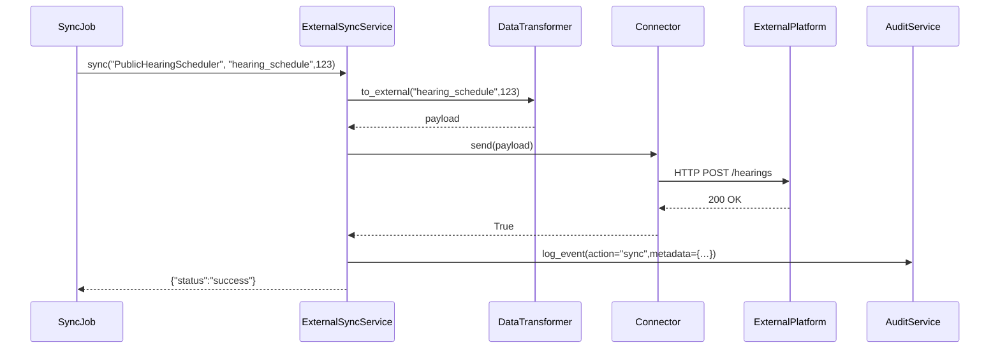

# Chapter 12: Integrated External System Sync

In [Chapter 11: Audit & Compliance Logging](11_audit___compliance_logging_.md) we captured every action inside HMS-DEV. Now let’s learn how to keep our data aligned with outside platforms—like scheduling systems, GIS databases, or document repositories—in real time. This is our **Integrated External System Sync**.

---

## 1. Motivation & Central Use Case

Imagine the Postal Inspection Service updates its field‐agent patrol timetable in HMS-DEV. The Public Hearing Scheduler and the GIS mapping system both need the same updated dates instantly. Without a sync layer, each department would manually export/import spreadsheets—risking data drift and delays.

With Integrated External System Sync, you set up a “courier service” that:

- Watches for changes in HMS-DEV (e.g., a patrol timetable update)  
- Transforms the internal record into each external platform’s format  
- Pushes the data over secure channels  
- Logs every handoff via our [Audit & Compliance Logging](11_audit___compliance_logging_.md)  

All participants see the same, optimized workflow—no more version mismatches.

---

## 2. Key Concepts

We break this abstraction into four beginner-friendly pieces:

1. **Connectors**  
   Adapters for each external platform (scheduling API, GIS service, document repo) that speak its protocol.

2. **Secure Channels**  
   HTTPS, OAuth tokens, or VPN tunnels to authenticate and encrypt every message.

3. **Data Transformer**  
   Converts internal HMS-DEV objects to the external schema (field names, date formats).

4. **Sync Orchestrator**  
   Listens for internal events (e.g., “TimetableUpdated”), picks the right connector, and runs the transform + send pipeline.

---

## 3. Using the Sync Service

Here’s a minimal example showing how a background job or UI might trigger a one-off sync for a public hearing schedule:

```python
# sync_job.py
from hms_sync.service import ExternalSyncService

# 1. Initialize with a config listing connectors and credentials
syncer = ExternalSyncService(config_path="sync-config.yml")

# 2. Tell it to sync hearing #123 to the Scheduling System
result = syncer.sync(
    system="PublicHearingScheduler",
    record_type="hearing_schedule",
    record_id=123
)

print("Sync status:", result["status"])
```

What happens:

1. `ExternalSyncService` loads connector settings from `sync-config.yml`.  
2. `sync()` fetches the internal record, transforms it, and calls the right connector.  
3. Every attempt is logged via our [Audit Service](11_audit___compliance_logging_.md).  
4. You get back `{"status":"success"}` or `{"status":"failed"}`.

---

## 4. Step-by-Step Flow



---

## 5. Under the Hood: Core Implementation

### 5.1 Connector Example

File: `hms_sync/connectors/scheduler_connector.py`

```python
import requests

class SchedulerConnector:
    def __init__(self, url, token):
        self.url = url
        self.token = token

    def send(self, payload):
        # Secure HTTP POST to the scheduling API
        resp = requests.post(
            f"{self.url}/hearings",
            json=payload,
            headers={"Authorization": f"Bearer {self.token}"}
        )
        return resp.ok
```

*Explanation:*  
This adapter wraps a simple HTTP call to the external scheduler, passing JSON and an OAuth bearer token.

### 5.2 Data Transformer

File: `hms_sync/transformer.py`

```python
class DataTransformer:
    def to_external(self, record_type, record_id):
        # 1. Fetch internal record from DB (omitted)
        # 2. Map fields to external schema
        return {
            "hearingId": record_id,
            "date": "2023-07-15T10:00:00Z",
            "venue": "Room 214, Main Building"
        }
```

*Explanation:*  
Transforms an internal HMS-DEV record into the exact JSON shape the external API expects.

### 5.3 Sync Orchestrator

File: `hms_sync/service.py`

```python
from .transformer import DataTransformer
from .connectors import SchedulerConnector
from audit_service import AuditService

class ExternalSyncService:
    def __init__(self, config_path):
        # Load connector configs from YAML (omitted)
        self.connectors = {
          "PublicHearingScheduler": SchedulerConnector(url, token)
        }
        self.transformer = DataTransformer()
        self.audit = AuditService(store="audit_db")

    def sync(self, system, record_type, record_id):
        payload = self.transformer.to_external(record_type, record_id)
        connector = self.connectors[system]
        success = connector.send(payload)
        # Log every attempt for compliance
        self.audit.log_event(
            user_id="system",
            action="sync_"+system,
            metadata={"record_type":record_type,"record_id":record_id,"success":success}
        )
        return {"status": "success" if success else "failed"}
```

*Explanation:*  
1. Loads all connectors on init.  
2. In `sync()`, transforms data, sends it, and logs via [Chapter 11: Audit & Compliance Logging](11_audit___compliance_logging_.md).

---

## 6. Summary

You’ve learned how **Integrated External System Sync**:

- Uses **Connectors** to talk to outside platforms  
- Secures every message over **HTTPS** with tokens  
- Transforms internal records via a **Data Transformer**  
- Orchestrates the entire flow and records it in an **Audit Trail**  

With this courier service in place, your patrol timetables, public hearing schedules, GIS layers, and document repositories stay perfectly in sync—no more manual exports or drift.

This completes our HMS-DEV tutorial. Happy building!

---

Generated by [AI Codebase Knowledge Builder](https://github.com/The-Pocket/Tutorial-Codebase-Knowledge)