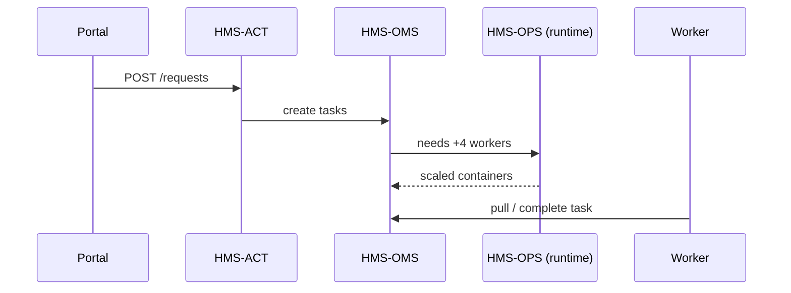

# Chapter 12: Management Layer (HMS-ACT / OMS / OPS)

*(Jumped in from [Autonomous Performance Monitor](11_autonomous_performance_monitor_.md))*  

---

## 1 — Why Do We Need a “City-Hall Scheduler”?

Imagine a hurricane hits New Orleans.  
Three different systems now scream for attention:

| System | What it just decided |
|--------|----------------------|
| Governance Layer | “Disaster Voucher” protocol is **approved**. |
| APM (robot IG)   | Wait-time KPI is **red** for 7 days. |
| ACH Engine       | 5,000 **urgent payments** are queued. |

Who, **exactly**, does what **next**?

* 20 HUD case-workers clock in at 08:00.  
* 12 FEMA inspectors start field visits.  
* A weekend shift is empty because the scheduler forgot to re-run.  

The **Management Layer** (three tiny services working as one) keeps this chaos civil:

```
HMS-ACT  =  workflow orchestrator  →  “Create 5,000 voucher cases”
OMS      =  task tracker           →  “Assign case #77 to Ana”
OPS      =  runtime caretaker      →  “Spin 8 more containers, keep logs”
```

Together they are the **city-hall scheduler** that answers:

> “WHO picks up WHICH task, WHEN, and on WHAT server?”

---

## 2 — Key Ideas in Plain English

| Word            | Think of it as…                          |
|-----------------|------------------------------------------|
| Request         | The citizen ticket (“I need a voucher”). |
| Workflow        | Recipe of steps for that request.        |
| Task            | One slice of work (“verify income”).     |
| Pool            | Group of humans or bots who can do it.   |
| Allocation      | The assignment Ana gets at 09:03.        |
| Lease           | The time window Ana has to finish.       |

Keep this order: **Request → Workflow → Task → Pool → Allocation → Lease**.

---

## 3 — 60-Second Walk-Through: From Request to Allocation

### 3.1  Create a Request (≤ 15 lines)

```php
// routes/api_v1.php
Route::post('/requests', function () {
    return HMS\ACT\Request::create([
        'program_id' => 42,            // Disaster Voucher
        'citizen_id' => 9988,
        'payload'    => request()->all()
    ]);
});
```

*Creates a row in `requests` table; status = `new`.*

### 3.2  Kick Off the Workflow (≤ 12 lines)

```php
// app/Observers/RequestObserver.php
public function created(Request $r) {
    HMS\ACT\Workflow::start($r->id, 'voucher.workflow.v1');
}
```

*Looks up a protocol approved by Governance; explodes it into Tasks.*

### 3.3  Worker Pulls a Task (≤ 18 lines)

```python
# worker/pull_task.py
from oms import Pool

ana = Pool("hud_case_workers").login("ana.smith@gov")
task = ana.next_task(tags=["income_check"])

print("📝 Got", task.id, task.title)
task.start()       # starts a 2-hour lease
```

Output:

```
📝 Got 1518 Verify Income for Citizen 9988
```

### 3.4  Finish & Record (≤ 10 lines)

```python
task.complete(result={"eligible": True})
print("✅ Task", task.id, "done!")
```

HMS-ACH sees the `eligible` flag and finally **releases the voucher payment**.

---

## 4 — What Happens Under the Hood?



1. **ACT** turns a citizen request into a **task list**.  
2. **OMS** tracks each task’s status & assignee.  
3. **OPS** scales pods, watches CPU, restarts crashed jobs.  

---

## 5 — File Tour (Where Does the Code Live?)

```
management/
 ├─ act/               # orchestrator micro-service
 │   └─ Workflow.php
 ├─ oms/               # task & pool service
 │   ├─ Task.php
 │   └─ Pool.php
 ├─ ops/               # runtime minder
 │   ├─ autoscaler.js
 │   └─ lease_watch.js
 └─ api_gateway/       # tiny façade for callers
```

### 5.1  Workflow Explosion (≤ 15 lines)

```php
// act/Workflow.php
public static function start(int $reqId, string $slug) {
    $steps = Protocol::bySlug($slug)->steps;   // from Chapter 2
    foreach ($steps as $i => $s) {
        OMS\Task::create([
            'request_id' => $reqId,
            'step_no'    => $i + 1,
            'title'      => $s['title'],
            'tags'       => $s['tags']
        ]);
    }
}
```

### 5.2  Autoscaler (≤ 15 lines)

```js
// ops/autoscaler.js
setInterval(async () => {
  const pending = await OMS.count({status:'queued'});
  const desired = Math.ceil(pending / 50);      // 1 pod per 50 tasks
  k8s.scale('worker-pod', desired);
}, 30_000);
```

---

## 6 — Beginner Pitfalls to Avoid

1. **Forgetting to finish leases** – tasks auto-requeue after expiry; always call `complete()`.  
2. **Over-tagging tasks** – too many tags ⇒ workers get *zero* matches.  
3. **Ignoring autoscaler math** – bad divisor floods the cluster or starves workers.  
4. **Hard-coding pool names** – reference pools from ENV (`POOL_CASE_WORKERS`).  

---

## 7 — Mini-Exercise

1. POST three mock requests to `/requests`.  
2. Run two worker scripts logged into the same pool.  
3. Watch tasks distribute 2-to-1.  
4. Kill one worker mid-lease and check that **OPS restarts** it and **OMS re-queues** the task.  

Tip: `watch "curl /metrics | grep task_"` to see live queue depth.

---

## 8 — Government Analogy Cheat-Sheet

Management Layer Thing | Real-World Counterpart
-----------------------|------------------------
Request                | Citizen’s paper form dropped at the clerk’s desk  
Workflow               | The agency’s standard operating procedure binder  
Task                   | One line item on the clerk’s to-do list  
Pool                   | Department (e.g., “Income Verification”)  
Allocation             | Clerk’s name stamp on that line item  
Lease                  | Deadline printed on the manila folder  

---

## 9 — Wrap-Up & What’s Next

You now know how the **Management Layer**:

* Explodes citizen **requests** into actionable **tasks**.  
* **Allocates** those tasks to the right people or bots at the right time.  
* Lets **OPS** keep servers healthy while autoscaling to demand.  

In the next chapter we’ll meet the **AI Representative Agent**, a digital co-worker that can *also* grab tasks from these pools, draft letters, or even propose new workflows—see [AI Representative Agent (HMS-AGT / AGX)](13_ai_representative_agent__hms_agt___agx__.md).

---

Generated by [AI Codebase Knowledge Builder](https://github.com/The-Pocket/Tutorial-Codebase-Knowledge)