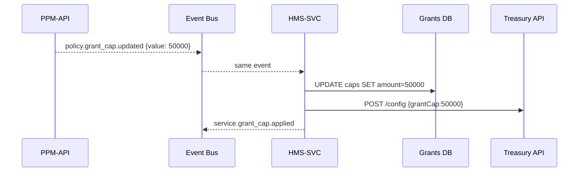

# Chapter 12: Management Layer (HMS-SVC & Friends)  
*(The “Public Works Department” that makes every policy real)*  

[← Back to Chapter 11: Process / Policy Management API](11_process___policy_management_api_.md)

---

## 1. Why Does HMS-NFO Need a Public-Works Department?

Picture **Greta**, a grants officer at the **Department of Transportation (DOT)**.  
Yesterday the policy office published (via the [PPM-API](11_process___policy_management_api_.md)) a new rule:

> “Increase the *Small Port Improvement Grant* cap from **$35 000 → $50 000**.”

Greta clicks “Approve” in the HITL dashboard and… expects magic:

1. The public **application form** now shows “Max $50 000”.  
2. All **existing draft applications** are auto-validated against the new cap.  
3. The **finance clearing house** (Treasury) is notified so the larger amount can actually be paid.  

Who does this heavy lifting?  
The **Management Layer**—a set of always-on backend services such as:

* **HMS-SVC** General utilities & rule enforcement  
* **HMS-ACH** Financial clearing / payment jobs  
* **Domain Services** Parcel tracker, Permit scheduler, etc.

Think of them as the city’s **Public Works Department**: when *City Hall* (HMS-GOV) passes an ordinance, public-works crews patch the roads, repaint signs, and update the water meters—quietly, 24 / 7.

---

## 2. Key Concepts (Plain English)

| Term | What It Really Means | Quick Analogy |
|------|----------------------|---------------|
| Service Listener | Function that waits for `policy.*` events. | Street-crew radio tuned to City Hall. |
| Rule Engine | Tiny module that checks “Does this request obey the latest rules?” | Building inspector with a checklist. |
| Job Runner | Schedules background tasks (payments, emails, nightly recalcs). | Garbage-truck route planner. |
| Integration Adapter | Code that talks to an outside system (e.g., Treasury API). | Bridge connecting city road to state highway. |
| Health Probe | Endpoint that lets DevOps know a service is alive. | Daily roll-call sheet. |

---

## 3. How the New Grant Cap Flows Through the Layer



1. PPM-API publishes the rule change.  
2. HMS-SVC consumes the event.  
3. It updates the local database **and** notifies external finance systems.  
4. Emits its own confirmation event—other micro-front-ends can refresh UI.

---

## 4. Quick-Start Code (≤ 20 Lines Each)

### 4.1 Event Listener in HMS-SVC

```ts
// svc/listeners/grantCap.ts
import bus from "../infra/bus";
import { setCap } from "../repo/caps";
import { notifyTreasury } from "../adapters/treasury";

bus.on("policy.grant_cap.updated", async (payload) => {
  await setCap("small_port_improvement", payload.value);   // DB write
  await notifyTreasury("SPI", payload.value);              // external call
  bus.emit("service.grant_cap.applied", payload);          // ✅ done
});
```

**What it does**  
1. Waits for the policy event.  
2. Writes the new cap into the Grants table.  
3. Calls Treasury’s API.  
4. Emits an “all clear” event.

---

### 4.2 Simple Rule Check Before Saving an Application

```ts
// svc/validators/grant.ts
import { getCap } from "../repo/caps";

export async function validateAmount(requested: number) {
  const cap = await getCap("small_port_improvement");
  if (requested > cap) throw `Amount exceeds cap of $${cap}`;
}
```

Any microservice or API route can `await validateAmount()` to enforce the rule in real time.

---

## 5. Under the Hood (Words First)

1. **Event Listener** subscribes to the same Event Bus used across HMS-NFO.  
2. When a `policy.*.updated` message arrives it triggers a **Handler**.  
3. Handler updates the **Domain Repository** (Postgres, Dynamo, etc.).  
4. Optional **Integration Adapter** calls an outside system (e-g, ACH/Treasury).  
5. Finally, the service publishes a **service.*.applied** event so UIs and other services can refresh.

---

### 5.1 File Map Glimpse

```
hms-svc/
  src/
    listeners/         grantCap.ts
    validators/        grant.ts
    repo/              caps.ts  applications.ts
    adapters/          treasury.ts
    jobs/              nightlyRecalc.ts
    infra/
      bus.ts           db.ts    scheduler.ts
```

Each folder has one clear responsibility—ideal for beginners.

---

### 5.2 Repository Helper (14 Lines)

```ts
// repo/caps.ts
import db from "../infra/db";

export async function setCap(code: string, amount: number){
  await db.query(
    "INSERT INTO caps(code, amount) VALUES ($1,$2) ON CONFLICT (code) DO UPDATE SET amount=$2",
    [code, amount]
  );
}

export async function getCap(code: string){
  const { rows } = await db.query("SELECT amount FROM caps WHERE code=$1", [code]);
  return rows[0]?.amount ?? 0;
}
```

Small, battle-tested CRUD—no ORM magic required.

---

### 5.3 External Adapter Stub (12 Lines)

```ts
// adapters/treasury.ts
import axios from "axios";

export async function notifyTreasury(grantCode: string, amt: number){
  await axios.post("https://treasury.example.gov/config", {
    grantCode,
    newCap: amt
  }, { timeout: 5000 });
}
```

Swap the URL or auth headers in production—beginners see the gist.

---

## 6. Hands-On Mini Lab (≈ 5 min)

1. `git clone hms-svc-demo && npm start`  
2. In another terminal publish the policy event:

```bash
node scripts/publishEvent.js policy.grant_cap.updated 50000
```

3. Watch the service log:

```
✅ DB updated → cap=50000
✅ Treasury notified
🔔 Published service.grant_cap.applied
```

4. Try submitting a mock application with `$55 000`; you’ll get:  
   `Amount exceeds cap of $50000` 🎉

---

## 7. Common Pitfalls & Quick Fixes

| Gotcha | Symptom | Fast Remedy |
|--------|---------|------------|
| Listener not auto-restarting | Event processed once then hangs | Wrap handlers with try/catch and emit `error.*` events. |
| External API timeout | Treasury call fails | Add retry w/ exponential back-off in adapter. |
| Stale in-memory cache | Services still use old cap | Publish `service.*.applied`; have caches listen & refresh. |

---

## 8. Where It Connects

* **Event Source:** rules arrive via the [Process / Policy Management API](11_process___policy_management_api_.md).  
* **Ethics/Safety:** critical changes are already vetted by the [Values Framework](06_ai_governance_values_framework_.md) and [HITL Oversight](07_human_in_the_loop__hitl__oversight_.md).  
* **Audit:** every DB update and external call logs an event to the [Compliance & Audit Trail Module](08_compliance___audit_trail_module_.md).  

---

## 9. What You Learned

You met HMS-SVC & friends—the quiet crew that:

1. Listens for policy changes,  
2. Enforces rules in databases & code,  
3. Talks to outside agencies (ACH, Treasury, USPS, etc.),  
4. Emits “all done” events so the rest of the platform stays in sync.

With this **Public Works Department** humming, new rules become reality in minutes—not quarters.

---

### Up Next  
How do we keep outside partners (Treasury, USPS, state systems) in perfect lock-step with these changes?  
Find out in [Chapter 13: External System Synchronization](13_external_system_synchronization_.md).

---

---

Generated by [AI Codebase Knowledge Builder](https://github.com/The-Pocket/Tutorial-Codebase-Knowledge)