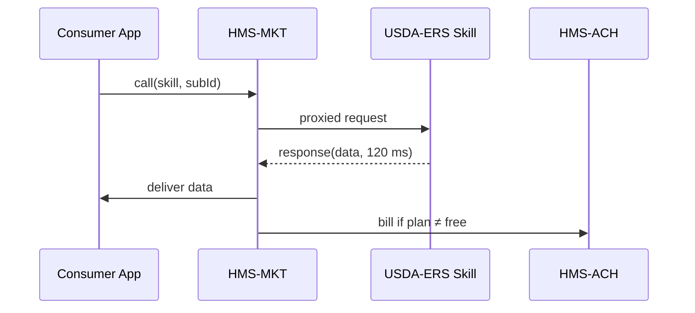

# Chapter 12: Marketplace & Capability Registry (HMS-MKT)

*(If you just finished designing slick UIs with the [Micro-Frontend Library (HMS-MFE)](11_micro_frontend_library__hms_mfe__.md) you may ask, “Where do these widgets—and the data or AI skills behind them—*come* from?”  Welcome to the ‘App Store’ of HMS-SME.)*

---

## 1. Why Do We Need HMS-MKT?

### A 60-Second Story  

1. The **Economic Research Service (ERS)** at USDA publishes a **“Food-Price-Forecast”** AI skill that predicts grocery inflation six months out.  
2. The **School Lunch Program** team at the Department of Education spots the skill in HMS-MKT, clicks **“Subscribe”**, and gets an API key—no procurement paperwork.  
3. Every morning their budgeting dashboard pulls fresh forecasts and auto-adjusts reimbursement rates.  

Result: smarter budgets in **hours**, not the **18-month** contracting cycle agencies are used to.

---

## 2. Key Concepts (Plain English)

| App-Store Analogy | HMS-MKT Term | One-Line Explanation |
|-------------------|--------------|----------------------|
| App Listing       | **Capability** | A reusable asset: dataset, AI model, workflow, or UI widget. |
| Developer Account | **Publisher** | The agency or vendor that owns a capability. |
| Price Tag         | **Plan** | Defines cost (free, per call, flat fee), quota, and SLA. |
| Install Button    | **Subscription** | Grants another agency access + API keys. |
| App-Store Rating  | **Usage Metrics** | Live stats & reviews (uptime, call volume, feedback). |

You only need **Capability**, **Plan**, and **Subscription** to get real work done; the rest come baked in.

---

## 3. Hands-On: Publish & Consume a Capability in < 50 Lines

Below are three tiny TypeScript-flavored scripts.  
*(All ≤ 20 lines each—copy-paste friendly!)*

### 3.1 Publisher: List the “Food-Price-Forecast” Skill

```ts
// 01_publish.ts
import { publish } from "hms-mkt-sdk";

await publish({
  id:       "food_price_forecast_v1",
  name:     "Food-Price-Forecast",
  owner:    "USDA-ERS",
  type:     "ai_skill",
  docsUrl:  "https://ers.usda.gov/forecast-docs",
  plans: [{
    name:  "Public-Agency-Free",
    cost:  0,
    quota: 1000,             // calls per month
    slaMs: 800               // 95-percentile latency
  }]
});
```

**What just happened?**  
USDA-ERS pushed a JSON record to HMS-MKT.  The capability is now searchable by any other agency.

---

### 3.2 Consumer: Discover & Subscribe

```ts
// 02_discover.ts
import { search, subscribe } from "hms-mkt-sdk";

const hits = await search("food price forecast");
const pick = hits[0];                // we like the first match!

const subId = await subscribe({
  capabilityId: pick.id,
  agency: "Department_of_Education"
});
console.log("✅ Subscribed:", subId);
```

*Outcome:* DOE gets a **Subscription ID** (`SUB-2024-0451`).  
Behind the scenes HMS-MKT:

1. Checks that the plan is “free for agencies.”  
2. Creates an API key.  
3. Logs the new consumer for the publisher’s metrics.

---

### 3.3 Use the Subscribed Skill

```ts
// 03_call_skill.ts
import { call } from "hms-mkt-sdk";

const forecast = await call({
  subscriptionId: subId,
  route: "/predict",
  body: { month: "2024-10" }
});

console.log("Grocery Inflation %:", forecast.rate);
```

Quota counting, metering, and SLA alerts are automatic; the caller writes **zero** extra code.

---

## 4. What Happens Behind the Curtain?



Five hops, all fast:

1. Consumer sends request with its **Subscription ID**.  
2. MKT checks quota & SLA, then proxies to the publisher endpoint.  
3. Result returns; MKT records usage.  
4. If the plan costs money, MKT posts a **Transfer Ticket** to [Financial Clearinghouse (HMS-ACH)](10_financial_clearinghouse__hms_ach__.md).

---

## 5. Peek Inside HMS-MKT (Super-Simplified Code)

### 5.1 Registry Map (Python, 16 Lines)

```py
# mkt/registry.py
CAPS = {}    # id -> capability
SUBS = {}    # subId -> {capId, quotaLeft}

def add_cap(cap):
    CAPS[cap["id"]] = cap

def new_sub(capId, agency):
    subId = f"SUB-{len(SUBS)+1:04}"
    plan  = CAPS[capId]["plans"][0]
    SUBS[subId] = {capId, "quotaLeft": plan["quota"]}
    return subId
```

Beginners see: two dictionaries, that’s the whole “App Store” brain!

---

### 5.2 Quota Check + Proxy (TypeScript, 18 Lines)

```ts
// mkt/gateway.ts
export async function proxy(req){
  const sub = SUBS[req.subscriptionId];
  if (!sub) throw "403 Invalid subscription";

  if (sub.quotaLeft <= 0) throw "429 Quota exceeded";
  sub.quotaLeft--;

  const url = CAPS[sub.capId].endpoint + req.route;
  const res = await fetch(url, { method:"POST", body:JSON.stringify(req.body) });

  meter(sub.subscriptionId, res.time);       // for SLA / billing
  return res.json();
}
```

What to notice:  
• **4** if-checks provide auth, quota, and SLA scaffolding.  
• `meter()` writes usage to [Operations & Observability Suite (HMS-OPS)](15_operations___observability_suite__hms_ops__.md).

---

## 6. How HMS-MKT Connects to the Rest of HMS

| Neighbor Module | Relationship |
|-----------------|--------------|
| [HMS-GOV](01_government_admin_portal__hms_gov__.md) | Officials browse catalog, approve agency subscriptions. |
| [HMS-AGT/AGX](05_agent_framework__hms_agt_agx__.md) | Agents auto-install capabilities at runtime. |
| [HMS-OMS](08_workflow___task_management_hub__hms_oms__.md) | Workflows reference capabilities by ID (“step uses skill:food_price_forecast”). |
| [HMS-ACH](10_financial_clearinghouse__hms_ach__.md) | Handles billing & revenue share. |
| [HMS-OPS](15_operations___observability_suite__hms_ops__.md) | Streams uptime & error metrics per capability. |

---

## 7. Mini-FAQ

**Q: Can private vendors list paid skills?**  
A: Yes—set `cost > 0` in the plan.  MKT auto-routes 90 % to the vendor and 10 % to the **Acquisition Innovation Fund** via HMS-ACH.

**Q: How are security reviews handled?**  
A: Publishing triggers the [AI Governance Layer](04_ai_governance_layer_.md) guardrails; only **approved** listings appear in search.

**Q: What if multiple plans exist?**  
A: `plans` is an array—free tier, enterprise tier, etc.  Consumers pick during `subscribe()`.

**Q: Can I transfer ownership?**  
A: Yes—call `transferOwnership(capId, newAgency)`; permissions update and an audit line is logged.

---

## 8. Recap & What’s Next

You learned:

• HMS-MKT is the **App Store** for data sets, AI skills, and workflows.  
• Publishing, subscribing, and calling a capability takes **three tiny scripts**.  
• Quotas, billing, and SLA enforcement happen automatically.  
• Internally, the registry is mostly two hash maps + a proxy function—friendly even to beginners.

Ready to see how agencies exchange *their own* live data once a capability is in place?  
Jump to [Inter-Agency Exchange Protocol (HMS-A2A)](13_inter_agency_exchange_protocol__hms_a2a__.md).

---

---

Generated by [AI Codebase Knowledge Builder](https://github.com/The-Pocket/Tutorial-Codebase-Knowledge)