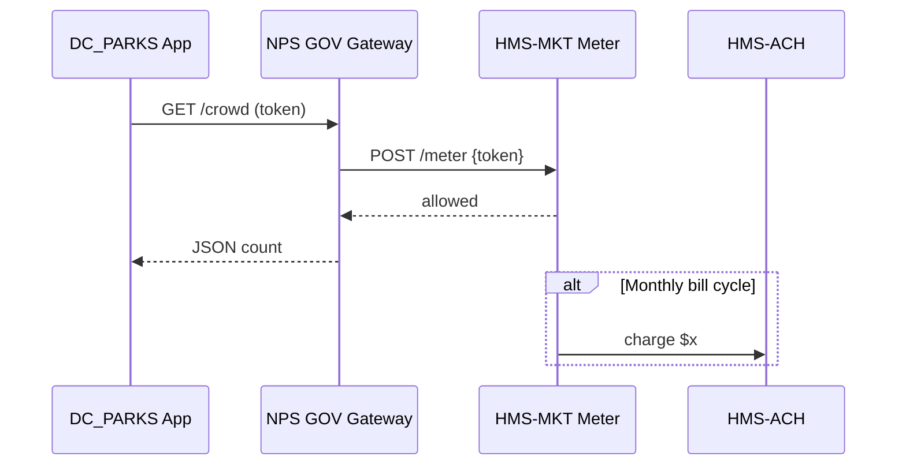

# Chapter 12: Marketplace Service (HMS-MKT)  
[← Back to Chapter 11: Financial Transaction Engine (HMS-ACH)](11_financial_transaction_engine__hms_ach__.md)

> “An App Store for civic APIs, models, and data—minus the procurement paperwork.”

---

## 1. Why Do We Need a Marketplace?

Imagine the **National Park Service (NPS)** spent a year perfecting an AI model that predicts visitor crowding.  
The **D.C. Parks Department** would love to reuse it for the Cherry-Blossom Festival, but:

* Traditional procurement takes **9-12 months**.  
* Budget line-items must be approved before purchase.  
* Each side worries about security, billing, and support contracts.

**HMS-MKT** turns that slog into three clicks:

1. NPS **lists** the “CrowdFlow Predictor” API for \$0.002 per request.  
2. D.C. Parks clicks **“Subscribe”** and sets a \$500 monthly cap.  
3. Usage is auto-metered, payments flow via [HMS-ACH](11_financial_transaction_engine__hms_ach__.md), and both agencies see real-time dashboards.

Think **Amazon Marketplace**, but for APIs, data products, and AI models inside the gov-cloud.

---

## 2. Key Concepts (Beginner Friendly)

| Concept            | Plain-English Analogy | One-Line Job |
|--------------------|-----------------------|--------------|
| Listing            | Storefront product page | Describes an API / dataset / model |
| Catalog            | A searchable aisle      | Lets agencies discover listings |
| Subscription       | Store loyalty card      | Grants usage rights & tracks limits |
| Meter              | Utility meter           | Counts each call for billing |
| Rating & Review    | Customer stars          | Signals quality to other agencies |
| Billing Connector  | Cash register           | Charges via HMS-ACH |

---

## 3. Quick Starter Use-Case – “Subscribe to CrowdFlow”

We will:

1. Publish a listing (NPS side).  
2. Subscribe and call the API (D.C. Parks side).  
3. Watch metering & billing happen automatically.

### 3.1 Publishing a Listing (NPS, 14 lines)

```js
// publishListing.js  (run once by NPS)
import axios from 'axios';

const listing = {
  id       : 'CROWD_FLOW_V1',
  name     : 'CrowdFlow Predictor',
  endpoint : 'https://nps.gov/api/crowd',
  price    : 0.002,           // dollars per request
  quota    : 1_000_000,       // free calls per month
  owner    : 'NPS'
};

await axios.post('http://mkt/listings', listing, {
  headers:{'x-api-key':'NPS_ADMIN'}
});
console.log('✅ Listing published');
```

Explanation  
1-5  Create a JSON object describing the product.  
6-9  Price & free-tier quota are simple numbers.  
10-12 POST to `HMS-MKT`—done!

### 3.2 Subscribing (D.C. Parks, 12 lines)

```js
// subscribe.js
import axios from 'axios';

const sub = await axios.post('http://mkt/subscribe', {
  listingId : 'CROWD_FLOW_V1',
  budgetCap : 500,          // max $/month
  consumer  : 'DC_PARKS'
}, { headers:{'x-api-key':'DC_ADMIN'} });

console.log('🔑 token', sub.data.token);
```

`token` is a short string (e.g., `tok_8f2a…`) that D.C. Parks will attach to each API call.

### 3.3 Calling the Purchased API (9 lines)

```js
// callApi.js
import axios from 'axios';
const { data } = await axios.get(
  'https://nps.gov/api/crowd?lat=38.89&long=-77.03',
  { headers:{'x-mkt-token':'tok_8f2a'} }
);
console.log('Predicted visitors:', data.count);
```

What magically happens behind the scenes?

* The call passes through **NPS’s HMS-GOV**, which detects `x-mkt-token`.  
* HMS-MKT’s **Meter** records one hit against D.C. Parks’ quota.  
* If monthly cost exceeds \$500, further calls return **402 Payment Required**.

---

## 4. Under the Hood – How One Call is Metered



Four actors, one simple dance:

1. **Gateway** forwards only if Meter says “allowed.”  
2. Meter tallies usage in real time.  
3. Once a month Meter pushes aggregated totals to **HMS-ACH** for payment.

---

## 5. Inside HMS-MKT (Folder Peek)

```
/hms-mkt
 ├─ listings/
 │    └─ db.json            # all marketplace items
 ├─ meter/
 │    ├─ record.js          # POST /meter route
 │    └─ cron.js            # nightly aggregation
 ├─ billing/
 │    └─ achBridge.js       # sends invoices to ACH
 ├─ ratings/
 │    └─ route.js           # POST /rate
 └─ README.md
```

### 5.1 Metering Endpoint (18 lines)

```js
// meter/record.js
import db from '../listings/db.json';

export function record(req, res){
  const { token, listingId } = req.body;
  const sub = db.subscriptions[token];
  if(!sub || sub.listingId !== listingId)
      return res.status(403).send('invalid token');

  // Increment usage
  const used = (sub.usage[thisMonth()] ||= 0) + 1;
  sub.usage[thisMonth()] = used;

  // Quota check
  const free = db.listings[listingId].quota;
  if(used > free + sub.budgetCap / db.listings[listingId].price)
      return res.status(402).send('over budget');

  res.status(200).send('ok');
}

function thisMonth(){ return new Date().toISOString().slice(0,7); }
```

Explanation  
1-5  Validate token & listing match.  
7-9  Increment this month’s usage counter.  
11-13 Compute allowed max hits (`free + paid`).  
14-15 If over budget ➜ return HTTP 402.  
17 Respond “ok” so gateway releases the actual API response.

### 5.2 Nightly Billing Cron (10 lines)

```js
// meter/cron.js
import { sendInvoice } from '../billing/achBridge.js';
import db from '../listings/db.json';

export function nightly(){
  for(const token in db.subscriptions){
     const sub   = db.subscriptions[token];
     const price = db.listings[sub.listingId].price;
     const qty   = sub.usage[thisMonth()] || 0;
     if(qty>0) sendInvoice(sub.consumer, qty*price, sub.listingId);
  }
}
```

Each invoice is a single call to `/ach/pay` just like in Chapter 11—no extra work.

---

## 6. Rating & Reviews (9 lines)

```js
// ratings/route.js
export function rate(req,res){
  const { token, stars, comment } = req.body;
  if(stars<1 || stars>5) return res.status(400).send('1-5 only');
  db.reviews.push({ token, stars, comment, ts:Date.now() });
  res.send('thanks!');
}
```

Average stars show up in `listings/db.json`, helping agencies pick high-quality products.

---

## 7. Security & Governance Hooks

* **Transport:** All `/meter` and `/subscribe` calls flow through [HMS-GOV](01_governance_layer__hms_gov__.md).  
* **Policy Enforcement:** Price caps and content rules are validated by [HMS-CDF](02_policy_codification_engine__hms_cdf__.md).  
* **Audit Trails:** Every subscription, invoice, and review is logged via [Activity Logging & Audit Trail](21_activity_logging___audit_trail_.md).  
* **Payment:** Uses the same ledger & fraud checks already built in [HMS-ACH](11_financial_transaction_engine__hms_ach__.md).

---

## 8. Frequently Asked Questions

**Q: Can private vendors list products?**  
Yes, as long as they onboard via **A2A** tunnels (see [HMS-A2A](10_secure_inter_agency_communication__hms_a2a__.md)) and accept the standard billing terms.

**Q: What prevents runaway costs?**  
Budget caps + real-time quota checks (HTTP 402). Agencies can also set **hard stop dates** in the subscription object.

**Q: Can listings be free?**  
Absolutely. Set `price: 0`; MKT still meters usage so you know adoption rates.

**Q: How do updates and versions work?**  
Publish `CROWD_FLOW_V2`. Existing subscribers stay on V1 unless they opt-in; both appear side-by-side in the Catalog.

---

## 9. Key Takeaways

• HMS-MKT is the **one-stop storefront** for APIs, datasets, and AI models across government.  
• Listings + Subscriptions + Metering + Billing = reuse without red tape.  
• Under 20 lines of code to publish, subscribe, and meter.  
• Integrates natively with policy (CDF), payments (ACH), security (GOV), and audits.

---

### Up Next

Some agencies need capabilities that don’t fit in the standard catalog—think drone-imagery analysis or quantum-safe cryptography.  
We’ll plug those into the platform via extension points in [Chapter 13: Extension & Specialty Capabilities (HMS-AGX)](13_extension___specialty_capabilities__hms_agx__.md).

---

Generated by [AI Codebase Knowledge Builder](https://github.com/The-Pocket/Tutorial-Codebase-Knowledge)