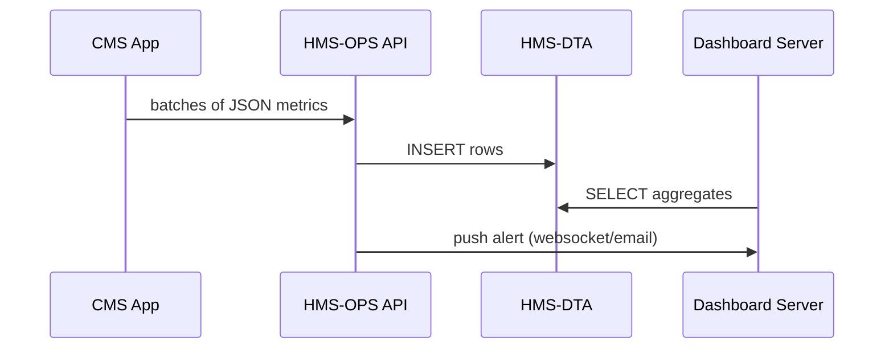
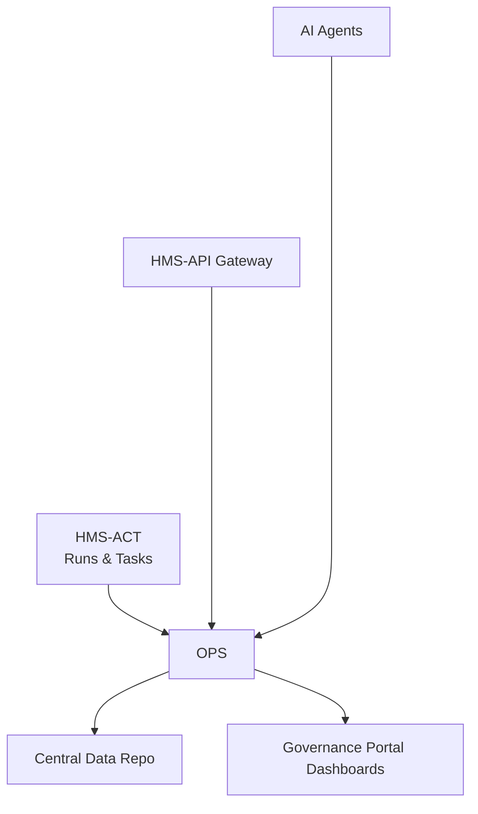

# Chapter 12: Metrics & Monitoring (HMS-OPS)

*(Coming from [Central Data Repository (HMS-DTA)](11_central_data_repository__hms_dta__.md)? Perfect—now we’ll learn **how we watch the heartbeat** of everything you’ve built so far.)*  

---

## 1. Why Do We Need “Mission Control”?

Picture the Centers for Medicare & Medicaid Services (CMS) rolling out a **new rule that promises to cut Medicaid eligibility reviews from 15 days to 24 hours**.

Three weeks later, Congress asks:

* Did the average processing time really drop?  
* How many applications error-ed out?  
* Are state case-workers happier or swamped?

If each team has to run its own SQL and e-mail screenshots, answers arrive weeks late—far too slow for oversight.

**HMS-OPS is Mission Control:** a continuous observability service that:

1. **Collects** latency, error, policy-effectiveness, and satisfaction metrics.  
2. **Aggregates & stores** them in HMS-DTA.  
3. **Surfaces** live dashboards and alerts so an administrator can say *“Yes, the rule works!”* in seconds.

> Analogy: Think of HMS-OPS as **NASA’s control room** for public-sector software—big screens, red lights, and friendly graphs so nobody is surprised mid-launch.

---

## 2. Key Concepts (Plain-English)

| Term | Friendly meaning | Why you care |
|------|------------------|--------------|
| Metric | A single number (e.g., *avg processing time = 26 h*) | Building block |
| KPI (Key Performance Indicator) | Mission-critical metric (latency, error rate, satisfaction) | Gets a big gauge on the wall |
| Dashboard | Group of KPIs with charts | One-glance status |
| SLO (Service-Level Objective) | Promise (“99 % processed < 48 h”) | Triggers alerts |
| Alert | E-mail / Slack / SMS when SLO breached | Saves careers |

Keep these five in mind—everything else is plumbing.

---

## 3. Walk-Through: Proving the Rule Cut Time to 24 h

We will:

1. **Instrument** the “Eligibility Review” Protocol.  
2. **Collect & store** latency + error data.  
3. **Plot** a live chart.  
4. **Alert** if latency > 48 h for 3 hours.

### 3.1 Instrument the Code (≤ 15 lines)

```php
// EligibilityReviewController.php  (simplified)
use Ops\HmsOps;   // tiny SDK helper

public function completeStep(Request $r) {
    $start = microtime(true);
    // ...run review logic...
    $ok = $this->reviewService->process($r->all());

    HmsOps::measure('eligibility.latency_ms', (microtime(true)-$start)*1000);
    HmsOps::increment($ok ? 'eligibility.ok' : 'eligibility.error');
    return response(['status'=>$ok?'ok':'error']);
}
```

What happened?  
* `measure()` records latency.  
* `increment()` ticks success/error counters.  
* Under the hood the SDK sends a small JSON packet to HMS-OPS every few seconds—no DB code needed.

---

### 3.2 What Does HMS-OPS Receive?

```json
{
  "program_id": 42,
  "metric": "eligibility.latency_ms",
  "value": 873,         // 0.873 seconds
  "ts": "2024-08-01T14:07:55Z"
}
```

Packets are batched, then written to a **metrics table** in HMS-DTA.

---

### 3.3 Build a Simple Dashboard (React, 18 lines)

```jsx
// CmsLatencyDashboard.jsx
import { useEffect, useState } from 'react';
export default function CmsLatencyDashboard() {
  const [pts, setPts] = useState([]);
  useEffect(() => {
    fetch('/api/ops/query?metric=eligibility.latency_ms&range=24h')
      .then(r=>r.json()).then(setPts);
  }, []);
  return (
    <div>
      <h3>Eligibility Review Latency (hrs)</h3>
      <svg width="400">{/* tiny line graph omitted */}</svg>
      <p>Avg: {(pts.reduce((a,b)=>a+b,0)/pts.length/3600).toFixed(1)} h</p>
    </div>
  );
}
```

Explanation  
1-4. Fetch 24 h of latency data via HMS-OPS query endpoint.  
5-10. Render a minimal line chart (details skipped).  
11. Show the average in hours—instantly tells Congress if 24 h goal met.

---

### 3.4 Create an SLO & Alert (cURL, 10 lines)

```bash
curl -X POST https://api.hms.gov/ops/slo \
  -H "Authorization: Bearer $JWT" \
  -H "Content-Type: application/json" \
  -d '{
        "metric": "eligibility.latency_ms",
        "threshold_ms": 172800000,   // 48h
        "window_minutes": 180,
        "notify": ["ops@cms.gov"]
      }'
```

Effect: if **average latency > 48 hours for 3 consecutive hours**, CMS Ops gets an email.

---

## 4. Under the Hood – How the Numbers Flow



Four simple actors—easy to reason about.

---

## 5. Internal Implementation (Super-Slim Peek)

### 5.1 Collector Service (Python, 18 lines)

```python
# app/ops_collector.py
from fastapi import FastAPI, Request
import asyncpg, json, time
app = FastAPI()
pool = asyncpg.create_pool(dsn="postgres://...")

@app.post("/ingest")
async def ingest(req: Request):
    payloads = await req.json()
    ts = int(time.time()*1000)
    # bulk insert for speed
    vals = [(p["program_id"], p["metric"], p["value"], p["ts"]) 
            for p in payloads]
    await pool.executemany(
      "INSERT INTO metrics(program_id,name,val,ts) VALUES($1,$2,$3,$4)", vals)
    return {"ok":len(vals)}
```

Line-by-line  
1-4. Create a tiny FastAPI app + connection pool.  
7. Read batched JSON.  
10-13. Bulk insert into `metrics` table—fast & beginner-friendly.

### 5.2 SLO Checker Job (≤ 15 lines)

```python
def check_slos():
    slos = db("SELECT * FROM slos")
    for s in slos:
        avg = db.val("""
          SELECT AVG(val) FROM metrics
          WHERE name=$1 AND ts>now()-$2::interval
        """, s.metric, f"{s.window_minutes} minutes")
        if avg > s.threshold_ms:
            Email.send(s.notify, f"SLO breach on {s.metric}: {avg/3600000:.1f} h")
```

Runs every 5 minutes via cron.

---

## 6. Folder Map

```
hms_ops/
├─ collector/      # FastAPI ingest
├─ jobs/           # SLO checker, retention, roll-ups
├─ dashboards/     # Pre-built React charts
└─ sdk/            # tiny client helpers (HmsOps::measure, etc.)
```

Everything is bite-size so new hires aren’t scared.

---

## 7. Where HMS-OPS Fits in the Universe



Every layer you learned earlier sends **observability crumbs** to OPS; policy makers read the crumbs on big friendly graphs.

---

## 8. Best-Practice Checklist

1. **Tag Every Metric with `program_id`** – Enables per-program drill-downs.  
2. **Retain Raw 30 days, Roll-Up Forever** – Cheap storage, rich history.  
3. **Link SLO → HITL** – When an alert fires, auto-create an Override task (see [Human-In-The-Loop](08_human_in_the_loop__hitl__override_flow_.md)).  
4. **Public Transparency** – Non-sensitive KPIs can auto-publish to data.gov for citizen trust.  
5. **Use Red / Amber / Green Colorblind-safe Palettes** – Accessibility matters.

---

## 9. Recap & Next Steps

You now know how to:

1. Instrument code with two one-liners (`measure`, `increment`).  
2. Store and query metrics through HMS-OPS and HMS-DTA.  
3. Build a quick dashboard and set an SLO alert.  
4. Understand the lightweight collector + SLO checker under the hood.  

With Mission Control online, the next challenge is **synchronizing HMS data to partner agencies and legacy mainframes**.  
Onward to [External System Sync Adapter](13_external_system_sync_adapter_.md)!

---

Generated by [AI Codebase Knowledge Builder](https://github.com/The-Pocket/Tutorial-Codebase-Knowledge)