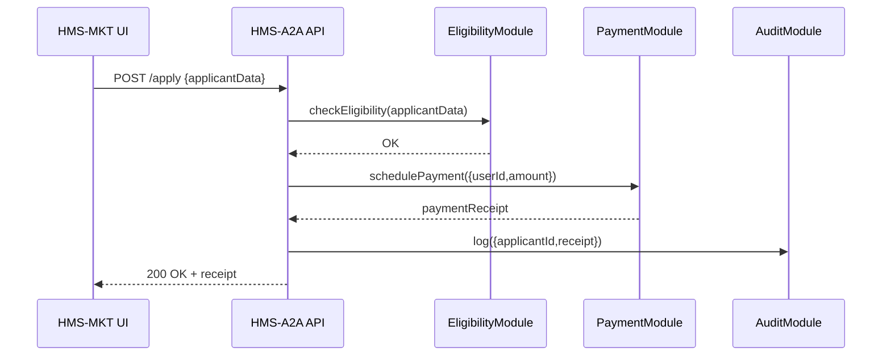

# Chapter 12: Module Architecture

In [Chapter 11: Tenant Management](11_tenant_management_.md) we saw how each agency’s data is neatly isolated. Now it’s time to dig into how HMS-API is organized on the inside: **Module Architecture**—the “departments” that handle discrete business tasks like eligibility, payments, or assessments.

---

## 1. Motivation & Central Use Case

Imagine a government building with separate departments:  
- **Eligibility Office** checks who qualifies.  
- **Payments Office** issues funds.  
- **Audit Office** records every transaction.

If the Payments Office rewires its systems, the Eligibility Office doesn’t break. In HMS-API, **Modules** are those “offices.” Each module groups related code (functions and data models) for one program segment. Front-ends—like **HMS-GOV** or **HMS-MKT**—call these modules to validate inputs or enforce rules, and everything remains loosely coupled and swappable.

**Use Case Example**  
A citizen applies for a housing subsidy:

1. **HMS-MKT** calls `EligibilityModule.check()`.  
2. If they qualify, **HMS-API** calls `PaymentModule.schedule()`.  
3. **AuditModule.log()` records the event.  

If we later update the payment logic, eligibility and audit code stay untouched.

---

## 2. Key Concepts

1. **Module**  
   A folder of related functions and models. Think “EligibilityModule” or “PaymentModule.”

2. **Models**  
   Data definitions used by the module (e.g., `Application`, `PaymentRecord`).

3. **Services**  
   Functions in each module that implement business rules (e.g., `checkEligibility()`, `processPayment()`).

4. **Module Registry**  
   A simple index that lets higher-level services discover and import modules.

5. **Loose Coupling**  
   Modules talk only through well-defined interfaces, so you can swap one out without breaking the rest.

---

## 3. Using Modules to Solve Our Use Case

### 3.1 Call the Eligibility Module

```js
// src/services/applicationService.js
import { checkEligibility } from '../modules/eligibility'

export async function submitApplication(applicant) {
  // 1. Enforce eligibility rules
  await checkEligibility(applicant)

  // 2. If OK, move on to payment
  // ...payment logic follows
}
```
This code asks **EligibilityModule** to validate inputs. If it throws, we stop early.

### 3.2 Invoke the Payment Module

```js
// src/services/applicationService.js
import { schedulePayment } from '../modules/payment'

export async function finalizeApplication(applicant) {
  // ...eligibility was already checked
  const receipt = await schedulePayment({
    userId: applicant.id,
    amount: applicant.awardedAmount
  })
  return receipt
}
```
Here we call **PaymentModule** to plan the disbursement, returning a simple receipt object.

---

## 4. What Happens Under the Hood



1. **HMS-MKT** sends application data.  
2. **API** calls **EligibilityModule**.  
3. On success, **PaymentModule** is invoked.  
4. Finally, **AuditModule** logs the transaction.  

Each module does its job in isolation.

---

## 5. Internal Implementation

### 5.1 File Structure

```
hms-api/
└── src/
    ├── modules/
    │   ├── eligibility.js
    │   ├── payment.js
    │   └── audit.js
    └── services/
        └── applicationService.js
```

### 5.2 Sample Module: eligibility.js

```js
// src/modules/eligibility.js

// A dummy data model for demonstration
export class Application {
  constructor(data) { Object.assign(this, data) }
}

// Business rule: income must be below cap
export async function checkEligibility(data) {
  const app = new Application(data)
  if (app.income > app.policyMaxIncome) {
    throw new Error('Applicant exceeds income limit')
  }
  // more checks could follow…
  return true
}
```
- We define a simple `Application` model.  
- `checkEligibility()` enforces one clear rule and throws on failure.

### 5.3 Sample Module: payment.js

```js
// src/modules/payment.js

export async function schedulePayment({ userId, amount }) {
  // Imagine inserting into a payments table
  const record = { id: 'pm_123', userId, amount, date: Date.now() }
  // Simulated database write…
  return record
}
```
This module returns a minimal receipt object. Real code would integrate a payment gateway.

---

## 6. Conclusion

You’ve seen how **Module Architecture** breaks business logic into independent “departments”:

- **EligibilityModule** enforces who qualifies  
- **PaymentModule** schedules disbursements  
- **AuditModule** logs every action  

This separation fosters clear interfaces, easy testing, and safe upgrades. With modules in place, HMS-API remains robust even as individual parts evolve. 

That wraps up our deep dive into Module Architecture—congratulations on finishing Chapter 12!

---

Generated by [AI Codebase Knowledge Builder](https://github.com/The-Pocket/Tutorial-Codebase-Knowledge)